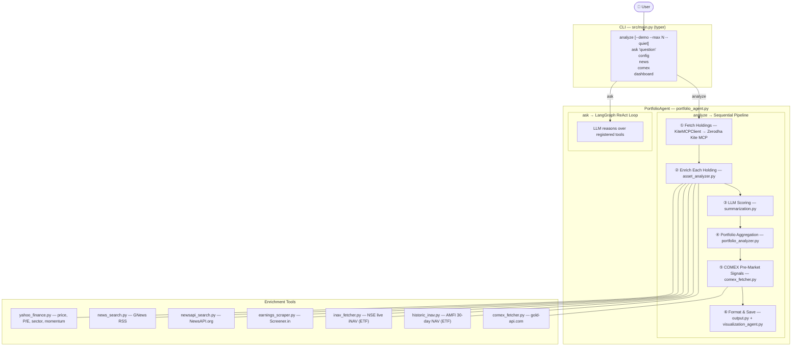

# Mosaic Fund Agent — Knowledge Graph

## Project Overview

**Mosaic Fund Agent** is a Python-based AI-powered portfolio intelligence system for Indian stock markets.
It connects to a Zerodha brokerage account via MCP (Model Context Protocol), enriches each holding with
live market data, news sentiment, earnings, and commodity signals, then produces an LLM-scored portfolio
report with an auto-refreshing HTML dashboard.

- **Language**: Python 3.11+
- **CLI Framework**: typer
- **Agent Framework**: LangGraph + Deep Agents
- **LLM Providers**: OpenAI (GPT-4o-mini), Anthropic (Claude Haiku), or local (LM Studio/Ollama)
- **Cost**: ₹4–12/run (cloud) or free (local model)
- **Core Output**: JSON report (`./output/*.json`) + auto-refreshing HTML dashboard

---

## Quick Reference (read this before exploring files)

> Full architecture: `docs/architecture.md` — single source of truth for data flow, tables, agents, tools, ML.

### Key entry points by task

| Task | File | Function / Command |
|---|---|---|
| Gold quant score | `src/tools/quant_scorecard.py` | `compute_gold_scorecard()` |
| Silver quant score | `src/tools/quant_scorecard.py` | `compute_silver_scorecard()` (adds GSR + CFTC live COT) |
| Run both metals | `scripts/metals_quant_scorecard.py` | `python scripts/metals_quant_scorecard.py` |
| Cross-asset opportunity scan | `scripts/opportunity_scan.py` | `python scripts/opportunity_scan.py` |
| Macro event scanner (8 themes) | `src/tools/macro_event_scanner.py` | `scan_macro_events()` / `python -m src.tools.macro_event_scanner` |
| Signal aggregator (18 ETFs) | `src/agents/signal_aggregator.py` | `run_signal_aggregation()` / `python src/main.py signals` |
| FII/DII flow analysis | `src/tools/who_is_selling_agent.py` | `python src/main.py who-is-selling` |
| iNAV live fetch | `src/tools/inav_fetcher.py` | `get_etf_inav(symbol)` |
| iNAV premium alerts | `src/tools/premium_alerts.py` | `python src/main.py premium-alerts` |
| Full portfolio analysis | `src/agents/portfolio_agent.py` | `python src/main.py analyze` |
| Import market data | `src/importer/cli.py` | `python src/main.py import --category all` |
| DSP 31-month backfill | `scripts/import_dsp_history.py` | `python scripts/import_dsp_history.py` |
| DSP quant strategy (GSR) | `scripts/dsp_quant_strategy_analyzer.py` | `python scripts/dsp_quant_strategy_analyzer.py` |
| ML trend forecast | `src/ml/trend_predictor.py` | Run directly or via Streamlit UI |
| Anomaly detection | `src/ml/anomaly.py` | `run_composite_anomaly(df)` |
| Streamlit data hub | `src/ui/app.py` | `streamlit run src/ui/app.py` |

### ClickHouse tables (database: `market_data`)

| Table | What's in it |
|---|---|
| `daily_prices` | OHLCV — 90+ symbols across stocks/ETFs/commodities/indices/FX |
| `inav_snapshots` | ETF iNAV vs market price, premium_discount_pct (intraday) |
| `cot_gold` | CFTC weekly COT — mm_net, open_interest for Gold (code 088) |
| `fii_dii_flows` | Daily FII/DII cash-market net flows (₹ Crore) |
| `fii_dii_fno_daily` | Daily F&O participant OI (futures + options) |
| `ml_predictions` | LightGBM 5-day return forecast for GOLDBEES |
| `signal_composite` | 6-pillar composite ETF scores 0–100 + BUY/HOLD/SELL action |
| `news_articles` | ETF-tagged news + macro events with sentiment |
| `mf_holdings` | Monthly mutual fund portfolio compositions — Morningstar (current) + DSP 31-month backfill (Sep 2023–Mar 2026) from DSP website |
| `etf_aum` | Daily ETF AUM in USD |
| `cb_gold_reserves` | Central bank gold holdings (quarterly, IMF) |
| `fx_rates` | Daily OHLC for USDINR, USDCNY, USDAED, USDSAR, USDKWD |
| `import_watermarks` | Delta-sync state — last_date per (source, symbol) |

### Signal pillars & weights

**Gold/Silver Quant Scorecard** (0–100 per pillar):
- Macro 30% — DXY + real yield (5D delta). Silver adds Gold-Silver Ratio.
- Flows 30% — COT mm_net/OI. Gold: `cot_gold` table. Silver: CFTC live `f_disagg.txt`.
- Valuation 20% — iNAV premium/discount from `inav_snapshots`.
- Momentum 20% — LightGBM (`ml_predictions`) for gold; SI=F 5D return for silver.

**Signal Aggregator** (18 ETFs):
- Macro 25% · Sentiment 15% · Valuation 15% · Flow 25% · ML 15% · Anomaly 5%

### Symbol registry quick lookup (`src/importer/registry.py`)
- **50 stocks**: Nifty large-caps (RELIANCE, TCS, HDFCBANK, INFY, …)
- **30+ ETFs**: GOLDBEES, SILVERBEES, NIFTYBEES, BANKBEES, ITBEES, CPSEETF, MON100, …
- **7 commodities**: GOLD (GC=F), SILVER (SI=F), COPPER (HG=F), CRUDEOIL, NGAS, PLATINUM, PALLADIUM
- **10 indices**: NIFTY50, SENSEX, BANKNIFTY, SP500, NASDAQ, US10Y, DXY, …
- **iNAV symbols**: GOLDBEES, SILVERBEES, NIFTYBEES, BANKBEES, ITBEES, ICICIB22, + 6 more

### Design patterns to know
- All tables: `ReplacingMergeTree` — use `argMax(close, imported_at)` not `FINAL` for speed
- Watermark delta sync: `import_watermarks.(source, symbol).last_date` — use `--full` to bypass
- Every signal pillar degrades to `None` (not 0) when data missing; composite re-weights
- Path to add sys.path: `sys.path.insert(0, ROOT)` + `sys.path.insert(0, ROOT/src)` (ROOT = dirname of dirname of __file__)

---

## Architecture Diagram



---

## Module Dependency Graph

```
src/main.py (CLI entry point)
├── config/settings.py (Settings — Pydantic BaseSettings from .env)
├── src/ml/anomaly.py (composite anomaly detection — used by Streamlit UI)
├── src/agents/portfolio_agent.py (PortfolioAgent — main orchestrator)
│   ├── src/analyzers/asset_analyzer.py (analyze_holding)
│   │   ├── src/tools/yahoo_finance.py (fetch_yahoo_data, fetch_price_history)
│   │   ├── src/tools/news_search.py (fetch_news_for_symbol)
│   │   ├── src/tools/newsapi_search.py (fetch_newsapi_articles)
│   │   ├── src/tools/earnings_scraper.py (fetch_from_screener)
│   │   ├── src/tools/inav_fetcher.py (get_etf_inav)
│   │   ├── src/tools/historic_inav.py (get_historic_inav)
│   │   ├── src/tools/summarization.py (summarize_asset / summarize_asset_demo)
│   │   └── src/utils/symbol_mapper.py (get_company_name, to_nse_yahoo)
│   ├── src/analyzers/portfolio_analyzer.py (build_portfolio_report)
│   │   └── src/tools/summarization.py (summarize_portfolio)
│   ├── src/clients/mcp_client.py (KiteMCPClient — Zerodha Kite MCP)
│   ├── src/models/portfolio.py (Holding, Portfolio, PortfolioReport)
│   └── src/utils/demo_data.py (get_demo_holdings)
├── src/agents/comex_agent.py (ComexAgent)
│   └── src/tools/comex_fetcher.py (get_comex_signals)
├── src/agents/news_sentiment_agent.py (NewsSentimentAgent)
│   ├── src/tools/news_search.py
│   └── src/tools/newsapi_search.py
├── src/agents/visualization_agent.py (VisualizationAgent — HTML dashboard)
├── src/formatters/output.py (print_report_to_console, save_json_report)
└── src/utils/report_loader.py (load_latest_report — for `ask` command)
```

---

## CLI Commands (`src/main.py`)

| Command | Description | Key Options |
|---------|-------------|-------------|
| `analyze` | Full portfolio analysis pipeline | `--demo`, `--max N`, `--quiet`, `--no-dashboard` |
| `dashboard` | Generate HTML dashboard from latest report | — |
| `ask` | Free-form Q&A via ReAct agent over portfolio | `question: str` |
| `config` | Display current settings (sensitive fields masked) | — |
| `news` | Multi-source news sentiment analysis | `symbol`, `--company` |
| `comex` | COMEX pre-market commodity signals | — |
| `premium-alerts` | Scarcity premium Z-score alerts for international ETFs | `--lookback`, `--z-threshold`, `--symbols`, `--min-snapshots` |
| `import` | Import historical market data into ClickHouse | `--category`, `--lookback`, `--full`, `--dry-run` |
| `ui` | Launch Streamlit data hub | `--port`, `--host` |

---

## Data Models (`src/models/portfolio.py`)

### Enums

| Enum | Values |
|------|--------|
| `Exchange` | NSE, BSE |
| `InstrumentType` | EQ, ETF, BE |
| `Sentiment` | POSITIVE, NEGATIVE, NEUTRAL, MIXED |

### Core Models

| Model | Key Fields | Purpose |
|-------|------------|---------|
| `Holding` | symbol, exchange, quantity, average_price, last_price, pnl | Raw broker holding |
| `Position` | symbol, exchange, quantity, buy_price, sell_price, pnl | Open position |
| `Portfolio` | holdings, positions, equity, available_margin | Full account state |
| `NewsItem` | title, source, url, published_at, sentiment | Single news article |
| `QuarterlyResult` | period, revenue_cr, net_profit_cr, yoy_revenue_growth_pct | Earnings data |
| `YahooFinanceData` | symbol, sector, industry, market_cap, pe_ratio, current_price, fifty_two_week_high/low, price_history | Market data |
| `AssetAnalysis` | holding, yahoo_data, news, quarterly_result, summary, risk_score, sentiment_score, insights | Per-holding enrichment |
| `PortfolioSummary` | total_invested, current_value, overall_pnl_pct, health_score, diversification_score | Aggregated metrics |
| `PortfolioReport` | summary, holdings_analysis, sector_allocation, portfolio_risks, actionable_insights, rebalancing_signals | Final output |

### Computed Properties on `Holding`

- `invested_value` = quantity × average_price
- `current_value` = quantity × last_price
- `pnl_percent` = ((last_price − average_price) / average_price) × 100
- `yahoo_symbol` = symbol + ".NS" (default NSE)

---

## Agents (`src/agents/`)

### PortfolioAgent (`portfolio_agent.py`)

Main orchestrator for the full analysis pipeline.

| Method | Purpose |
|--------|---------|
| `__init__(demo_mode=False)` | Init LLM + ReAct agent; graceful fallback to rule-based |
| `run_full_analysis(console)` | 6-step pipeline: Fetch → Enrich → Score → Aggregate → COMEX → Format |
| `ask(question)` | ReAct agent Q&A with latest report context injection |
| `_fetch_holdings_async()` | Async Kite MCP fetch with auto-login on 401 |
| `_build_llm()` | Priority: local OpenAI-compat > Anthropic > OpenAI |

**Tool Registry**: `ALL_TOOLS = ZERODHA_TOOLS + YAHOO_TOOLS + NEWS_TOOLS + EARNINGS_TOOLS + SUMMARIZATION_TOOLS`

### ComexAgent (`comex_agent.py`)

Commodity pre-market signals (XAU, XAG, XPT, XPD, HG).

| Method | Purpose |
|--------|---------|
| `run()` | Local → direct call; Cloud → deep-agent (recursion_limit=6) |
| `_run_direct()` | Bypass agent, call `get_comex_signals()` directly |

**Loop Guard**: `_MAX_TOOL_CALLS = 2` with thread-local counter.  
**Tools**: `fetch_all_comex_signals`, `fetch_single_commodity`, `get_comex_pre_market_context`

### NewsSentimentAgent (`news_sentiment_agent.py`)

Multi-source news sentiment with deduplication.

| Method | Purpose |
|--------|---------|
| `run(symbol, company_name)` | Local → direct; Cloud → deep-agent |
| `_run_direct(symbol, company_name)` | Direct `collate_news_sentiment` invocation |

**Tools**: `collate_news_sentiment`, `get_newsapi_stock_news`, `get_stock_news`  
**Deduplication**: Normalizes titles via `_norm()` to merge across NewsAPI + GNews.

### VisualizationAgent (`visualization_agent.py`)

HTML dashboard generator — zero-build React 18 + Tailwind from CDN.

| Method | Purpose |
|--------|---------|
| `generate(report)` | Build data → render HTML → write to disk |
| `_build_dashboard_data(report)` | Flatten report into React-optimized structure |
| `_render_html(data)` | Inject JSON into HTML template via `window.__PORTFOLIO_DATA__` |
| `open_in_browser(path)` | Open `file://` URL in default browser |

**React Components**: `MetricCard`, `SectionTitle`, `ComexPanel`, `SvgSectorChart`, `SvgInavChart`, `HoldingCard`, `BulletList`, `Dashboard`

---

## Tools (`src/tools/`)

### Data Fetchers

| Module | Function | External API | Returns |
|--------|----------|-------------|---------|
| `yahoo_finance.py` | `fetch_yahoo_data(symbol, exchange="NSE")` | Yahoo Finance | `YahooFinanceData` |
| `yahoo_finance.py` | `fetch_price_history(symbol, period="3mo")` | Yahoo Finance | `list[OHLCV dicts]` |
| `earnings_scraper.py` | `fetch_from_screener(symbol)` | Screener.in + Yahoo fallback | `QuarterlyResult \| None` |
| `news_search.py` | `fetch_news_for_symbol(symbol, company_name)` | Google News RSS (GNews) | `list[NewsItem]` |
| `newsapi_search.py` | `fetch_newsapi_articles(symbol, company_name)` | NewsAPI.org | `list[NewsItem]` |
| `inav_fetcher.py` | `get_etf_inav(symbol)` | NSE API + Yahoo fallback | `dict[inav, market_price, premium_discount_pct, label]` |
| `inav_fetcher.py` | `get_portfolio_etf_inav(symbols)` | NSE API | `dict[symbol → iNAV data]` |
| `historic_inav.py` | `get_historic_inav(symbol, days=30)` | MFAPI.in + Yahoo | `dict[records, trend, sparkline]` |
| `comex_fetcher.py` | `get_comex_signals(symbols)` | gold-api.com + Yahoo | `dict[commodities, signals, summary]` |
| `zerodha_mcp_tools.py` | `fetch_portfolio_holdings()` | Zerodha Kite MCP | `dict[holdings]` |

### LangChain `@tool` Decorators

| Tool Name | Module | Input |
|-----------|--------|-------|
| `get_quarterly_results` | earnings_scraper | `input_str: str` (symbol) |
| `get_stock_news` | news_search | `input_str: str` (symbol\|company) |
| `get_newsapi_stock_news` | newsapi_search | `input_str: str` (symbol\|company) |
| `get_yahoo_finance_data` | yahoo_finance | `input_str: str` (symbol) |
| `get_price_momentum` | yahoo_finance | `input_str: str` (symbol) |
| `fetch_portfolio_holdings` | zerodha_mcp_tools | `_` (no input) |
| `fetch_open_positions` | zerodha_mcp_tools | `_` (no input) |
| `fetch_account_profile` | zerodha_mcp_tools | `_` (no input) |
| `initiate_kite_login` | zerodha_mcp_tools | `_` (no input) |

### LLM Analysis (`summarization.py`)

| Function | Purpose |
|----------|---------|
| `summarize_asset(asset_data)` | LLM-scored per-holding analysis → risk_score, sentiment_score, insights |
| `summarize_portfolio(portfolio_data)` | LLM-scored portfolio-level → health_score, diversification, risks, actions |
| `summarize_asset_demo(asset_data)` | Rule-based scoring (no LLM needed) for demo mode |

---

## Analyzers (`src/analyzers/`)

### `asset_analyzer.py`

**Single-holding enrichment pipeline**: `analyze_holding(holding, use_llm=True)`

Flow: Yahoo Finance → News (GNews + NewsAPI) → Quarterly Results → iNAV (ETF only) → Historic iNAV (ETF only) → LLM Scoring → `AssetAnalysis`

### `portfolio_analyzer.py`

**Portfolio-level aggregation**: `build_portfolio_report(portfolio, holdings_analysis, comex_signals, use_llm=True)`

Key computations:
- Sector allocation via `SYMBOL_SECTOR_FALLBACK` (120+ symbol → sector mappings)
- Concentration risk via HHI (Herfindahl-Hirschman Index)
- Diversification score (0–100)
- Portfolio health score
- COMEX-to-ETF linkage via `_STATIC_COMEX_MAP` (e.g., GOLDBEES → XAU)

---

## Clients (`src/clients/`)

### `KiteMCPClient` (`mcp_client.py`)

Async HTTP client for Zerodha Kite MCP server using JSON-RPC 2.0 protocol.

| Method | Purpose |
|--------|---------|
| `get_holdings()` | Fetch portfolio holdings |
| `get_positions()` | Fetch open positions |
| `get_margins()` | Fetch account margins |
| `get_quotes(symbols)` | Get live quotes |
| `get_ltp(symbols)` | Get last traded prices |
| `login()` | Initiate OAuth browser login |

- Uses `httpx.AsyncClient` with session cookie management
- Context manager support (`async with KiteMCPClient() as client`)
- Auto-login on 401 responses

---

## Formatters (`src/formatters/`)

### `output.py`

Rich terminal output + JSON persistence.

| Function | Purpose |
|----------|---------|
| `print_report_to_console(report)` | 9-section Rich terminal display |
| `save_json_report(report)` | Save to `./output/portfolio_YYYYMMDD_HHMMSS.json` |

**Console Sections**: COMEX signals → Portfolio overview → Holdings table → Per-holding panels → Sector chart → Risks → Insights → Rebalancing signals

**Specialized Panels**: iNAV premium/discount, Historic iNAV sparklines, COMEX commodity signals

---

## ML Module (`src/ml/`)

### `trend_predictor.py`

LightGBM 5-day (configurable) forward return predictor for GOLDBEES.  
Soft-threshold complement to the `who_is_selling_agent.py` expert system.

**Public API**: `run_trend_prediction(horizon, n_splits, verbose, ch_host, ch_port, ch_database, ch_user, ch_password) → dict`

**Pipeline steps:**

| Step | Function | Purpose |
|------|----------|---------|
| 1 | `_fetch_macro_series(ch_client)` | Fetches DXY (DX-Y.NYB) + US 10Y yield (^TNX) from Yahoo Finance; degrades gracefully |
| 2 | `build_master_table(ch_client)` | LEFT JOINs daily_prices + mf_nav (+ ffill) + fx_rates + etf_aum + cot_gold + macro series |
| 3 | `engineer_features(df)` | Computes 16 `f_*` alpha factors from raw columns |
| 4 | `label_forward_return(df, horizon)` | `target = (close[t+horizon] / close[t] − 1) × 100` |
| 5 | `fit_walk_forward(df, n_splits, gap)` | `TimeSeriesSplit` walk-forward; `_GAP=10`; early stopping 800 est / 50-round patience / 15% val split |
| 6 | Persistence | Upserts to `market_data.ml_predictions` + appends to `predictions_log.jsonl` |

**Alpha features** (`f_` prefix — auto-selected by `fit_walk_forward`):

| Feature | Formula | Signal |
|---------|---------|--------|
| `f_cot_pct_oi` | `mm_net / open_interest × 100` | Speculator over-positioning |
| `f_spread_pct` | `(goldbees_close − nav) / nav × 100` | Retail panic discount |
| `f_aum_mom_30d` | 30-day pct_change of GLD AUM | Institutional flow |
| `f_usdinr_vol14` | 14-day log-return std of USDINR × 100 | Currency stress |
| `f_usdinr_60d` | 60-day USDINR pct_change | Macro regime |
| `f_goldbees_logret5` | 5-day log return | Near-term momentum |
| `f_goldbees_logret20` | 20-day log return | Medium-term momentum |
| `f_ma_ratio` | `close / 20-day MA` | Mean reversion |
| `f_spread_delta5` | 5-day diff of `f_spread_pct` | Accelerating panic |
| `f_hvol10` | 10-day log-return std × √252 | Realized volatility |
| `f_gold_logret5` | 5-day log return of GOLD commodity | Commodity momentum |
| `f_dxy_proxy` | USDINR 5-day log-return as DXY proxy | Dollar strength (dropped if real DXY available) |
| `f_dxy_logret5` | 5-day DXY log return (real DX-Y.NYB) | Dollar momentum |
| `f_dxy_logret20` | 20-day DXY log return | Dollar medium-term |
| `f_us10y_level` | US 10Y yield level (^TNX) | Rate regime |
| `f_us10y_delta5` | 5-day change in US 10Y yield | Rate velocity |
| `f_month_sin` | `sin(2π × month / 12)` | Seasonal cycle |
| `f_month_cos` | `cos(2π × month / 12)` | Seasonal cycle |
| `f_dow_sin/cos` | Cyclical day-of-week (0=Mon) | Day-of-week pattern |
| `f_fii_net_5d` | 5-day rolling sum of `fii_net_cr` (LEFT JOIN `fii_dii_flows`) | FII net flow momentum |
| `f_dii_net_5d` | 5-day rolling sum of `dii_net_cr` (LEFT JOIN `fii_dii_flows`) | DII net flow momentum |
| `f_inst_net_momentum` | `f_fii_net_5d + f_dii_net_5d` | Combined institutional net flow |

**Coverage filter**: keeps rows where ≥ `len(feature_cols) // 2` features are non-NaN

**Regime thresholds** (on predicted return %):

| Signal | Threshold |
|--------|-----------|
| BUY | pred ≥ +1.5% |
| WATCH_LONG | pred ≥ +0.5% |
| HOLD | pred ≥ −0.5% |
| WATCH_SHORT | pred ≥ −1.5% |
| SELL | pred < −1.5% |

**ClickHouse table** (`market_data.ml_predictions`):
- `ORDER BY (as_of, horizon_days)` — `ReplacingMergeTree(created_at)` — idempotent upsert
- Columns: `as_of`, `horizon_days`, `expected_return_pct`, `confidence_low`, `confidence_high`,
  `regime_signal`, `cv_r2_mean`, `n_training_rows`, `goldbees_close`, `created_at`

**Key implementation notes**:
- `_GAP = 10` — prevents target-feature overlap at fold boundaries (2× the 5-day horizon)
- `mf_nav` uses LEFT JOIN + `goldbees_nav.ffill()` — no rows dropped on AMFI holidays
- `dxy_close` and `us10y_close` forward-filled after merge
- macOS: auto-injects `DYLD_LIBRARY_PATH=/opt/homebrew/opt/libomp/lib` if libomp missing
- Passes DataFrame (not `.values`) to `model.predict()` to preserve LightGBM feature names
- Validated: 2468 training rows (10 years), hit ratio ~0.567, `f_hvol10` #1 feature by importance
- CLI smoke-test: `python src/ml/trend_predictor.py`

---

### `anomaly.py`

Self-contained composite anomaly detection for daily OHLCV time series.  
Independent of the UI — importable from CLI, agents, or tests.

**3-step pipeline** exposed via `run_composite_anomaly(df, rf_lags, contamination, z_threshold)`:

| Step | Function | Output columns |
|------|----------|-----------------|
| 1 | `robust_zscore(s)` | `z_return`, `z_range`, `z_robust` |
| 2 | `fit_rf_residuals(df, rf_lags, train_frac)` | `rf_pred`, `residual`, `z_resid`, `z_resid_abs` |
| 3 | `fit_isolation_forest(df, contamination)` | `if_confidence` (0→1), `if_label` (-1/1) |
| — | `classify_regime(df)` | `final_z`, `final_z_abs`, `regime` |

**Formula:** `Final_Z = Z_robust × (1 + IF_confidence)`

**Regime matrix:**

| Z_robust | Z_volume | Z_resid | Regime |
|---|---|---|---|
| High | Low (pos. return) | — | 🧨 Blow-off Top (Weak) — checked first |
| High | — | Low  | 📈 Strong Trend (HODL) |
| Low  | — | High | ⚡ Flash Crash / Black Swan (EXIT) |
| High | — | High | 🔥 Volatile Breakout |
| Low  | — | Low  | ✅ Normal |

**Volume Z-score** (`z_volume`): `robust_zscore(df["volume"].ffill(), window=z_window)` — independent of `z_robust`. Added to Isolation Forest feature set: `[daily_return, range_pct, z_robust, z_volume]`.

**Blow-off Top threshold**: currently uses `abs(z_volume) < median(z_volume)` (50th pct). Backtest on GOLDBEES (652 days) showed 43.5% hit rate at this threshold — consider tightening to `z_volume < -0.5` for higher precision.

**Backtest results** (`tests/_backtest_anomaly.py`, GOLDBEES Jul 2023–Apr 2026):

| Regime | Count | Ret 5d | Hit Rate 5d |
|---|---|---|---|
| 🧨 Blow-off Top | 69 | +0.34% | 43% (weak) |
| ⚡ Flash Crash | 111 | +1.30% | 69% (strong) |
| 📈 Strong Trend | 96 | +0.76% | 62% (good) |
| 🔥 Volatile Breakout | 159 | +0.78% | — |

**RF features:** `lag_1..lag_N`, `ma7`, `ma30`, `vol_lag1` (lag count configurable, default 5)

**Returns:** `(df_result, df_flagged, r2_train)` — full DataFrame with all signals, flagged subset, RF R².

---

## Importer (`src/importer/`)

Historical data pipeline that populates ClickHouse from multiple sources.

### CLI Entry: `run_import(categories, lookback_days=3650, full_reimport=False)`

**Import categories:**

| Category | Source | Symbols | Table |
|----------|--------|---------|-------|
| `etfs` | yfinance | 12 ETFs (GOLDBEES, NIFTYBEES, …) | `daily_prices` |
| `stocks` | yfinance | NSE stocks | `daily_prices` |
| `commodities` | yfinance | 7 (GOLD, SILVER, CRUDE, …) | `daily_prices` |
| `indices` | yfinance | 9 (NIFTY50, SENSEX, … + US10Y ^TNX, US13W ^IRX) | `daily_prices` |
| `fx_rates` | yfinance | 5 USD pairs (USDINR, USDCNY, …) | `daily_prices` + `fx_rates` |
| `mf` | mfapi.in | 11 MF schemes | `mf_nav` |
| `nse_eod` | NSE Quote API | ETFs + stocks | `daily_prices` |
| `inav` | NSE API | 12 ETFs | `inav_snapshots` |
| `cot` | CFTC | Gold COT | `cot_gold` |
| `cb_reserves` | IMF | Central bank gold | `cb_gold_reserves` |
| `etf_aum` | Various | GLD AUM | `etf_aum` |
| `mf_holdings` | Morningstar sal-service API (direct) | 4 multi-asset funds (DSP, Quant, ICICI, Bajaj) | `mf_holdings` |
| `fii_dii` | Sensibull oxide API | MARKET (singleton) | `fii_dii_flows` |

**Delta-sync**: Uses `import_watermarks` table — each (source, symbol) gets a `last_date` watermark;
subsequent imports fetch from `last_date − 3d` (overlap) to today. Use `--full` to ignore watermarks.

**10-year history**: Default `lookback_days=3650` (~10 years). All `_client.insert()` calls pass
`settings={"max_partitions_per_insert_block": 300}` to avoid ClickHouse's default 100-partition limit
(10 years × 12 months = 120 partitions exceeds 100 without this setting).

**NSE Quote Fetcher** (`nse_quote_fetcher.py`): Fetches today's OHLCV from NSE Quote API.
Available immediately after 3:30 PM IST — no Yahoo Finance ~1h delay. Requires NSE cookie warmup
via `_NSE_WARMUP` request before per-symbol calls. Category `nse_eod` in CLI.

### ClickHouse Schema (`market_data` database)

All tables use `ReplacingMergeTree` for idempotent re-imports.

| Table | Engine | Partition | Order Key | Notes |
|-------|--------|-----------|-----------|-------|
| `daily_prices` | ReplacingMergeTree(imported_at) | toYYYYMM(trade_date) | (symbol, trade_date) | ETFs, stocks, commodities, indices, FX |
| `mf_nav` | ReplacingMergeTree(imported_at) | toYYYYMM(nav_date) | (symbol, nav_date) | AMFI NAV from MFAPI.in |
| `fx_rates` | ReplacingMergeTree(imported_at) | toYYYYMM(trade_date) | (trade_date, symbol) | USD pair OHLC |
| `inav_snapshots` | ReplacingMergeTree(snapshot_at) | toYYYYMM(snapshot_at) | (symbol, snapshot_at) | Live iNAV |
| `cot_gold` | ReplacingMergeTree | toYYYYMM(report_date) | report_date | CFTC COT positioning |
| `cb_gold_reserves` | ReplacingMergeTree | toYYYYMM(ref_period) | (ref_period, country_code) | IMF reserves |
| `etf_aum` | ReplacingMergeTree | toYYYYMM(trade_date) | (trade_date, symbol) | ETF AUM snapshots |
| `fii_dii_flows` | ReplacingMergeTree(imported_at) | — | (trade_date) | FII/DII daily cash-market flows |
| `import_watermarks` | ReplacingMergeTree(updated_at) | — | (source, symbol) | Delta-sync state |
| `ml_predictions` | ReplacingMergeTree(created_at) | — | (as_of, horizon_days) | ML forecast log |
| `mf_holdings` | ReplacingMergeTree(imported_at) | toYYYYMM(as_of_month) | (scheme_code, as_of_month, isin) | Monthly portfolio snapshot; Morningstar sal-service API = current snapshot only, run monthly to build time-series |

**Query pattern for deduplication** (replaces `FINAL` for better performance):
```sql
SELECT trade_date, argMax(close, imported_at) AS close
FROM market_data.daily_prices
WHERE symbol = 'GOLDBEES' AND category = 'etfs'
  AND trade_date >= toDate('2023-01-01')
GROUP BY trade_date
ORDER BY trade_date ASC
```
Use `argMax(col, imported_at) GROUP BY` instead of `FINAL` — `FINAL` triggers full cross-partition
deduplication which is slow on 120+ partitions (10-year data). `argMax` is a parallel aggregation
and supports partition pruning via `WHERE trade_date >= ...`.

---

## UI (`src/ui/app.py`)

Streamlit 5-tab data hub.

**Tabs**: Import | SQL Query | Explorer | Anomaly Detection | Who Is Selling? | MF Holdings

**Who Is Selling? tab sections:**
1. Live signal check (expert system: COT + iNAV + AUM + USD/INR)
2. LightGBM 5-day forecast with walk-forward CV results
3. **🔬 Quant Scorecard** — composite 0–100 score (Macro 30% / Flows 30% / Valuation 20% / Momentum 20%); Plotly gauge + pillar breakdown table + 30d rolling GOLDBEES↔DXY correlation
4. **🌍 Scarcity Premium Alerts** — Z-score bar chart + premium level scatter (today vs 30d mean) + signal cards + full table; scans MAFANG, HNGSNGBEES, MON100, NIFTYQLITY, PSUBNKBEES

**Explorer tab charts:**

| Chart | Query Pattern | Notes |
|-------|---------------|-------|
| COMEX Gold Daily Close | `argMax + GROUP BY` with date filter | USD/oz from `daily_prices` where `symbol='GOLD'` |
| GOLDBEES Market Close vs AMFI NAV | `argMax` on both tables; range selector 1Y/3Y/5Y/10Y/All | `nullIf(nav, 0)` hides Muhurat/holiday zeros |
| GOLDBEES Discount Alert Banner | Latest row query with `WHERE n.nav > 0` | 🚨 red ≤ −1%, ⚠️ yellow < 0%, ✅ green |
| Premium/Discount Impact Scatter | Altair scatter + correlation | `argMax + GROUP BY` + `next_day_return` derived |

**Alert banner logic** (between chart header and chart):
- Queries most recent row: `ORDER BY p.trade_date DESC LIMIT 1` with `WHERE n.nav > 0`
- `st.error` (≤ −1.0%), `st.warning` (< 0%), `st.success` (premium)

**ClickHouse connection env vars**: `CH_HOST`, `CH_PORT` (8123), `CH_USER`, `CH_PASS`, `CH_DB` (market_data)

---

## Utils (`src/utils/`)

---

## Quant Tools (`src/tools/`)

### `quant_scorecard.py`

Composite Gold Score engine for GOLDBEES (0–100).

**Public API**: `compute_gold_scorecard(ch_host, ch_port, ch_user, ch_pass, ch_database) → dict`

**Pillars and scoring constants:**

| Pillar | Weight | Inputs | Constants |
|--------|--------|--------|----------|
| Macro | 30% | DXY level + US10Y real yield 5d delta | `_DXY_LOW=100`, `_DXY_HIGH=110`; `_YIELD_D5_LOW=-0.10`, `_YIELD_D5_HIGH=+0.10` |
| Flows | 30% | COT mm_net / open_interest % | `_COT_LOW=20%`, `_COT_HIGH=35%` (raised from 25% after backtest: 20% hit rate) |
| Valuation | 20% | GOLDBEES iNAV premium/discount % | `_DISC_HIGH=+0.50%`, `_PREM_HIGH=+0.50%` |
| Momentum | 20% | LightGBM `expected_return_pct` | `_MOM_HIGH=+1.0%`, `_MOM_LOW=-1.0%` |

**Graceful degradation**: missing pillars are re-weighted so composite stays on 0–100 scale.  
**COT query**: uses `FINAL` keyword to avoid `AggregateFunction(argMax, Int64, Date)` deserialization error on `cot_gold` ReplacingMergeTree.  
**Return schema**: `composite_score, macro_score, flows_score, valuation_score, momentum_score, signals{}, goldbees_prices (DataFrame), dxy_prices (DataFrame), as_of, error`

### `premium_alerts.py`

Scarcity Premium Alert engine for international ETFs under RBI $7B overseas cap.

**Public API**: `check_premium_alerts(ch_client, symbols, lookback_days=30, z_threshold=-1.5, good_entry_threshold=-1.0, min_snapshots=5) → list[dict]`

**Logic**:
1. Query `inav_snapshots` — group by `toStartOfHour(snapshot_at)`, `argMax(premium_discount_pct, snapshot_at)` over `lookback_days`
2. Compute `mean_prem`, `std_prem` via `statistics.stdev`
3. Fetch latest premium via separate `argMax` query (no date filter)
4. Z-score: `(latest − mean) / std`; Signal: `z ≤ -1.5` → 🟢 SCREAMING BUY; `z ≤ -1.0` → 🟡 GOOD ENTRY; else → 🔴 NO ACTION
5. Returns sorted by z ascending (best opportunities first)

**Default symbols**: `MAFANG, HNGSNGBEES, MON100, NIFTYQLITY, PSUBNKBEES`  
**Note**: MON100, NIFTYQLITY not yet in `INAV_SYMBOLS` — add to registry to start accumulating data.

---

## Utils (`src/utils/`)

| Module | Key Functions | Purpose |
|--------|---------------|---------|
| `cache.py` | `cache_get(key, ttl)`, `cache_set(key, data)`, `cache_clear()`, `cache_age_seconds(key)` | Disk-based TTL cache (stdlib only) |
| `demo_data.py` | `get_demo_holdings()` | 5 sample holdings (3 stocks + 2 ETFs) |
| `report_loader.py` | `load_latest_report()`, `_compact_context(report)` | Token-aware context builder (8K/32K/cloud scaling) |
| `symbol_mapper.py` | `get_company_name(symbol)`, `to_nse_yahoo(symbol)`, `to_bse_yahoo(symbol)`, `from_yahoo(yahoo_symbol)` | 160+ NSE symbol ↔ Yahoo ↔ company name mappings |

---

## Configuration (`config/settings.py`)

Pydantic `BaseSettings` loading from `.env` file:

| Category | Key Fields |
|----------|------------|
| **LLM** | `llm_provider` (openai/anthropic/local), `openai_api_key`, `anthropic_api_key`, `llm_model`, `llm_base_url` |
| **Zerodha MCP** | `kite_mcp_url`, `kite_mcp_timeout` |
| **APIs** | `newsapi_key`, `gold_api_key` |
| **Cache** | `cache_dir`, `comex_cache_ttl` (3600s), `newsapi_cache_ttl` (3600s) |
| **Output** | `output_dir` (./output) |
| **Market** | Market hours, timezone (Asia/Kolkata) |

**Validation**: Warns on missing API keys; masks sensitive fields for `config` command display.

---

## External Services & APIs

| Service | Endpoint | Auth | Module(s) | Notes |
|---------|----------|------|-----------|-------|
| **Sensibull Oxide** | `oxide.sensibull.com/v1/compute/cache/fii_dii_daily` | None (public) | fii_dii_fetcher | Monthly buckets; `?year_month=YYYY-MonthName`; ~6 months rolling history |
| **Zerodha Kite MCP** | `mcp.kite.trade` | OAuth 2.0 (browser) | mcp_client, zerodha_mcp_tools | Account-level rate limits |
| **Yahoo Finance** | yfinance library | None (free) | yahoo_finance, historic_inav, yfinance_fetcher, fx_rates_fetcher | 20+ years history; `lookback_days=3650` default |
| **NewsAPI.org** | newsapi.org/v2 | API Key | newsapi_search | 100 req/day (free tier) |
| **Google News** | RSS via GNews | None (free) | news_search | Soft limits |
| **Screener.in** | screener.in/company | Web scraping | earnings_scraper | Polite delays applied |
| **NSE API** | nseindia.com/api | Custom headers + cookie warmup | inav_fetcher, nse_quote_fetcher, nse_inav_fetcher | Rate limited; requires `_NSE_WARMUP` request |
| **MFAPI.in** | mfapi.in/mf | None (free) | historic_inav, mfapi_fetcher | Full scheme history; polite delays |
| **gold-api.com** | gold-api.com/api | `x-access-token` | comex_fetcher | Free tier |
| **ClickHouse** | localhost:8123 | username/password | clickhouse.py, app.py, trend_predictor | `market_data` database; 10 tables |
| **CFTC** | Various | None | cot_fetcher | COT gold positioning |
| **Morningstar** | sal-service API (direct httpx, no mstarpy) | Public API key (client-side) | mf_holdings_fetcher | Current snapshot only — no historical date API; ISIN → securityID via morningstar.in autocomplete |
| **IMF** | IMF Data API | None | imf_reserves_fetcher | Central bank gold reserves |
| **OpenAI** | api.openai.com | API Key | summarization, all agents | Pay-per-token |
| **Anthropic** | api.anthropic.com | API Key | summarization, all agents | Pay-per-token |
| **Local LLM** | `LLM_BASE_URL` | None | summarization, all agents | Unlimited / free |

---

## Security Features

### Prompt Injection Protection (`comex_fetcher.py`)

- `_safe_str(val)` — Detects "ignore previous instructions", "SYSTEM:", "act as" → returns `[SANITIZED]`
- `_safe_price(val)` — Rejects non-numeric and negative values
- `_safe_symbol(val)` — Whitelist: XAU, XAG, XPT, XPD, HG only
- `_safe_timestamp(val)` — Validates ISO 8601 format
- ASCII control character stripping, regex pattern detection, string length limits

### Sensitive Data

- All API keys stored in `.env`, loaded via Pydantic Settings
- `config` command masks sensitive fields in display
- No keys logged or serialized to report JSON

### Agent Loop Guards

- `_MAX_TOOL_CALLS = 2` per agent invocation (comex_agent)
- `recursion_limit=6` on LangGraph agents
- Thread-local call counters prevent infinite loops

---

## Caching Strategy

| Cache Key | TTL | Source |
|-----------|-----|--------|
| COMEX signals | 3600s (1h) | `comex_cache_ttl` setting |
| NewsAPI articles | 3600s (1h) | `newsapi_cache_ttl` setting |
| NSE ETF list | Per-process | Module-level variable |

Storage: Disk-based JSON files in `cache_dir` with filename sanitization. Pure stdlib implementation (no external dependencies).

---

## Key Architectural Patterns

1. **Two-Mode Routing**: Local model → direct function call (no token waste); Cloud model → LangGraph deep-agent with loop guards
2. **LLM Fallback**: Attempts LLM init; silently falls back to rule-based scoring (`summarize_asset_demo`) on failure
3. **Tool Aggregation**: Agents expose tool lists (`COMEX_TOOLS`, `NEWS_TOOLS`, etc.) that `PortfolioAgent` combines into `ALL_TOOLS`
4. **Token-Aware Context**: `_compact_context()` scales injected report context based on model capacity (8K/32K/cloud)
5. **Zero-Build Frontend**: React 18 from CDN + Tailwind + pure SVG charts; data injected as `window.__PORTFOLIO_DATA__`
6. **Deduplication**: News articles normalized and merged across NewsAPI + GNews sources

---

## Data Flow: Full Analysis Run

```
User runs: python -m src.main analyze
│
├─ 1. Fetch Holdings
│   ├─ Demo mode → get_demo_holdings() (5 sample holdings)
│   └─ Live mode → KiteMCPClient.get_holdings() → Zerodha MCP
│       └─ 401? → Browser OAuth login → retry
│
├─ 2. Enrich Each Holding (per holding)
│   ├─ fetch_yahoo_data(symbol) → YahooFinanceData
│   ├─ fetch_news_for_symbol(symbol) → list[NewsItem] (GNews)
│   ├─ fetch_newsapi_articles(symbol) → list[NewsItem] (NewsAPI, cached 1h)
│   ├─ fetch_from_screener(symbol) → QuarterlyResult
│   ├─ [ETF only] get_etf_inav(symbol) → iNAV data
│   ├─ [ETF only] get_historic_inav(symbol) → 30-day history + sparkline
│   └─ summarize_asset(data) or summarize_asset_demo(data) → AssetAnalysis
│
├─ 3. COMEX Pre-Market Signals
│   └─ ComexAgent().run() → XAU, XAG, XPT, XPD, HG signals
│
├─ 4. Portfolio Aggregation
│   └─ build_portfolio_report(portfolio, holdings_analysis, comex)
│       ├─ Sector allocation (SYMBOL_SECTOR_FALLBACK — 120+ entries)
│       ├─ Concentration risk (HHI)
│       ├─ Diversification score (0–100)
│       ├─ COMEX-to-ETF linkage (_STATIC_COMEX_MAP)
│       └─ LLM portfolio insights or rule-based fallback
│
└─ 5. Output
    ├─ save_json_report() → ./output/portfolio_*.json
    ├─ print_report_to_console() → Rich terminal panels
    └─ VisualizationAgent().generate() → HTML dashboard + browser open
```

---

## Test Coverage (`tests/`)

| Test File | Type | Coverage |
|-----------|------|----------|
| `test_tools.py` | Unit (11 tests) | Yahoo Finance, symbol mapper, earnings, news, models, sector allocation, config, iNAV, premium/discount, historic iNAV, COMEX signals |
| `test_cache.py` | Unit + Integration | Cache round-trip, TTL expiry, cache clear, NewsAPI cache hit speedup (>50×) |
| `test_inav_cli.py` | Visual + Mocked | 9 ETF scenarios with mocked iNAV/market prices, Rich panel rendering |
| `test_news_sentiment.py` | Smoke (live APIs) | `collate_news_sentiment` + `NewsSentimentAgent._run_direct` |
| `_validate_ml.py` | ML Validation | Master table row count, macro series presence, all 7 new features, hit ratio ≥ 0.50 || `tests/test_quant_signals.py` | Backtest Script | COT Crowded Long → GOLDBEES price drop backtest; `--threshold`, `--drop`, `--days` CLI args |
| `tests/_backtest_anomaly.py` | Backtest Script | Anomaly regime forward-return backtest; all 5 regimes × 3/5/10d horizons; Blow-off Top deep-dive section || `_compare_inav_sources.py` | Script | NSE vs Yahoo Finance iNAV comparison for 8 ETFs |
| `_fetch_live_prices.py` | Script | Live Yahoo Finance data for 9 ETFs |
| `_test_comex.py` | Script | COMEX signals smoke test (XAU, XAG, HG) |
| `_test_nse_parse.py` | Script | NSE API ETF list parsing validation |

### Key Test Scenarios

- **iNAV Premium/Discount thresholds**: 11 boundary scenarios — > +0.25% = PREMIUM, < −0.25% = DISCOUNT, else FAIR VALUE
- **COMEX signal thresholds**: > ±1.0% = STRONG, ±0.3–1.0% = normal, within ±0.3% = NEUTRAL
- **Prompt injection guards**: 10 unit tests for `_safe_str`, `_safe_price`, `_safe_symbol`, `_safe_timestamp`
- **Cache speedup**: Asserts second call is >50× faster than first (disk cache hit)

---

## Dependencies (`requirements.txt`)

| Category | Packages |
|----------|----------|
| **Agent Framework** | `langchain`, `langchain-core`, `langchain-openai`, `langchain-anthropic`, `langgraph`, `deepagents` |
| **MCP Client** | `mcp`, `httpx`, `httpx-sse` |
| **Market Data** | `yfinance`, `pandas`, `numpy` |
| **Web Scraping** | `beautifulsoup4`, `requests`, `lxml`, `fake-useragent` |
| **News** | `gnews`, `newsapi-python` |
| **Config** | `pydantic`, `pydantic-settings`, `python-dotenv` |
| **Output / CLI** | `rich`, `typer` |
| **UI** | `streamlit`, `altair>=5.0.0` |
| **ClickHouse** | `clickhouse-connect` |
| **ML / Anomaly** | `scikit-learn>=1.4.0` (IsolationForest, RandomForestRegressor) |
| **ML / Forecast** | `lightgbm>=4.3.0` — macOS: `brew install libomp` required for `libomp.dylib`; Docker: `libgomp1` |
| **MF Holdings / Charts** | `httpx` — Morningstar sal-service API (direct, no mstarpy); `plotly>=5.0` — Streamlit charts |

---

## File Index

| Path | Purpose |
|------|---------|
| `src/main.py` | CLI entry point — 6 commands via typer |
| `config/settings.py` | Pydantic BaseSettings from .env (40+ fields) |
| `src/agents/portfolio_agent.py` | Main orchestrator — full analysis + ask Q&A |
| `src/agents/comex_agent.py` | COMEX commodity signals agent |
| `src/agents/news_sentiment_agent.py` | Multi-source news sentiment agent |
| `src/agents/visualization_agent.py` | HTML dashboard generator (React 18) |
| `src/analyzers/asset_analyzer.py` | Per-holding enrichment pipeline |
| `src/analyzers/portfolio_analyzer.py` | Portfolio aggregation + scoring |
| `src/clients/mcp_client.py` | Zerodha Kite MCP async client (JSON-RPC 2.0) |
| `src/models/portfolio.py` | All Pydantic data models + enums |
| `src/tools/yahoo_finance.py` | Yahoo Finance data + momentum |
| `src/tools/news_search.py` | Google News via GNews RSS |
| `src/tools/newsapi_search.py` | NewsAPI.org premium news |
| `src/tools/earnings_scraper.py` | Screener.in quarterly results |
| `src/tools/inav_fetcher.py` | Live ETF iNAV from NSE |
| `src/tools/historic_inav.py` | 30-day iNAV history from AMFI/MFAPI.in |
| `src/tools/comex_fetcher.py` | COMEX commodity prices + signals |
| `src/tools/summarization.py` | LLM analysis + rule-based fallback |
| `src/tools/zerodha_mcp_tools.py` | Zerodha MCP LangChain tool wrappers |
| `src/formatters/output.py` | Rich console output + JSON report |
| `src/utils/cache.py` | Disk-based TTL cache (stdlib only) |
| `src/utils/demo_data.py` | 5 sample holdings for demo mode |
| `src/utils/report_loader.py` | Latest report loader + token-aware context compaction |
| `src/utils/symbol_mapper.py` | 160+ NSE ↔ Yahoo ↔ company name mappings |
| `docs/architecture.mmd` | Mermaid architecture diagram |
| `src/ml/__init__.py` | Package marker |
| `src/ml/anomaly.py` | Composite anomaly detection — Robust Z + RF Residuals + Isolation Forest + Volume Z; 5 regimes incl. Blow-off Top |
| `src/ml/trend_predictor.py` | LightGBM 5-day forward return predictor — 19 alpha features (incl. real DXY, US10Y, seasonality), walk-forward CV, ClickHouse + JSONL persistence |
| `src/tools/quant_scorecard.py` | Composite Gold Score engine — 4-pillar weighted 0–100 score for GOLDBEES |
| `src/tools/premium_alerts.py` | Scarcity Premium Alert engine — Z-score on iNAV premium for international ETFs |
| `src/ui/__init__.py` | Package marker |
| `src/ui/app.py` | Streamlit 6-tab UI — Import / SQL Query / Explorer / Anomaly Detection / Who Is Selling? / MF Holdings |
| `src/importer/__init__.py` | Package marker |
| `src/importer/cli.py` | Orchestrates all import categories; `run_import(lookback_days=3650)` |
| `src/importer/clickhouse.py` | ClickHouse DDL + `ClickHouseImporter` — insert methods with `max_partitions_per_insert_block=300` |
| `src/importer/registry.py` | Symbol registries — `ETFS`, `STOCKS`, `COMMODITIES`, `INDICES`, `FX_PAIRS`, `MF_SCHEME_CODES`, `INAV_SYMBOLS` |
| `src/importer/fetchers/yfinance_fetcher.py` | Batch OHLCV download via yfinance; `BATCH_SIZE=40` |
| `src/importer/fetchers/mfapi_fetcher.py` | MFAPI.in NAV fetcher with polite delays |
| `src/importer/fetchers/nse_quote_fetcher.py` | NSE Quote API — today's OHLCV, available right after 3:30 PM IST |
| `src/importer/fetchers/fx_rates_fetcher.py` | USD FX pair OHLC via Yahoo Finance |
| `src/importer/fetchers/cot_fetcher.py` | CFTC COT gold positioning data |
| `src/importer/fetchers/etf_aum_fetcher.py` | ETF AUM (GLD etc.) snapshots |
| `src/importer/fetchers/imf_reserves_fetcher.py` | IMF central bank gold reserve data |
| `src/importer/fetchers/nse_inav_fetcher.py` | Live NSE iNAV snapshots (updated every ~15s) |
| `src/importer/fetchers/fii_dii_fetcher.py` | FII/DII cash-market flows from Sensibull oxide API; `--from YYYY-MM-DD --insert`; 127 rows Oct 2025→present |
| `src/tools/market_context.py` | Queries `fii_dii_flows` from ClickHouse; returns 5-day narrative + streak analysis for LLM prompt |
| `src/importer/fetchers/mf_holdings_fetcher.py` | Morningstar portfolio snapshot via direct sal-service API (no mstarpy/Selenium); ISIN→secID lookup via morningstar.in autocomplete; current-snapshot only — no date param |
| `predictions_log.jsonl` | Git-trackable JSONL log — one entry per (as_of, horizon_days); used for accuracy backtesting |
