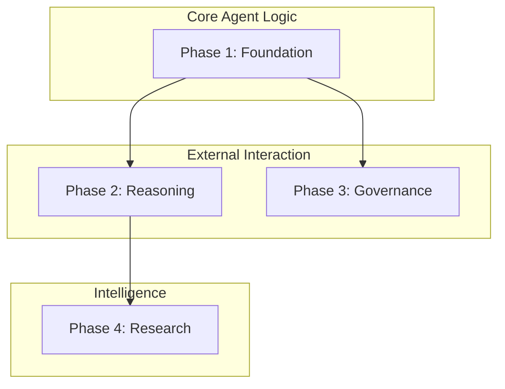

# Mosaic Fund Agent - LangGraph Roadmap

This project board outlines the transition of the Mosaic Fund Agent from linear scripts to a stateful, multi-agent system powered by LangGraph.

## 🛠 Setup & Infrastructure

Run these commands to prepare the repository for the LangGraph migration:

```bash
# 1. Create custom labels
gh label create "langgraph" --color "534AB7" --description "LangGraph agent graph work"
gh label create "agent"     --color "993C1D" --description "Agent orchestration"
gh label create "risk"      --color "D93F0B" --description "Risk management"
gh label create "cli"       --color "006B75" --description "CLI enhancements"
gh label create "research"  --color "FBCA04" --description "Macro research loops"

# 2. Create milestones
gh milestone create --title "Phase 1: Stateful Foundation"
gh milestone create --title "Phase 2: Dynamic Reasoning"
gh milestone create --title "Phase 3: Governance & Control"
gh milestone create --title "Phase 4: Advanced Research"
```

---

## 🗺 Milestone Plan

### Phase 1: Stateful Foundation 🏗️
*Goal: Move core portfolio logic into a stateful graph with retry capabilities.*
- **Task:** Rewrite `portfolio_agent.py` as a LangGraph stateful graph.
- **Key Features:** Per-holding retry logic, state persistence via SQLite.
- **Issue:** #1

### Phase 2: Dynamic Reasoning 🧠
*Goal: Enable the CLI to reason and use tools dynamically.*
- **Task:** Upgrade `ask` CLI command to a full LangGraph ReAct agent.
- **Key Features:** ClickHouse tool calling, live iNAV fetching, multi-step reasoning.
- **Issue:** #3

### Phase 3: Governance & Control ⚖️
*Goal: Add safety gates for execution.*
- **Task:** Add human-in-the-loop approval gate to Risk Governor.
- **Key Features:** `interrupt()` for trade approvals, revision loops, persistent checkpointers.
- **Issue:** #2

### Phase 4: Advanced Research 🔍
*Goal: Implement iterative loops for high-confidence signals.*
- **Task:** Multi-step macro research loop for `signal_aggregator`.
- **Key Features:** Iterative fetching until confidence > 0.75, pillar-specific research.
- **Issue:** #4

---

## 🔗 Dependency Map



## 📋 Project Board Configuration

1. **Go to:** `github.com/Mosaic-agent/Mosaic-fund-agent/projects/new`
2. **Template:** Table or Board
3. **Columns:** `Backlog` → `Ready` → `In Progress` → `In Review` → `Done`
4. **Automation:** Link the issues above to the respective milestones and columns.

## ✅ Acceptance Criteria for All Graphs
- [ ] State defined as `TypedDict`
- [ ] Hard loop guards (max 5-10 iterations)
- [ ] Unit tests for each node function (isolated)
- [ ] Integration tests for the compiled graph
- [ ] LangSmith tracing enabled
