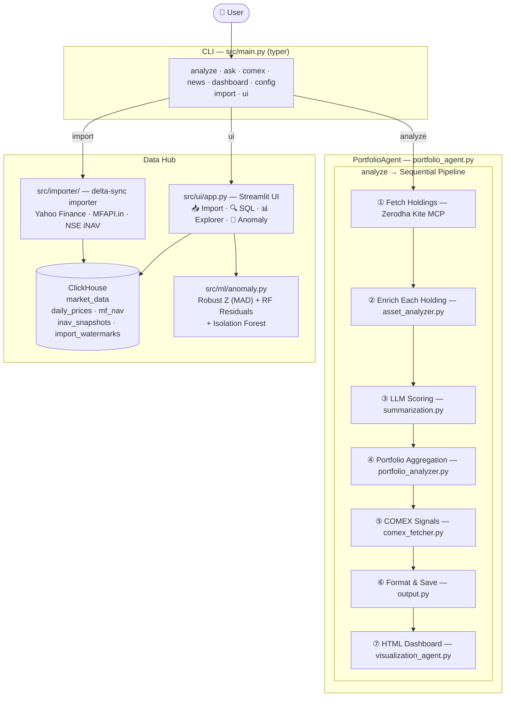

# Portfolio Insight

Ask your Zerodha portfolio a question. Get an actual answer.

This agent pulls your live holdings from Zerodha Kite, looks up recent news and
quarterly results for each stock, checks COMEX metals prices before the Indian
market opens, writes a plain-English report — with risk scores, sector
breakdown, and ETF premium/discount analysis baked in — and generates a
**self-contained HTML dashboard** that auto-refreshes every 5 minutes.

A built-in **Streamlit data hub** lets you import and store historical OHLCV,
MF NAV, and live iNAV data in ClickHouse, run arbitrary SQL against it, and run
**composite anomaly detection** (Robust Z-Score + Random Forest Residuals +
Isolation Forest) directly through a browser UI — no code required.

No spreadsheets. No manual data entry. One command.

> **Not financial advice.** This is a personal research tool.
> Always verify before acting on any output.

---

## Why I built this

I kept forgetting to check whether GOLDBEES was trading at a premium before
buying more. I also wanted to know — at a glance — whether any of my holdings
had bad news in the last week without opening ten browser tabs.

This does both, plus a few things I didn't originally plan for (COMEX signals
turned out to be genuinely useful context before 9:15 AM IST, and the anomaly
detector has already flagged two meaningful gold flash-crash days).

---

## What it does

### Portfolio Intelligence (original)

1. Fetches your holdings from Zerodha via the free hosted Kite MCP server
2. For each stock: pulls price data, recent news, and the latest quarterly results
3. For each ETF: fetches live iNAV from NSE and calculates premium/discount
4. Checks COMEX spot prices (Gold, Silver, Copper, Platinum, Palladium) vs
   the previous close — useful context before NSE opens
5. Scores each holding on risk (1–10) and sentiment (−1 to +1)
6. Writes a terminal report and saves a JSON file to `./output/`
7. Generates a self-contained HTML dashboard with interactive charts, auto-refresh,
   and holding deep-dives

### Data Hub + Anomaly Detection (new)

8. **Historical importer** — pulls 2 years of OHLCV from Yahoo Finance (stocks,
   ETFs, commodities, indices), MF NAV from MFAPI.in (AMFI official), and live
   iNAV snapshots from NSE into **ClickHouse** (`market_data` database)
9. **Streamlit UI** (`localhost:8501`) — five tabs:
   - **📥 Import** — trigger category imports with live log output
   - **🔍 SQL Query** — ad-hoc SQL editor with 20+ presets, CSV export, and
     **Bulk Table Export** (CSV or Parquet) for all 9 tables
   - **📊 Explorer** — interactive charts: COMEX Gold, GOLDBEES NAV vs market,
     premium/discount, iNAV time-series, COT positioning, ETF AUM flows,
     central bank reserves, FX rates (rebased index + rolling correlation)
   - **🔬 Anomaly Detection** — composite ML pipeline (see below)
   - **🕵️ Who Is Selling?** — real-time sell-off attribution + LightGBM forecast
10. **Who Is Selling?** (`src/tools/who_is_selling_agent.py`) — identifies *which*
    market segment is driving a gold sell-off:
    - 🇮🇳 **Retail Panic** — USDINR +3% in 60d AND GOLDBEES discount < −1%
    - 🏦 **Institutional Exit** — GLD AUM proxy −3% in 30d
    - 📋 **Speculator Crowding** — MM Net / OI > 25%
    - 🌍 **CB Accumulation** — USDCNY stable AND WTI > $80
    - Outputs a **regime** (RETAIL_PANIC / INSTITUTIONAL_EXIT / OVERLEVERED_LONGS /
      SHORT_SQUEEZE_SETUP / CB_ACCUMULATION / MIXED / NEUTRAL) + recommendation
11. **LightGBM 5-day forward return predictor** (`src/ml/trend_predictor.py`) —
    soft-threshold complement to the expert system:
    - **9 alpha features**: COT leverage, GOLDBEES spread, GLD AUM momentum,
      USDINR vol (14d), USDINR trend (60d), price momentum (5d/20d), MA ratio,
      spread delta
    - **Walk-forward CV**: `TimeSeriesSplit` — no look-ahead leakage
    - **Regime signals**: BUY / WATCH_LONG / HOLD / WATCH_SHORT / SELL
    - **Persists** every prediction to `market_data.ml_predictions` (ClickHouse)
      and `predictions_log.jsonl` (git-trackable) — enables accuracy scoring
      5 trading days later via the SQL preset
    - Requires ≥ 120 clean training rows; uses coverage-aware NaN filter so
      sparse `etf_aum` column doesn't eliminate rows
12. **Composite anomaly detection** (`src/ml/anomaly.py`) — three-step pipeline:
    - **Robust Z-Score (MAD)** — rolling median/MAD instead of mean/σ; immune
      to trending price inflation that causes standard Z to miss crashes
    - **Random Forest Residual Z** — trains RF on lagged prices + MA7/MA30;
      the residual isolates the *unexpected* component; Z_resid classifies
      regime (Strong Trend / Flash Crash / Volatile Breakout / Normal)
    - **Isolation Forest Confidence Multiplier** — `Final_Z = Z_robust × (1 + IF_confidence)`;
      boosts days suspicious to both algorithms, filtering noise
    - Output: price chart with colour-coded regime dots, Z decomposition chart,
      IF confidence area chart, RF actual vs predicted, downloadable anomaly CSV

All data sources are free. The only paid component is the LLM call — roughly
₹4–12 per full portfolio run on cloud models; free with a local model.

---

## Setup

### Prerequisites

- Python 3.11+
- A Zerodha account (for live portfolio; `--demo` mode needs nothing)
- One of: OpenAI API key, Anthropic API key, **or** a local LLM (LM Studio / Ollama)
- **Docker** — for ClickHouse (required only for the data hub / anomaly features)

### Install

```bash
git clone https://github.com/Mosaic-agent/Mosaic-fund-agent.git
cd Mosaic-fund-agent
python3 -m venv .venv
source .venv/bin/activate
pip install -r requirements.txt
```

### Configure

```bash
cp .env.example .env
# open .env and fill in your keys
```

The keys you need to get started:

```
OPENAI_API_KEY=sk-...          # or use ANTHROPIC_API_KEY instead
NEWSAPI_KEY=...                # free at newsapi.org — 100 req/day
GOLD_API_KEY=...               # free at gold-api.com — for COMEX signals
```

**Using a local model (LM Studio / Ollama)?** Set these instead:

```
LLM_BASE_URL=http://localhost:1234/v1   # your local server URL
LLM_MODEL=DeepSeek-R1-Distill-Qwen-14B-GGUF
LLM_CONTEXT_WINDOW=4096
```

### Start ClickHouse (for data hub features)

```bash
docker compose up clickhouse -d
# ClickHouse is now at localhost:8123, database: market_data
```

Check your config:

```bash
python src/main.py config
```

---

## Running it

### Portfolio analysis

```bash
# Demo (no Zerodha login, no API keys needed)
python src/main.py analyze --demo

# Live portfolio
python src/main.py analyze
python src/main.py analyze --max 3   # test with 3 holdings first
```

### HTML Dashboard

```bash
python src/main.py dashboard
```

### Ask a question

```bash
python src/main.py ask "which of my holdings has the worst news sentiment?"
python src/main.py ask "am I overexposed to IT sector?"
python src/main.py ask "which ETFs are trading at a premium right now?"
```

### COMEX pre-market signals

```bash
python src/main.py comex
```

### News sentiment for a single stock

```bash
python src/main.py news RELIANCE
python src/main.py news GOLDBEES --company "Nippon India Gold BeES"
```

### Other options

```bash
python src/main.py analyze --quiet        # JSON + dashboard only, no terminal display
python src/main.py analyze --no-dashboard # skip HTML generation
python src/main.py config                 # show current settings (masked)
```

---

## Data Hub + Streamlit UI

### Start the UI

```bash
# Via CLI
python src/main.py ui

# Or directly
streamlit run src/ui/app.py

# Via Docker Compose (UI + ClickHouse together)
docker compose up -d
```

Open **http://localhost:8501** in your browser.

### Import data from the command line

```bash
# Import 2 years of COMEX Gold
python src/main.py import --category commodities

# Import GOLDBEES ETF OHLCV + AMFI NAV
python src/main.py import --category etfs --category mf

# Live iNAV snapshot from NSE
python src/main.py import --category inav

# Full re-import (ignore watermarks)
python src/main.py import --category commodities --full

# Dry run (fetch but don't write)
python src/main.py import --category stocks --dry-run
```

Subsequent runs are **delta-synced** — only new data since the last import is
fetched (3-day overlap for late corrections).

### Supported import categories

| Category | Source | Symbols |
|---|---|---|
| `stocks` | Yahoo Finance (`.NS`) | 50 NSE large/mid-caps |
| `etfs` | Yahoo Finance (`.NS`) | 15 NSE ETFs |
| `commodities` | Yahoo Finance (futures) | Gold, Silver, Copper, Crude Oil, etc. |
| `indices` | Yahoo Finance | Nifty50, Sensex, S&P500, Nasdaq, etc. |
| `mf` | MFAPI.in (AMFI official) | NAV history for 13 ETF schemes |
| `inav` | NSE API (live) | 15 ETFs — iNAV + market price + premium/discount |
| `cot` | CFTC Socrata API (free) | Weekly Gold COT — Managed Money + Commercials positioning |
| `cb_reserves` | IMF IFS REST API (free) | Monthly gold reserves for 9 central banks (CN, IN, RU, US, DE, TR, GB, JP, PL) |
| `etf_aum` | Yahoo Finance (free) | Daily AUM snapshot for GLD, IAU, SGOL, PHYS + implied gold tonnes |
| `fx_rates` | Yahoo Finance (free) | Daily OHLC for USDINR, USDCNY, USDAED, USDSAR, USDKWD |

### ClickHouse tables

| Table | Engine | Purpose |
|---|---|---|
| `daily_prices` | ReplacingMergeTree | OHLCV for stocks, ETFs, commodities, indices |
| `mf_nav` | ReplacingMergeTree | Daily MF/ETF NAV from AMFI via MFAPI.in |
| `inav_snapshots` | ReplacingMergeTree | Live iNAV + premium/discount snapshots |
| `import_watermarks` | ReplacingMergeTree | Delta-sync watermarks per source+symbol |
| `cot_gold` | ReplacingMergeTree | Weekly CFTC COT — `mm_net`, `comm_net`, `open_interest` |
| `cb_gold_reserves` | ReplacingMergeTree | Monthly central bank gold reserves in metric tonnes |
| `etf_aum` | ReplacingMergeTree | Daily ETF AUM (USD) + implied gold tonnes |
| `fx_rates` | ReplacingMergeTree | Daily OHLC for 5 USD pairs (INR, CNY, AED, SAR, KWD) |
| `ml_predictions` | ReplacingMergeTree | LightGBM forecast log — `expected_return_pct`, `regime_signal`, `goldbees_close` per `(as_of, horizon_days)` |

---

## Anomaly Detection — How it works

The **🔬 Anomaly Detection** tab in the UI runs a three-step composite pipeline
on any symbol in ClickHouse.

### Step 1 — Robust Z-Score (MAD)

Standard Z inflates σ when prices trend, causing it to report near-zero on a
real crash (the high prices leading up to the crash bloat the standard deviation).

Rolling MAD Z stays centred on the local median and resists outlier inflation:

$$Z_{robust} = 0.6745 \times \frac{x - \tilde{x}_{rolling}}{\text{MAD}_{rolling}}$$

Applied to `daily_return %` and `range %` (high−low / close), averaged for a
combined `z_robust` score.

### Step 2 — Random Forest Residual Z-Score

Trains a Random Forest regressor on lagged close prices (`lag_1..lag_N`),
`MA7`, `MA30`, and lagged volume. The **residual** (actual − predicted)
isolates the unexpected component of each day's price move.

`Z_resid` is the rolling MAD Z-score of those residuals.

| `z_robust` | `z_resid` | Regime |
|---|---|---|
| High | Low | 📈 Strong Trend (HODL) — predictable uptrend |
| Low | High | ⚡ Flash Crash / Black Swan (EXIT) — unexpected shock |
| High | High | 🔥 Volatile Breakout — caution |
| Low | Low | ✅ Normal |

### Step 3 — Isolation Forest Confidence Multiplier

Isolation Forest is run on `[daily_return, range_pct, z_robust]`. Its
`score_samples` output is normalised to [0 → 1] (1 = most anomalous).

$$Z_{final} = Z_{robust} \times (1 + IF_{confidence})$$

This **boosts** days suspicious to both algorithms while filtering out noise
where only one signal fires.

### Configurable parameters

| Parameter | Default | Range | Effect |
|---|---|---|---|
| IF Contamination | 5% | 1–20% | Expected anomaly fraction |
| Final-Z threshold | 2.5 | 1.0–5.0 | Flagging sensitivity |
| RF lag features | 5 | 3–10 | How much history RF sees |
| Z-score rolling window | 30 | 10–60 | Rolling MAD lookback |

---

## HTML Dashboard

The dashboard is a **self-contained HTML file** — no Node.js, no build step,
no server required.

**Tech stack:** React 18 + Babel Standalone (CDN) + Tailwind CSS (CDN) + pure SVG charts.

**What it shows:**
- Header — portfolio metadata, COMEX signal badge, auto-refresh countdown (5 min)
- 4 metric cards — total value, total P&L (%), health score, ETF/equity split
- COMEX signals table — colour-coded STRONG BULLISH → STRONG BEARISH badges
- Sector allocation chart — horizontal bar chart (pure SVG)
- Holdings deep-dive — collapsible cards with price, P&L, risk/sentiment scores,
  iNAV analysis (ETFs), quarterly results, COMEX-linked alerts
- Portfolio Risks / Actionable Insights / Rebalancing Signals panels

---

## How it's built



### Project structure

```
├── config/
│   └── settings.py               # Pydantic settings (ClickHouse + LLM + API keys)
├── src/
│   ├── main.py                   # CLI — analyze, ask, dashboard, news, comex, config, import, ui
│   ├── agents/                   # portfolio, comex, news, visualization agents
│   ├── analyzers/                # asset_analyzer.py, portfolio_analyzer.py
│   ├── clients/
│   │   └── mcp_client.py         # Async Zerodha Kite MCP client (JSON-RPC 2.0)
│   ├── formatters/
│   │   └── output.py             # Rich terminal + JSON report
│   ├── importer/                 # Historical data importer module
│   │   ├── cli.py                # run_import() — delta-sync logic
│   │   ├── clickhouse.py         # ClickHouse schema DDL + bulk inserts + watermarks
│   │   ├── registry.py           # Symbol registry (stocks, ETFs, commodities, indices, MF, iNAV)
│   │   └── fetchers/
│   │       ├── yfinance_fetcher.py   # OHLCV via yfinance (batch, MultiIndex-safe)
│   │       ├── mfapi_fetcher.py      # MF NAV from MFAPI.in (AMFI official)
│   │       ├── nse_inav_fetcher.py   # Live iNAV snapshot from NSE API
│   │       ├── cot_fetcher.py        # CFTC COT Gold (hedge fund positioning)
│   │       ├── imf_reserves_fetcher.py  # IMF IFS central bank gold reserves
│   │       └── etf_aum_fetcher.py    # Gold ETF AUM snapshots (GLD, IAU, SGOL, PHYS)
│   ├── ml/
│   │   ├── anomaly.py            # Composite anomaly detection (Robust Z + RF + IsolationForest)
│   │   └── trend_predictor.py    # LightGBM 5-day forward return predictor
│   ├── models/
│   │   └── portfolio.py          # Pydantic models: Holding, Portfolio, Report
│   ├── tools/
│   │   ├── who_is_selling_agent.py  # 4-signal sell-off attribution + regime synthesis
│   │   └── ...                   # yahoo_finance, news, earnings, inav, comex, summarization
│   ├── ui/
│   │   └── app.py                # Streamlit 5-tab data hub UI
│   └── utils/                    # cache, symbol_mapper, report_loader, demo_data
├── tests/
│   ├── test_tools.py             # 11 unit tests (no API keys needed for 10/11)
│   ├── test_cache.py             # cache round-trip + TTL + speedup
│   ├── test_inav_cli.py          # iNAV scenarios (mocked)
│   ├── test_news_sentiment.py    # smoke test (live APIs)
│   └── _test_importer.py         # 7 integration tests against live ClickHouse
├── docker-compose.yml            # clickhouse + mosaic CLI + ui (Streamlit)
├── Dockerfile
├── .env.example
└── requirements.txt
```

---

## Data sources

| What | Where | Notes |
|---|---|---|
| Portfolio holdings | Zerodha Kite MCP (hosted) | Free, OAuth login |
| Stock / ETF / commodity OHLCV | Yahoo Finance `.NS`, `GC=F`, etc. | Free, no rate limit |
| Indian financial news | NewsAPI.org | Free: 100 req/day |
| Indian financial news | Google News RSS (GNews) | Free, no key |
| Quarterly results | Screener.in (scraped) | Free, polite delays |
| ETF iNAV — live | NSE API | Free, 15-second refresh |
| ETF iNAV — historic / NAV | MFAPI.in (AMFI official) | Free |
| COMEX spot prices | gold-api.com | Free with API key |
| COMEX previous close | Yahoo Finance futures | Free |
| CFTC COT (hedge fund positioning) | publicreporting.cftc.gov | Free, no auth |
| Central bank reserves | IMF IFS REST API | Free, no auth |
| Gold ETF AUM flows | Yahoo Finance (totalAssets) | Free |
| Historical storage | ClickHouse (Docker) | Free, self-hosted |
| LLM scoring | OpenAI / Anthropic / Local | ~₹4–12/run cloud; free local |

---

## ETF iNAV

- **Premium (> +0.25%)** — ETF more expensive than underlying. Wait before buying.
- **Discount (< −0.25%)** — ETF cheaper than underlying. Potential buying opportunity.
- **Fair value** — within ±0.25% of NAV.

Live iNAV from NSE API (9:15 AM – 3:30 PM IST). Yahoo Finance fallback outside hours.

Schedule periodic iNAV imports to build a time-series:

```bash
# crontab — every 15 min during market hours (IST)
*/15 9-15 * * 1-5 cd /path/to/project && .venv/bin/python src/main.py import --category inav

# COT — Fridays after 3:30 PM ET (CFTC release)
30 22 * * 5  cd /path/to/project && .venv/bin/python src/main.py import --category cot

# IMF reserves — monthly with ~6-week lag; run weekly to catch it
0 9 * * 1   cd /path/to/project && .venv/bin/python src/main.py import --category cb_reserves

# ETF AUM — daily after US market close
0 23 * * 1-5 cd /path/to/project && .venv/bin/python src/main.py import --category etf_aum

# ML forecast — daily after Indian market close (persists to ClickHouse + JSONL)
30 15 * * 1-5 cd /path/to/project && .venv/bin/python src/ml/trend_predictor.py
```

---

## COMEX pre-market signals

Fetches live spot Gold (XAU), Silver (XAG), Copper (HG), Platinum (XPT), and
Palladium (XPD) from gold-api.com vs previous close from Yahoo Finance futures.

Signal thresholds: `> +1.0%` STRONG BULLISH → `< -1.0%` STRONG BEARISH.

Signals surface in the terminal report, per-holding risk panels, and the HTML dashboard.

---

## Tests

```bash
# Unit tests (no API keys needed for 10/11)
python tests/test_tools.py

# Importer integration tests (requires ClickHouse running)
python tests/_test_importer.py
```

---

## Known limitations

- **NewsAPI free tier:** 100 requests/day. Top holdings by weight are prioritised.
- **Screener.in scraping:** Fragile to HTML layout changes; Yahoo Finance is the fallback.
- **iNAV outside market hours:** NSE API only live 9:15 AM – 3:30 PM IST.
- **COMEX coverage:** Only the 5 metals gold-api.com supports.
- **Local LLMs:** Models < 30B struggle with multi-turn tool orchestration.
  COMEX and news agents bypass LangGraph for local models automatically.
- **Anomaly detection:** Requires ≥ 60 rows per symbol in ClickHouse. Run
  an import first.
- **LightGBM forecast:** Requires ≥ 120 clean training rows (GOLDBEES + NAV + COT
  + FX). Use `--lookback 1000` on first import. CV R² is typically negative with
  < 2 years of data — improves as history accumulates.
- **ML predictions accuracy:** The `ml_predictions` accuracy SQL preset needs
  ≥ `horizon_days` of subsequent price data before it can show `actual_return_pct`.

---

## Configuration reference

```
# LLM
OPENAI_API_KEY          [SENSITIVE]
ANTHROPIC_API_KEY       [SENSITIVE]
LLM_PROVIDER            openai            # "openai" | "anthropic"
LLM_MODEL               gpt-4o-mini
LLM_BASE_URL                              # set for local model
LLM_CONTEXT_WINDOW      4096

# APIs
NEWSAPI_KEY             [SENSITIVE]
GOLD_API_KEY            [SENSITIVE]

# Zerodha MCP
KITE_MCP_URL            https://mcp.kite.trade/mcp
KITE_API_KEY            [SENSITIVE]       # only for self-hosted MCP
KITE_API_SECRET         [SENSITIVE]
KITE_MCP_TIMEOUT        30

# ClickHouse (data hub)
CLICKHOUSE_HOST         localhost
CLICKHOUSE_PORT         8123
CLICKHOUSE_DATABASE     market_data
CLICKHOUSE_USER         default
CLICKHOUSE_PASSWORD

# Behaviour
NEWS_ARTICLES_PER_STOCK 5
NEWS_LOOKBACK_DAYS      7
MAX_HOLDINGS_PER_RUN    0                 # 0 = no cap
SCRAPE_DELAY_SECONDS    2.0
OUTPUT_DIR              ./output
LOG_LEVEL               INFO
```

