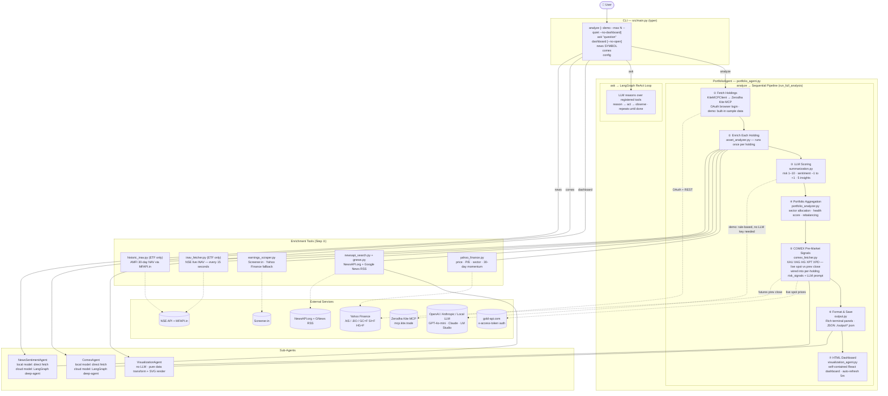

# Portfolio Insight

Ask your Zerodha portfolio a question. Get an actual answer.

This agent pulls your live holdings from Zerodha Kite, looks up recent news and
quarterly results for each stock, checks COMEX metals prices before the Indian
market opens, writes a plain-English report — with risk scores, sector
breakdown, and ETF premium/discount analysis baked in — and generates a
**self-contained HTML dashboard** that auto-refreshes every 5 minutes.

No spreadsheets. No manual data entry. One command.

> **Not financial advice.** This is a personal research tool.
> Always verify before acting on any output.

---

## Why I built this

I kept forgetting to check whether GOLDBEES was trading at a premium before
buying more. I also wanted to know — at a glance — whether any of my holdings
had bad news in the last week without opening ten browser tabs.

This does both, plus a few things I didn't originally plan for (COMEX signals
turned out to be genuinely useful context before 9:15 AM IST).

---

## What it does

1. Fetches your holdings from Zerodha via the free hosted Kite MCP server
2. For each stock: pulls price data, recent news, and the latest quarterly results
3. For each ETF: fetches live iNAV from NSE and calculates premium/discount
4. Checks COMEX spot prices (Gold, Silver, Copper, Platinum, Palladium) vs
   the previous close — useful context before NSE opens
5. COMEX signals are wired into per-holding risk signals and the portfolio
   summary so the LLM has commodity context when scoring
6. Scores each holding on risk (1–10) and sentiment (−1 to +1)
7. Writes a terminal report and saves a JSON file to `./output/`
8. **Generates a self-contained HTML dashboard** (`./output/dashboard.html`)
   with interactive charts, auto-refresh countdown, and holding deep-dives

All data sources are free. The only paid component is the LLM call
(OpenAI, Anthropic, or any local OpenAI-compatible model) — roughly ₹4–12
per full portfolio run on cloud models; free with a local model.

---

## Setup

### Prerequisites

- Python 3.11+
- A Zerodha account
- One of: OpenAI API key, Anthropic API key, **or** a local LLM via LM Studio /
  Ollama / any OpenAI-compatible server

### Install

```bash
git clone https://github.com/Mosaic-agent/Mosaic-fund-agent.git
cd Mosaic-fund-agent
python3 -m venv .venv
source .venv/bin/activate
pip install -r requirements.txt
```

### Configure

```bash
cp .env.example .env
# open .env and fill in your keys
```

The keys you need to get started:

```
OPENAI_API_KEY=sk-...          # or use ANTHROPIC_API_KEY instead
NEWSAPI_KEY=...                # free at newsapi.org — 100 req/day
GOLD_API_KEY=...               # free at gold-api.com — for COMEX signals
```

**Using a local model (LM Studio / Ollama)?** Set these instead:

```
LLM_BASE_URL=http://localhost:1234/v1   # your local server URL
LLM_MODEL=DeepSeek-R1-Distill-Qwen-14B-GGUF  # or any local model name
LLM_CONTEXT_WINDOW=4096                 # set to your model's context window
```

When `LLM_BASE_URL` is set, COMEX and news agents skip LangGraph entirely and
call tool functions directly — bypassing the multi-turn loop that small local
models struggle with.

Kite API key and secret are **not required** — the hosted MCP server handles
auth via browser OAuth.

Check your config looks right before running (sensitive values are masked):

```bash
python src/main.py config
```

---

## Running it

### Try the demo first

No Zerodha login needed. Uses a sample portfolio (GOLDBEES + RELIANCE) with
real live data from Yahoo Finance, NSE, and Screener.in:

```bash
python src/main.py analyze --demo
```

This also auto-generates `./output/dashboard.html` at the end.

### Your real portfolio

```bash
python src/main.py analyze
```

First run will print a Zerodha login URL. Open it in your browser, log in,
then press Enter. Session persists until Kite expires it.

Test with a few holdings first:

```bash
python src/main.py analyze --max 3
```

### HTML Dashboard

```bash
python src/main.py dashboard
```

Reads the latest JSON report and opens `./output/dashboard.html` in your
browser. The dashboard auto-refreshes every 5 minutes.

The `analyze` command generates the dashboard automatically. To skip it:

```bash
python src/main.py analyze --no-dashboard
```

### Ask a question

```bash
python src/main.py ask "which of my holdings has the worst news sentiment?"
python src/main.py ask "am I overexposed to IT sector?"
python src/main.py ask "which ETFs are trading at a premium right now?"
```

### COMEX pre-market signals only

```bash
python src/main.py comex
```

### News sentiment for a single stock

```bash
python src/main.py news RELIANCE
python src/main.py news GOLDBEES --company "Nippon India Gold BeES"
```

### Other options

```bash
python src/main.py analyze --quiet        # JSON + dashboard only, no terminal display
python src/main.py analyze --max 5        # cap at 5 holdings
python src/main.py dashboard --no-open    # generate dashboard without opening browser
python src/main.py config                 # show current settings (masked)
```

Reports are saved to `./output/portfolio_report_YYYYMMDD_HHMMSS.json`.

---

## HTML Dashboard

The dashboard is a **self-contained HTML file** — no Node.js, no build step,
no server required. Open it in any modern browser.

**What it shows:**

- **Header** — portfolio metadata, COMEX overall signal badge, and a live
  countdown to the next auto-refresh (default: 5 minutes, calls `location.reload()`)
- **4 metric cards** — total value, total P&L (%), health score, ETF/equity
  allocation split
- **COMEX signals table** — live commodity signals with colour-coded
  STRONG BULLISH → STRONG BEARISH badges and linked NSE ETFs
- **Sector allocation chart** — horizontal bar chart (pure SVG, no external
  chart library)
- **Holdings deep-dive** — collapsible cards per holding showing:
  - Current price, quantity, P&L %, recommendation badge
  - Risk score (colour-coded), sentiment score
  - Key insights + risk signals (including COMEX-linked alerts)
  - Quarterly results (revenue, net profit, EPS with YoY change)
  - iNAV analysis (ETFs only) — current premium/discount label
  - Historic iNAV chart — iNAV vs market price area chart + premium/discount
    % bar chart over the last 30 days (pure SVG)
  - COMEX-linked commodity badges
- **Portfolio Risks / Actionable Insights / Rebalancing Signals** — three
  bullet-list panels at the bottom

**Tech stack:** React 18 + Babel Standalone (CDN) + Tailwind CSS (CDN) +
pure SVG charts. No Recharts, no bundler, no server.

---

## How it's built



> Source: [docs/architecture.mmd](docs/architecture.mmd)

### How the agent is orchestrated

`PortfolioAgent` has two distinct execution modes depending on which CLI
command you run:

**`analyze` — sequential pipeline (`run_full_analysis`)**

The main workflow is a direct, ordered pipeline — not a ReAct loop. Each step
runs once and passes its output to the next:

1. **Fetch holdings** — `KiteMCPClient` calls the hosted Zerodha Kite MCP
   server over HTTP. OAuth browser login on first run; session cached after.
   `--demo` bypasses this entirely using a hardcoded sample portfolio.

2. **Enrich each holding** — `asset_analyzer.py` runs a sub-pipeline per
   holding: Yahoo Finance for price/sector data, multi-source news (NewsAPI +
   Google News RSS), Screener.in for quarterly results, and (for ETFs only)
   the NSE iNAV API plus 30-day AMFI history from MFAPI.in.

3. **LLM scoring** — `summarization.py` calls the configured LLM with the
   enriched data and returns a risk score (1–10), sentiment score (−1 to +1),
   five key insights, and a one-paragraph summary per holding. In `--demo`
   mode this is replaced by rule-based scoring — no API key needed.

4. **Portfolio aggregation** — `portfolio_analyzer.py` rolls up all scored
   holdings into sector allocation, concentration risk, a health score (0–100),
   and rebalancing suggestions.

5. **COMEX signals** — `ComexAgent` fetches live spot prices and classifies
   each commodity. Signals are injected into per-holding `risk_signals` (e.g.
   "COMEX 🥇Gold (XAU) STRONG BULLISH +2.65% — pre-market tailwind") and
   into the portfolio-level LLM prompt for richer analysis.

6. **Output** — `output.py` renders Rich terminal panels and writes a JSON
   report to `./output/`.

7. **Dashboard** — `VisualizationAgent` reads the report dict, strips/converts
   all monetary strings to floats, null-guards ETF-only fields, and renders
   `./output/dashboard.html`. Opened in the browser automatically unless
   `--no-dashboard` is passed.

**`ask` — LangGraph ReAct loop**

The `ask` command uses a proper ReAct (Reason + Act) agent built with
LangGraph. The LLM is given all registered tools (Yahoo Finance, news search,
earnings, iNAV) and loops — reasoning about which tool to call next, observing
the result, and reasoning again — until it has enough information to answer
the question.

**Local model path — bypassing LangGraph**

Small local models (< 30B parameters) cannot reliably follow "call this tool
once then stop" instructions in a multi-turn loop. When `LLM_BASE_URL` is set,
`ComexAgent` and `NewsSentimentAgent` detect `is_local_model = True` and skip
LangGraph entirely — tool functions are called directly, no LLM involved.
Cloud model path is unchanged.

Config lives in `config/settings.py`. Every field is annotated
`# [SENSITIVE]` or `# [NON-SENSITIVE]`. Sensitive fields come exclusively
from `.env` — never hardcoded. `.env` is in `.gitignore`.

### Project structure

```
portfolio_insight/
├── config/
│   └── settings.py               # Pydantic settings — all fields annotated
├── src/
│   ├── main.py                   # CLI entry point (analyze, ask, dashboard, news, comex, config)
│   ├── clients/
│   │   └── mcp_client.py         # Async HTTP client for Kite MCP
│   ├── models/
│   │   └── portfolio.py          # Pydantic models: Holding, Portfolio, Report
│   ├── tools/
│   │   ├── zerodha_mcp_tools.py  # get_holdings, get_positions
│   │   ├── yahoo_finance.py      # price, sector, momentum
│   │   ├── newsapi_search.py     # NewsAPI.org
│   │   ├── gnews.py              # Google News RSS
│   │   ├── earnings_scraper.py   # Screener.in + Yahoo Finance fallback
│   │   ├── inav_fetcher.py       # NSE live iNAV (ETFs only)
│   │   ├── historic_inav.py      # AMFI 30-day NAV history (ETFs only)
│   │   ├── comex_fetcher.py      # COMEX signals via gold-api.com
│   │   └── summarization.py      # LLM scoring
│   ├── agents/
│   │   ├── portfolio_agent.py    # main orchestration
│   │   ├── comex_agent.py        # COMEX sub-agent (local: direct / cloud: LangGraph)
│   │   ├── news_sentiment_agent.py # news sub-agent (local: direct / cloud: LangGraph)
│   │   └── visualization_agent.py  # HTML dashboard generator (no LLM)
│   ├── analyzers/
│   │   ├── asset_analyzer.py     # per-holding enrichment
│   │   └── portfolio_analyzer.py # portfolio-level aggregation
│   ├── formatters/
│   │   └── output.py             # terminal + JSON output
│   └── utils/
│       ├── symbol_mapper.py      # NSE ↔ Yahoo Finance ↔ company name
│       ├── report_loader.py      # load latest JSON report for ask()
│       └── demo_data.py          # sample portfolio for --demo mode
├── tests/
│   └── test_tools.py             # 11 tests
├── output/                       # generated reports + dashboard (git-ignored)
├── .env.example
└── requirements.txt
```

---

## Data sources

Everything is free except the LLM:

| What | Where | Notes |
|---|---|---|
| Portfolio holdings | Zerodha Kite MCP (hosted) | Free, OAuth login |
| Stock prices, P/E, sector | Yahoo Finance `.NS` / `.BO` | Free, no rate limit |
| Indian financial news | NewsAPI.org | Free tier: 100 req/day |
| Indian financial news | Google News RSS (GNews) | Free, no key needed |
| Quarterly results | Screener.in (scraped) | Free, polite rate-limiting applied |
| ETF iNAV — live | NSE API | Free, updates every 15s during market hours |
| ETF iNAV — historic (30d) | MFAPI.in (official AMFI data) | Free |
| COMEX spot prices | gold-api.com | Free with API key |
| COMEX previous close | Yahoo Finance futures (GC=F etc.) | Free |
| LLM scoring | OpenAI / Anthropic / Local LLM | ~₹4–12/run cloud; free local |

NewsAPI free tier caps at 100 requests/day. If you have more than ~15 holdings,
the agent prioritises by portfolio weight so you don't blow the limit before
covering your larger positions.

---

## ETF iNAV

For ETF holdings, the agent checks whether the ETF is trading at a premium or
discount to its indicative NAV:

- **Premium (> +0.25%)** — ETF is more expensive than the underlying. Worth
  waiting before buying more.
- **Discount (< −0.25%)** — ETF is cheaper than the underlying. Can be a
  buying opportunity.
- **Fair value** — within ±0.25% of NAV. Nothing to act on.

During market hours, iNAV comes from the NSE API (15-second refresh). Outside
hours it falls back to Yahoo Finance's delayed navPrice — so the
premium/discount figure will be less meaningful after 3:30 PM IST.

The 30-day historic iNAV shows a sparkline (`▁▂▄▇█`), trend direction
(WIDENING / NARROWING / STABLE), and the dates of peak premium and discount
over the period. The dashboard renders this as an interactive SVG area chart
(iNAV vs market price) plus a green/red bar chart for the daily P/D %.

Supported ETFs: GOLDBEES, NIFTYBEES, BANKBEES, SILVERBEES, JUNIORBEES,
LIQUIDBEES, HNGSNGBEES, MAFANG, MAHKTECH, and others. Unknown ETF symbols
are detected automatically via Yahoo Finance `quoteType`.

---

## COMEX pre-market signals

Before Indian markets open, metals prices on COMEX are often the most useful
leading indicator — especially if you hold gold/silver ETFs.

The agent fetches live spot prices for Gold (XAU), Silver (XAG), Copper (HG),
Platinum (XPT), and Palladium (XPD) from gold-api.com, compares them to the
previous trading day's close from Yahoo Finance futures, and classifies each:

```
> +1.0%   STRONG BULLISH
> +0.3%   BULLISH
± 0.3%   NEUTRAL
< -0.3%   BEARISH
< -1.0%   STRONG BEARISH
```

COMEX signals are surfaced in three places:

1. **Terminal report** — at the top of every `analyze` run
2. **Per-holding risk signals** — e.g. "COMEX 🥇Gold (XAU) STRONG BULLISH
   +2.65% — pre-market tailwind for GOLDBEES"
3. **Dashboard** — colour-coded signals table with NSE ETF linkages

All fields from the external API are validated before use — symbol whitelist,
positive-float price check, string length cap, and regex guard for
prompt-injection patterns.

---

## Output format

**Terminal report panels:**
- COMEX pre-market signals (shown first)
- Portfolio overview: total value, P&L, health score, diversification score
- Per-holding: current price, sector, sentiment, risk, key insights, latest news
- iNAV panel per ETF: premium/discount %, sparkline, 30-day trend
- Sector allocation breakdown + rebalancing suggestions

**JSON report** saved to `./output/portfolio_report_YYYYMMDD_HHMMSS.json`:
- `portfolio_summary` — value, P&L, health/diversification scores
- `holdings_analysis` — full per-holding data including iNAV and historic records
- `sector_allocation` — `{ "Sector": weight_pct, ... }`
- `portfolio_risks`, `actionable_insights`, `rebalancing_signals`
- `comex_signals` — live commodity data with NSE ETF linkages

**HTML dashboard** saved to `./output/dashboard.html` — see [HTML Dashboard](#html-dashboard) above.

---

## Tests

```bash
python tests/test_tools.py
```

11 tests. Tests 1–10 run without any API keys. Test 11 (COMEX live prices)
needs `GOLD_API_KEY` and skips gracefully without it.

```
TEST 1:  Yahoo Finance         live price, sector, momentum
TEST 2:  Symbol mapper         NSE ↔ Yahoo ↔ company name
TEST 3:  Earnings scraper      Screener.in + Yahoo fallback
TEST 4:  News (no key)         graceful empty return
TEST 5:  Portfolio models      P&L, ETF detection, totals
TEST 6:  Sector allocation     concentration risk, diversification score
TEST 7:  Config masking        sensitive field warnings
TEST 8:  iNAV fetcher          live iNAV, premium/discount, batch
TEST 9:  iNAV boundaries       11 PREMIUM/DISCOUNT/FAIR VALUE edge cases
TEST 10: Historic iNAV         30-day AMFI data, sparkline, trend
TEST 11: COMEX signals         live XAU/XAG/HG + prompt-injection guards

11 passed, 0 failed
```

---

## Known limitations

- **NewsAPI free tier:** 100 requests/day. With a large portfolio, not every
  stock gets news — top holdings by weight are prioritised.
- **Screener.in scraping:** HTML scraping occasionally breaks when they update
  their layout. Yahoo Finance financials is the fallback.
- **iNAV outside market hours:** NSE iNAV API is only live 9:15 AM – 3:30 PM IST.
  The Yahoo Finance fallback is less accurate outside those hours.
- **COMEX coverage:** Only the 5 commodities gold-api.com supports (XAU, XAG,
  HG, XPT, XPD). No crude oil or agri commodities.
- **Local LLMs:** Models below ~30B parameters struggle with multi-turn tool
  orchestration. The `is_local_model` bypass handles this for COMEX and news
  agents but the main `ask` ReAct loop still benefits from a larger model.
- **LLM consistency:** Scores and summaries can vary slightly between runs on
  identical data. Normal LLM behaviour.

---

## Configuration reference

```
OPENAI_API_KEY          [SENSITIVE]   OpenAI key
ANTHROPIC_API_KEY       [SENSITIVE]   alternative to OpenAI
LLM_PROVIDER            openai        "openai" or "anthropic"
LLM_MODEL               gpt-4o-mini
LLM_BASE_URL                          set for local model (LM Studio / Ollama)
LLM_CONTEXT_WINDOW      4096          model context window — drives token budgets
NEWSAPI_KEY             [SENSITIVE]   newsapi.org free key
GOLD_API_KEY            [SENSITIVE]   gold-api.com free key
KITE_MCP_URL            https://mcp.kite.trade/mcp
KITE_API_KEY            [SENSITIVE]   only for self-hosted MCP
KITE_API_SECRET         [SENSITIVE]   only for self-hosted MCP
KITE_MCP_TIMEOUT        30            seconds
NEWS_ARTICLES_PER_STOCK 5
NEWS_LOOKBACK_DAYS      7             max 30 on free tier
MAX_HOLDINGS_PER_RUN    0             0 = no cap
SCRAPE_DELAY_SECONDS    2.0           be polite to Screener.in
OUTPUT_DIR              ./output
LOG_LEVEL               INFO
```

`LLM_CONTEXT_WINDOW` drives three derived settings (visible in `config` command):
- `llm_token_budget` = `max(1024, context_window / 4)` — max output tokens per LLM call
- `llm_prompt_budget` = `context_window * 3` chars — max prompt content per call
- `is_local_model` = `True` when `LLM_BASE_URL` is set

Recommended values: `8192` for 8B models, `32768` for 32B models,
`131072` for 70B+ models or cloud APIs.

---

## Disclaimer

This tool is for personal research only. It is not financial advice.
The author is not responsible for investment decisions made using this output.
Always do your own research before buying or selling any security.

