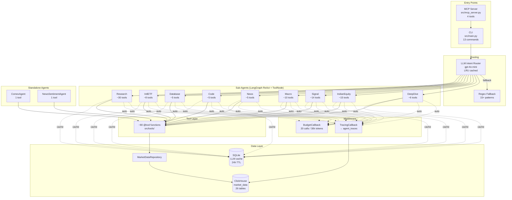

# Agent Architecture

> Last updated: 2026-06-05

This document details the multi-agent orchestration layer of the Mosaic Fund Agent platform. For the broader system architecture (data pipeline, ClickHouse schema, ML, tools), see [architecture.md](architecture.md).

---

## Overview

The platform uses a **Multi-Agent Orchestrator** pattern built on [LangGraph](https://langchain-ai.github.io/langgraph/) `create_react_agent`. A main `MosaicFundAgent` delegates user queries to 10 specialised sub-agents via an **LLM-based Intent Router**, with middleware for **tracing** and **budget enforcement** on every invocation.

```
User Query
    │
    ▼
┌─────────────────────────────┐
│  Intent Router              │
│  (LLM classifier →          │
│   regex fallback)           │
│  src/agents/intent_router.py│
└──────────┬──────────────────┘
           │  intent: "signal" | "macro" | "deepdive" | …
           ▼
┌──────────────────────────────────────────────────┐
│  run_subagent_for(question)                      │
│  src/agents/sub_agents.py                        │
│                                                  │
│  Middleware auto-attached:                        │
│  ┌───────────────────┐  ┌─────────────────────┐  │
│  │ TracingCallback    │  │ BudgetCallback      │  │
│  │ → agent_traces     │  │ 20 calls / 30k tok  │  │
│  │   table            │  │ / 180s wall-clock   │  │
│  └───────────────────┘  └─────────────────────┘  │
│                                                  │
│  Sub-Agent (lazy-init LangGraph ReAct)           │
│  ┌──────────┐ ┌──────────┐ ┌──────────┐         │
│  │ToolNode  │ │System    │ │LLM       │         │
│  │(parallel)│ │Prompt    │ │(local or │         │
│  │          │ │+ rules   │ │ cloud)   │         │
│  └──────────┘ └──────────┘ └──────────┘         │
└──────────────────────────────────────────────────┘
           │
           ▼
       Response (Markdown text)
```

---

## Intent Router

**File:** `src/agents/intent_router.py`

The router classifies free-form user questions into one of 10 intents, which map 1:1 to sub-agents.

### LLM Router (primary)

- Model: `gpt-4o-mini` (OpenAI) / `claude-haiku-4` (Anthropic) / `gemini-2.0-flash` (Google)
- Cost: ~$0.0001 per classification
- JSON-mode output: `{"intent": "signal", "confidence": 0.92}`
- LRU cache: 256 entries keyed by question hash — repeat questions are free
- `clear_intent_cache()` provided for testing

### Regex Router (fallback)

- **File:** `src/agents/sub_agents.py` → `route_intent()`
- 15+ compiled regex patterns (e.g. `_SIGNAL_RE`, `_DEEPDIVE_RE`, `_MACRO_RE`)
- Activates when: no cloud API key configured, LLM call fails, or network error
- Deterministic, zero-cost, zero-latency

### Intent → Sub-Agent Map

| Intent | Sub-Agent Class | Trigger Examples |
|---|---|---|
| `deepdive` | `DeepDiveSubAgent` | "10-K filing for AAPL", "SEC filings" |
| `india_equity` | `IndianEquityResearchSubAgent` | "research RELIANCE", "TCS quarterly results" |
| `signal` | `SignalSubAgent` | "today's GOLDBEES signal", "run pipeline", "composite score" |
| `macro` | `MacroSubAgent` | "COMEX pre-market", "FII flows today", "macro risks" |
| `news` | `NewsSubAgent` | "HDFC Bank news", "market sentiment" |
| `code` | `CodeSubAgent` | "run this Python", "query ClickHouse" |
| `database` | `DatabaseSubAgent` | "show schema", "watermark status", "row counts" |
| `intl_etf` | `IntlETFSubAgent` | "MAFANG performance", "Hang Seng premium" |
| `research` | `ResearchSubAgent` | "compare gold vs silver", "cross-asset analysis" |
| `main` | `MosaicFundAgent` (direct) | General / unclassifiable queries |

---

## Sub-Agent Base Class

**File:** `src/agents/sub_agents.py` → `_SubAgent`

All sub-agents inherit from `_SubAgent`, which provides:

```python
class _SubAgent:
    SYSTEM_PROMPT: str    # Domain-specific instructions (override in subclass)
    TOOLS: list           # Tool set (override in subclass)
    RECURSION_LIMIT: int  # Max LangGraph steps (default: 20)

    def _build()          # Lazy-init: create LLM + create_react_agent + ToolNode
    def run(question)     # Invoke the ReAct agent and return text
    def _fallback()       # Programmatic data gathering when LLM can't call tools
```

### Key design decisions

1. **Lazy initialisation** — LLM and agent are built on first `run()` call, not at import time
2. **Parallel tool execution** — `ToolNode` runs all tool calls from a single `AIMessage` concurrently via `ThreadPoolExecutor`
3. **Cloud upgrade** — If local model context window < 12,000 tokens, automatically promotes to cloud LLM
4. **Strategy fallback** — When LLM tool-calling fails entirely (e.g. gemma4 with 4k context), `_fallback()` collects data via direct Python function calls, then a single LLM synthesis call produces the narrative

---

## Sub-Agents

### DeepDiveSubAgent

- **Purpose:** US stock SEC filings (10-K/10-Q), XBRL financials, peer valuation
- **Tools (~6):** `resolve_company`, Yahoo Finance tools, earnings scraper, `run_deepdive_analysis`, `query_clickhouse_db`
- **Behaviour:** Starts with `resolve_company`; if Indian stock detected → redirects to `IndianEquityResearchSubAgent`

### IndianEquityResearchSubAgent

- **Purpose:** NSE/BSE company research — price, earnings, cashflow, holdings, news
- **Tools (~15):** `resolve_company`, Yahoo Finance, earnings, cashflow, MF holdings, FII/DII, news, `plot_price_chart`
- **Recursion limit:** 40 (needs more steps for parallel multi-tool batches)
- **Workflow:** Round 1 → resolve symbol; Round 2 → emit all data-fetching tools in parallel
- **Fallback:** `_gather_indian_equity_data()` — programmatic data collection

### SignalSubAgent

- **Purpose:** ETF composite scores, ML prediction, Kelly weights, GARCH vol-targeting, iNAV, and anomaly explanation
- **Tools (~15):** `run_daily_signal_composite`, `run_goldbees_pipeline`, `run_risk_governor_analysis`, `run_etf_news_sentiment`, `run_premium_alerts`, `get_live_inav`, `query_clickhouse_db`, `explain_price_anomalies`, 5× `plot_*` chart tools
- **Rule:** Never invent composite scores or regime labels — only narrate tool output
- **Anomaly tool:** `explain_price_anomalies` calls `run_composite_anomaly` (GARCH + IF + MAD-Z) on full OHLCV history, surfaces per-date `regime` + `Final Z`, correlates news, and appends ML forward context (`ml_prediction_asof`, `signal_composite_asof`) — always invoke `plot_price_chart` in parallel
- **Fallback (`_fallback`):** keyword-routed programmatic path for local models that can't emit tool-call JSON. Detects intent from the question and calls tools directly — *anomaly/spike/crash* → `explain_price_anomalies` + `plot_price_chart`; *signal/pipeline/goldbees* → `run_goldbees_pipeline`; *composite/score* → `run_daily_signal_composite`. Extracts symbol + time window (`30 days`, `3 months`, `1 year`) from the prompt, then runs an optional single LLM synthesis pass over the tool output.

### MacroSubAgent

- **Purpose:** COMEX pre-market, FII/DII flows, macro themes, geopolitics
- **Tools (~10):** `fetch_all_comex_signals`, `run_macro_theme_scanner`, `collate_news_sentiment`, `get_fii_dii_summary`, `plot_*` charts

### NewsSubAgent

- **Purpose:** Latest news headlines and sentiment per stock/ETF
- **Tools (~5):** `get_stock_news`, `get_newsapi_stock_news`, `get_etf_news_sentiment`, `query_clickhouse_db`

### CodeSubAgent

- **Purpose:** Ad-hoc Python execution and ClickHouse queries
- **Tools (~5):** `exec_python_snippet`, `query_clickhouse_db`, `import_symbol_data`, `run_data_engineering_importer`

### DatabaseSubAgent

- **Purpose:** ClickHouse schema inspection, watermarks, data freshness
- **Tools (~5):** `query_clickhouse_db`, `describe_schema`, `show_watermarks`, `query_raw_db_table`

### IntlETFSubAgent

- **Purpose:** International ETF analysis (MAFANG, HNGSNGBEES, Nasdaq 100)
- **Tools (~8):** `get_intl_etf_performance`, `get_intl_etf_premium`, `plot_intl_etf_*`

### ResearchSubAgent / AutonomousResearchAgent

- **Purpose:** Multi-domain cross-asset research combining fundamentals, ML, macro, news, MF holdings
- **Tools (~30):** Union of most tool sets
- **Use case:** Complex comparative questions ("gold vs silver positioning", "best ETF this quarter")

---

## Middleware

### TracingCallbackHandler

**File:** `src/agents/tracer.py`

Records every tool call and LLM invocation to `market_data.agent_traces` (ClickHouse).

| Column | Type | Description |
|---|---|---|
| `run_id` | String | 16-char hex per agent invocation |
| `agent` | String | Sub-agent intent (e.g. "signal") |
| `step_idx` | UInt16 | Sequential step within the run |
| `tool_name` | String | Tool function name |
| `latency_ms` | UInt32 | Wall-clock time for the step |
| `tokens_in` | UInt32 | Prompt tokens consumed |
| `tokens_out` | UInt32 | Completion tokens generated |
| `status` | String | "ok" or "error" |
| `error_class` | String | Exception class name (if failed) |

- **Best-effort writes** — errors are logged but never raised (tracing never blocks the agent)
- `log_trace()` helper for non-LangChain paths (e.g. router decisions)
- Table: `ReplacingMergeTree` partitioned by `toYYYYMM(created_at)`

### BudgetCallbackHandler

**File:** `src/agents/budget.py`

Enforces per-run resource limits. Raises `BudgetExceededError(RuntimeError)` on breach.

| Limit | Default | Purpose |
|---|---|---|
| `max_tool_calls` | 20 | Prevents runaway ReAct loops |
| `max_tokens` | 30,000 | Caps LLM spend per query |
| `max_wall_clock_s` | 180 | Hard timeout (3 minutes) |

**Per-tool caps** (`DEFAULT_TOOL_CAPS`):

| Tool | Max Calls | Rationale |
|---|---|---|
| `fetch_all_comex_signals` | 1 | Single-call design |
| `collate_news_sentiment` | 2 | At most 2 symbols |
| `run_pipeline` | 1 | Heavy ML workload |
| `run_deepdive_analysis` | 1 | Long-running SEC analysis |
| `run_data_engineering_importer` | 1 | Full import pipeline |

`.summary` property returns current usage: `{"tool_calls": 5, "tokens": 12340, "wall_clock_s": 22.1}`

### Middleware attachment

Both callbacks are **auto-attached** in `run_subagent_for()` — no per-agent wiring needed:

```python
# src/agents/sub_agents.py — run_subagent_for()
callbacks = [TracingCallbackHandler(run_id, agent=intent), BudgetCallbackHandler()]
answer = subagent.run(question, callbacks=callbacks)
```

---

## LLM Response Cache (SQLite)

**File:** `src/utils/llm_cache.py`

A **SQLite-backed cache** (`output/.cache/llm_cache.db`) stores LLM responses keyed by prompt hash, so identical questions return instantly without re-hitting the model.

| Property | Value |
|---|---|
| Backend | SQLite (single-file, no server) |
| TTL | 24h (configurable) |
| Scope | Per-prompt response cache, distinct from the in-memory intent-router LRU and the joblib ML-model cache |

This is the **second storage engine** in the platform: ClickHouse holds market data (the quant engines read it), SQLite holds LLM responses (the agent layer reads it). Cache state is shown at startup, e.g. `llm_cache: enabled · ttl=24h · live=178 entries · size=1228kB`.

---

## Mandatory Rules

### No LLM Calculations

Every agent system prompt includes the `NO_LLM_CALC_RULE` (defined in `src/agents/sub_agents.py`):

> **NEVER compute, estimate, or derive any number** (returns, ratios, averages, percentages, scores, sums, differences, CAGR, PE, Kelly fractions, etc.) inside your response. ALL numeric work MUST be performed by a tool call (Python, SQL, or a dedicated function). You may ONLY narrate or format numbers that were returned verbatim by a tool.

This rule is injected at three levels:
1. `SubAgent._build()` — appended to every sub-agent's `SYSTEM_PROMPT` automatically
2. `AGENT_SYSTEM_PROMPT` — main MosaicFundAgent prompt
3. `AGENT_SYSTEM_PROMPT_COMPACT` — compact fallback for local models
4. `COMEX_SYSTEM_PROMPT` and `NEWS_SENTIMENT_SYSTEM_PROMPT` — standalone agent prompts

### Tool Loop Protection

- COMEX agent: direct function call for local LLMs (bypasses ReAct loop)
- News agent: single `collate_news_sentiment()` call (not a multi-tool loop)
- Budget handler: hard cap at 20 tool calls per run

---

## Name Resolution & Spelling Correction

**File:** `src/tools/company_resolver.py`

Before any stock research or deep-dive, the system uses the `resolve_company` tool to resolve human queries (like "reliance", "welspun living", or "adanai") to canonical symbols (like `RELIANCE`, `WELSPUNLIV`, `ADANIENT`) and markets (`India` vs `US`). 

The resolution flow follows a multi-tiered pipeline:

1. **Fast Local Lookup**: Checks for exact matches and fuzzy matches (similarity $\ge 0.85$) against a local alias dictionary (`_ALIAS`) and registered company list (`SYMBOL_TO_COMPANY`).
2. **LLM Ticker Suggestion**: Prompts the LLM to suggest the exchange ticker symbol from its training knowledge.
3. **Exact Ticker Validation**: Queries Yahoo Finance Search with the LLM-suggested ticker. If a matching candidate is found, it uses it. If the suggested ticker does not exist as an exact match in the returned results, the suggestion is discarded, preventing incorrect mappings (e.g., mapping `"WELSPUN"` to `"WELENT"`).
4. **Yahoo Search & Word-Overlap Ranking**: Performs a Yahoo Finance query using the user's original raw text. Results are scored and sorted by a word-overlap similarity ratio to prioritize the best match (e.g. prioritizing `"WELSPUNLIV.NS"` over `"WELENT.NS"` for `"welspun living"`).
5. **ClickHouse ngramDistance Fallback**: If Yahoo search returns no results (common for typos like `"welspn living"`), the resolver queries ClickHouse `market_data.mf_holdings` (12,000+ unique stock names) using `ngramDistance`. If a close match is found ($\le 0.65$), it recursively restarts the search with the corrected name.
6. **Interactive User Confirmation & Pre-Resolution**:
   - **Environment Check**: If running in an interactive CLI session (indicated by the `MOSAIC_INTERACTIVE_CHAT == "1"` environment variable set inside `run_chat_loop`), the CLI prompts the user to confirm the resolved company. If rejected, the user can input the correct name and select from the top 3 LLM-suggested matching options.
   - **Pre-Resolution**: The chat REPL loop pre-resolves potential company subjects in the user query *before* generating the visual AI execution plan. This ensures that the plan panel printed to the terminal uses the correct user-accepted canonical symbol.
   - **Turn-Level Caching & Question Rewriting**: Exact symbol matches and symbols already resolved/confirmed in the current chat turn are automatically bypassed. All sub-agent delegation tools (`delegate_to_*_agent`) automatically rewrite the queries using `rewrite_delegation_question` to replace the raw subject text with the final corrected symbol. This ensures that sub-agents do not trigger duplicate prompt prompts in the same turn.
7. **Auto-Import**: If the resolved symbol is listed in India and is missing from the local ClickHouse database (`daily_prices`), it triggers a parallel data backfill before launching sub-agents.

---

## Standalone Agents

These agents run outside the sub-agent routing framework:

### ComexAgent (`src/agents/comex_agent.py`)

- **Purpose:** Pre-market commodity signals for XAU, XAG, XPT, XPD, HG
- **Local path:** Direct `get_comex_signals()` call (no agent loop)
- **Cloud path:** LangGraph ReAct with `recursion_limit=6`
- **Tool:** `fetch_all_comex_signals` (single-call design with internal call counter)

### NewsSentimentAgent (`src/agents/news_sentiment_agent.py`)

- **Purpose:** Multi-source news sentiment (NewsAPI + Google News)
- **Local path:** Direct `collate_news_sentiment()` call
- **Cloud path:** LangGraph ReAct with `recursion_limit=6`
- **Tool:** `collate_news_sentiment` (deduplicates across sources, scores sentiment)

---

## MCP Server

**File:** `src/mcp_server.py`

Exposes 4 tools to external LLM clients (Claude Code, Gemini CLI) via stdio transport:

| MCP Tool | Maps To | Use When |
|---|---|---|
| `run_pipeline` | GOLDBEES ML pipeline | "run pipeline", "today's signal" |
| `get_latest_signal` | Last stored prediction | "latest signal", "last recommendation" |
| `evaluate_performance` | Hit-ratio from checkpoints | "how accurate", "evaluate" |
| `import_data` | Data import pipeline | "refresh data", "import stocks" |

---

## Request Flow Examples

### `ask "what is my GOLDBEES signal?"`

```
CLI ask()
 → route_intent_llm("what is my GOLDBEES signal?")
 → intent: "signal" (confidence: 0.95)
 → run_subagent_for("signal", question)
    ├── TracingCallbackHandler attached
    ├── BudgetCallbackHandler attached
    └── SignalSubAgent.run(question)
        → LangGraph ReAct stream
          Step 1: LLM → run_goldbees_pipeline()
          Step 2: Tool returns {prob_up, regime_signal, weights, ...}
          Step 3: LLM narrates tool output (no computation)
        → Markdown response
```

### `ask "explain GOLDBEES price anomalies"`

```
CLI ask()
 → intent: "signal"
 → SignalSubAgent.run(question)
    → LangGraph ReAct stream
      Step 1: LLM emits two parallel tool calls:
              explain_price_anomalies(symbol="GOLDBEES", days=60)
              plot_price_chart(symbol="GOLDBEES", days=60)
      Step 2a: explain_price_anomalies
               → fetch full OHLCV (ClickHouse, yfinance fallback)
               → fetch COT (cot_gold) + USDINR FX in parallel
               → run_composite_anomaly(df, df_cot, df_fx)
                   GARCH(1,1) + Isolation Forest + MAD-Z
                   → df_flagged: dates where final_z_abs > 2.5
                   → df_result:  per-date regime + final_z + garch_vol
               → filter flagged to last 60 days
               → per anomaly date:
                   search_financial_news(query, target_date)
                   ml_prediction_asof(date)      ← what ML expected
                   signal_composite_asof(date)   ← confirmed vs contradicted
               → append COMEX GC=F chart + GARCH vol chart
      Step 2b: plot_price_chart → ASCII price chart with 🔴 anomaly markers
      Step 3: LLM synthesises regime narrative + news correlation
    → Markdown report with table, per-date detail, charts
```

### `ask "research RELIANCE"`

```
CLI ask()
 → route_intent_llm("research RELIANCE")
 → intent: "india_equity"
 → run_subagent_for("india_equity", question)
    └── IndianEquityResearchSubAgent.run(question)
        → LangGraph ReAct stream
          Step 1: LLM → resolve_company("reliance")
          Step 2: Tool → symbol=RELIANCE, exchange=NSE
          Step 3: LLM emits 9 parallel tool calls:
                  get_yahoo_finance_data, get_price_momentum,
                  get_quarterly_results, get_stock_cashflow,
                  get_shareholding_pattern, get_mf_holdings_for_stock,
                  get_stock_news, get_newsapi_stock_news, plot_price_chart
          Step 4-9: ToolNode executes all concurrently
          Step 10: LLM synthesises Markdown report
        → Rich-formatted terminal output
```

### `ask "macro risks today"`

```
CLI ask()
 → route_intent_llm("macro risks today")
 → intent: "macro"
 → run_subagent_for("macro", question)
    └── MacroSubAgent.run(question)
        → LangGraph ReAct stream
          Step 1: LLM → run_macro_theme_scanner()
          Step 2: Tool → 8 themes with per-ETF impact scores
          Step 3: LLM → get_fii_dii_summary()
          Step 4: Tool → 5-day FII/DII net flows
          Step 5: LLM narrates macro landscape
        → Markdown response
```

---

## Architecture Diagram



---

## Adding a New Sub-Agent

1. Create a subclass of `_SubAgent` in `src/agents/sub_agents.py`:

```python
class MySubAgent(_SubAgent):
    SYSTEM_PROMPT = "You are a specialist in ..."
    RECURSION_LIMIT = 20

    @property
    def TOOLS(self):
        return [my_tool_1, my_tool_2]
```

2. Register the intent in `route_intent()` (regex) and `_ROUTER_SYSTEM_PROMPT` (LLM router)
3. Add the sub-agent to the `_SUBAGENT_MAP` dict
4. The `NO_LLM_CALC_RULE` and middleware (tracer + budget) are attached automatically

---

## Observability Queries

```sql
-- Tool call frequency by agent (last 7 days)
SELECT agent, tool_name, count() AS calls
FROM market_data.agent_traces FINAL
WHERE created_at > now() - INTERVAL 7 DAY
GROUP BY agent, tool_name
ORDER BY calls DESC;

-- Avg latency by sub-agent
SELECT agent, avg(latency_ms) AS avg_ms, max(latency_ms) AS p100_ms
FROM market_data.agent_traces FINAL
WHERE status = 'ok'
GROUP BY agent;

-- Budget breaches
SELECT agent, run_id, error_msg, created_at
FROM market_data.agent_traces FINAL
WHERE error_class = 'BudgetExceededError'
ORDER BY created_at DESC
LIMIT 20;

-- Token consumption by day
SELECT toDate(created_at) AS day, sum(tokens_in + tokens_out) AS total_tokens
FROM market_data.agent_traces FINAL
GROUP BY day
ORDER BY day DESC;
```
