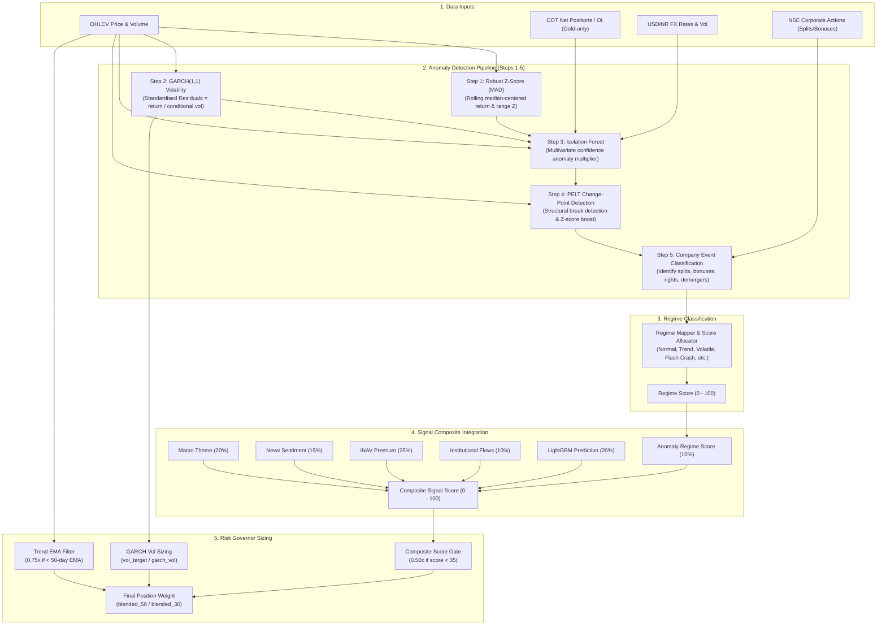

# Anomaly Detection — How It Works

The **🔬 Anomaly Detection** tab runs a five-step composite pipeline on any symbol in ClickHouse: robust MAD-Z → GARCH(1,1) volatility normalization → Isolation Forest → PELT change-point detection → Company Event classification.

## Architectural Pipeline & Data Flow

The following data flow diagram illustrates how raw market inputs flow through the 5-step anomaly detection pipeline, map to a volatility/trend regime, integrate into the multi-pillar Signal Composite, and finally determine position sizing in the Risk Governor:



---

## Step 1 — Robust Z-Score (MAD)

Standard Z inflates σ when prices trend, causing it to report near-zero on a real crash (the high prices leading up to the crash bloat σ).

Rolling MAD Z stays centred on the local median and resists outlier inflation:

$$Z_{robust} = 0.6745 \times \frac{x - \tilde{x}_{rolling}}{\text{MAD}_{rolling}}$$

Applied to `daily_return %` and `range %` (high−low / close), averaged for a combined `z_robust` score.
An independent `z_volume` score is also computed on raw volume.

## Step 2 — GARCH(1,1) Standardised Residual

Replaces the previous Random Forest step. Daily log-returns are near a random walk (RF R²≈0.32, firing on 21% of days); GARCH models **conditional volatility** $\sigma_t$ directly:

$$\sigma_t^2 = \omega + \alpha \cdot \varepsilon_{t-1}^2 + \beta \cdot \sigma_{t-1}^2$$

The **standardised residual** $e_t = r_t / \sigma_t$ is the industry-standard financial anomaly score:
- During quiet periods: σ_t is small → moderate returns are correctly flagged
- During volatile periods: σ_t is large → only truly extreme moves flag
- Fire rate: **~8%** (vs RF's 21%)

A Student-t distribution is used (fat tails — more realistic for gold than Gaussian).

### Output columns

| Column | Description |
|---|---|
| `garch_vol` | Annualised conditional volatility % (e.g. 34.5%) |
| `garch_band_1s` / `_2s` | Price-space band width at ±1σ / ±2σ |
| `residual` | Raw standardised residual $e_t = r_t / \sigma_t$ |
| `z_resid` | MAD Z-score of standardised residuals |

## Step 3 — Isolation Forest Confidence Multiplier

Isolation Forest is run on an enriched feature set:

| Feature | Source |
|---|---|
| `daily_return` | OHLCV |
| `range_pct` | OHLCV |
| `z_robust` | OHLCV (Combined return & range robust Z-score) |
| `z_volume` | OHLCV |
| `usdinr_logret` | USDINR FX (if available) |
| `usdinr_vol14` | USDINR 14-day realised vol |
| `cot_pct_oi` | COT mm_net / open_interest (forward-filled weekly) |

`score_samples` normalised to [0 → 1] (1 = most anomalous).

$$Z_{final} = Z_{robust} \times (1 + \text{IF}_{\text{confidence}})$$

This **boosts** days suspicious to both algorithms while filtering noise where only one signal fires.

## Step 4 — PELT Change-Point Detection (regime-shift confirmation)

Steps 2–3 detect **point shocks** (single surprising days). PELT detects **structural breaks** — the boundary where the return *distribution* shifts to a new variance regime (calm → turbulent). These are different objects: a one-day spike is not a regime change, and a regime change need not contain a single dramatic day.

`ruptures.Pelt(model="rbf")` is fit on **standardised log-returns** (z-scored so the penalty is scale-invariant across assets). The rbf kernel cost reacts to changes in the whole distribution (mean + variance), pinpointing volatility-regime boundaries. Auto penalty = `2·log(n)` when not supplied; higher penalty → fewer breaks.

| Column | Meaning |
|---|---|
| `is_changepoint` | True on a detected breakpoint date |
| `cp_confirmed` | True within ±`cp_proximity_days` (default 3) of any breakpoint |

**Role = confirmation booster** (it does *not* replace the Final-Z gate). A point anomaly that coincides with a structural break is corroborated by two independent views, so:

$$Z_{final} \leftarrow Z_{final} \times \text{cp\_boost} \quad (\text{default } 1.15) \text{ where } \text{cp\_confirmed}$$

and its regime is relabelled **🔀 Regime Shift (Change Point)**. The Final-Z threshold still gates which dates are flagged; CPD only sharpens confidence and labelling.

## Step 5 — Company Event Classification (mechanical shock identification)

Price jumps on the ex-dates of stock splits, bonus issues, demergers, and rights issues are mechanical adjustments rather than informational market shocks. To ensure these are recognized correctly:

1. The fetcher [nse_corporate_actions_fetcher.py](file:///Users/dhiraj.thakur/project/ofin-agent/src/importer/fetchers/nse_corporate_actions_fetcher.py) scrapes corporate events from the NSE website.
2. The ex-dates are matched against the price history.
3. Ex-dates matching price-impacting types (`split`, `bonus`, `demerger`, `rights`, `face_value_split`) are labelled `is_corporate_action=True` and `suppress_corp_action=True` in [anomaly.py](file:///Users/dhiraj.thakur/project/ofin-agent/src/ml/anomaly.py).
4. These rows are **not** filtered out from `df_flagged` anomalies; instead, they are preserved and their regime is classified as `🏢 Price Driven by Company Event`.
5. On the price chart, these ex-dates are overlayed as gold `🏢` markers, highlighting them as company-event driven anomalies.
6. Regular dividends, buybacks, and AGM events are labelled as corporate actions but are not flagged under this regime as they do not mechanically dilute or double stock prices.

**Graceful degradation:** if `ruptures` is not installed or there are too few rows, `is_changepoint`/`cp_confirmed` are all False and the pipeline behaves exactly as the GARCH+IF version did. If no corporate actions are found in the database, the pipeline runs normally without suppression.

> The red anomaly dots on [plot_price_chart](file:///Users/dhiraj.thakur/project/ofin-agent/src/tools/chart_tools.py) are now driven by this full 3-method composite ([_composite_anomaly_dates](file:///Users/dhiraj.thakur/project/ofin-agent/src/tools/chart_tools.py#L32)), falling back to a naive `max(2.0, 2.5·std)` return threshold only when the pipeline can't run (<60 rows, `arch`/`ruptures` missing, or the DB-less yfinance path).

## Regime Classification

Thresholds are dynamic (80th percentile of the full window) to prevent threshold drift across different vol regimes.

Each regime label is also mapped to a **numeric score (0–100)** that participates in the signal composite weighted sum (see [Signal Composite Integration](#signal-composite-integration) below).

| Regime | Condition | Score | Action |
|---|---|---|---|
| ⚡ Flash Crash / Black Swan (EXIT) | Low z_robust + High z_resid | 25 | Unexpected shock — reduce exposure |
| 🔥 Volatile Breakout | High z_robust + High z_resid | 40 | Caution |
| ⚠️ Crowded Long (Squeeze Risk) | High z_robust + COT > 75th pct + Positive return | 40 | Positioning risk |
| 🧨 Blow-off Top (Weak) | High z_robust + Low volume + Positive return | 30 | Thin-volume rally |
| 📈 Strong Trend (HODL) | High z_robust + Low z_resid | 70 | Predictable uptrend — hold position |
| 🔀 Regime Shift (Change Point) | Flagged date confirmed by a PELT break (±3 rows) | 35 | Structural vol-regime change — re-assess sizing |
| 🏢 Price Driven by Company Event | Mechanical price adjustment on ex-date (split/bonus/demerger/rights) | 50 | Plotted as gold `🏢` marker (included in anomalies, not suppressed) |
| 😱 Panic | Extreme drawdown across multiple indicators | 20 | Severe stress — maximum defensive |
| ✅ Normal | All other | 50 | No action |

> **Design note:** "Strong Trend (HODL)" maps to 70 (moderately bullish) rather than neutral 50. The composite acknowledges that a trending regime is mildly positive for the held asset. The *Risk Governor* handles sizing via a 1.0× multiplier — it maintains full exposure without deploying new cash.

## Signal Composite Integration

Anomaly regimes feed into the [signal_aggregator.py](file:///Users/dhiraj.thakur/project/ofin-agent/src/agents/signal_aggregator.py) as one of six weighted pillars. The regime label is converted to a 0–100 numeric score via `ANOMALY_REGIME_SCORES` and multiplied by the anomaly weight.

### Composite Weights

| Pillar | Weight | Source |
|---|---|---|
| Macro | 20% | Google News RSS theme scanner + IMF/WB fundamentals overlay |
| Sentiment | 15% | News article positive/negative ratio (7-day) |
| Valuation | 25% | iNAV premium/discount Z-score (30-day) |
| Flow | 10% | FII + DII 5-day net institutional flows |
| ML | 20% | LightGBM 5-day directional forecast (GOLDBEES; others neutral) |
| Anomaly | 10% | GARCH+IF+PELT regime score (this pipeline) |

Weights sum to **1.00**. Valuation, ML, and Anomaly are prioritised over Flow because FII/DII net-flow is a single scalar applied uniformly — it adds zero cross-ETF ranking power when flat.

### Flow Bucket Classification

FII/DII equity flows are applied differently depending on ETF type:

| Bucket | ETFs | Flow Score | Rationale |
|---|---|---|---|
| Equity | NIFTYBEES, BANKBEES, ITBEES, etc. (10) | `eq_score` | FII/DII directly trades these |
| Haven | LIQUIDBEES, LIQUIDCASE, GILT5YBEES (3) | `100 - eq_score` | Risk-on → money exits liquid/gilt |
| Commodity | GOLDBEES, SILVERBEES (2) | 50 (neutral) | Commodity-backed — FII/DII equity flows irrelevant |
| International | MON100, MAFANG, HNGSNGBEES (3) | 50 (neutral) | Tracks foreign indices, not INR flows |

When no FII/DII data exists in the 5-day window, `fii_dii_5d()` returns `None` (not `(0, 0)`) and the flow source logs `⚠ No FII/DII data` and returns neutral scores.

### Auditable Score Breakdown

Every ETF's composite score includes a per-pillar breakdown stored in the `rationale` field and displayed in a "Score Breakdown" panel:

```
GOLDBEES = 72
  Macro=100 ×0.20=+20.0 | Sent.=42 ×0.15=+6.4 | Val.=95 ×0.25=+23.6
  Flow=50 ×0.10=+5.0 | ML=52 ×0.20=+10.3 | Anom.=70 ×0.10=+7.0
```

The breakdown is persisted to ClickHouse `signal_composite.rationale` for historical auditability.

### Anomaly Density Report

The `GARCHAnomalySource` logs an anomaly density report showing what fraction of trading days were flagged across different windows:

```
GOLDBEES Anomaly Density Report:
  Lifetime: 8.46% (316/3737)
  1Y:       10.40% (26/250)
  90D:      10.00% (6/60)
  30D:      9.09% (2/22)
```

Rising density (30D > 1Y > Lifetime) indicates the market is entering an unusually turbulent regime.

## Risk Governor Integration

`garch_vol` feeds directly into the **Risk Governor** ([risk_governor.py](file:///Users/dhiraj.thakur/project/ofin-agent/src/tools/risk_governor.py)):

$$w(t) = \min\left(w_{\max},\ \frac{\text{vol\_target}}{\sigma_t}\right) \times \text{regime\_mult} \times \text{trend\_mult} \times \text{score\_gate\_mult}$$

Where:
- $\text{vol\_target}$ is calibrated per asset class: 15% for Gold/safe-havens, 20% for domestic Equity ETFs, 18% for International ETFs, and 25% for single-name stocks.
- $w_{\max}$ is the weight cap (default 1.0, no leverage).
- $\text{trend\_mult}$ is the trend filter multiplier (0.75 if price < 50-day EMA, else 1.0).
- $\text{score\_gate\_mult}$ is the composite quant score gate (0.50 if composite score < 35, else 1.0).

At current gold vol (34.5%) with a 15% target: `w = min(1.0, 15/34.5) = 43%` → hold 43% of target position (before other multipliers).

## Configurable Parameters

| Parameter (Python API) | Default | Range | Effect |
|---|---|---|---|
| IF Contamination (`contamination`) | 5% (0.05) | 1–20% | Expected anomaly fraction |
| Final-Z threshold (`z_threshold`) | 2.5 | 1.0–5.0 | Flagging sensitivity |
| Z-score rolling window (`z_window`) | 30 | 10–60 | Rolling MAD lookback |
| Change-point penalty (`cp_penalty`) | auto `2·log n_valid` | — | PELT penalty; higher → fewer change points |
| Change-point proximity (`cp_proximity_days`) | 3 | 0–10 | ± rows around a break that count as confirmed |
| Change-point boost (`cp_boost`) | 1.15 | 1.0–2.0 | Final-Z multiplier for confirmed dates (1.0 = off) |

## Performance — In-Process Cache

`fit_isolation_forest()` maintains a module-level `_IF_CACHE` dict keyed by `(n_rows, contamination, feat_cols_tuple)`. If the signal aggregator or UI runs multiple analyses in the same Python process with the same data and parameters, the Isolation Forest is refit only once (~300 ms first call, ~50 ms cached — 6× speedup).

The cache is in-memory only and does not persist across processes. It is cleared automatically when new price data arrives (via `ModelCacheInvalidator` observer) or when the process restarts.

## Requirements

- ≥ 60 rows per symbol in ClickHouse
- Run `python src/main.py import --category etfs` (or any category) first
- Cross-asset enrichment (COT + USDINR) fetched automatically if available
- Python deps: `arch>=6.3.0` (GARCH) and `ruptures>=1.1.9` (PELT). Both degrade gracefully — the pipeline falls back to the naive return threshold if either is missing.

---

## Anomaly Explanation Tool (`explain_price_anomalies`)

The agent's anomaly explanation capability (implemented in [gold.py](file:///Users/dhiraj.thakur/project/ofin-agent/src/tools/market/gold.py) and re-exported via [skills_tools.py](file:///Users/dhiraj.thakur/project/ofin-agent/src/tools/skills_tools.py)) is built on top of [run_composite_anomaly](file:///Users/dhiraj.thakur/project/ofin-agent/src/ml/anomaly.py#L464). It bridges the ML detection layer with news/event correlation and forward model context.

### Additional Anomaly & Corporate Action Tools

Two specialized tools are available in [equity.py](file:///Users/dhiraj.thakur/project/ofin-agent/src/tools/market/equity.py) to investigate stock-specific shocks:

1. **`get_corporate_actions(symbol)`**: Fetches historical corporate actions (splits, bonuses, demergers, rights, dividends) from the NSE website, stores them in ClickHouse, and displays a summary table. Used when verifying if a price drop (like the MSUMI -32.5% drop on July 18, 2025) was a mechanical corporate action.
2. **`search_anomaly_events(symbol, days)`**: An internet search agent tool that queries ClickHouse corporate actions, fits the GARCH+PELT pipeline to detect anomaly dates, filters out suppressed corporate action ex-dates, and dispatches parallel target-date Google News queries to correlate and explain each shock.

### Pipeline

```
Full OHLCV history (ClickHouse → yfinance fallback)
  + COT (cot_gold, gold-only) + USDINR FX (fx_rates)
      ↓
run_composite_anomaly(df, df_cot, df_fx)
  → df_result: regime + final_z + garch_vol per date
  → df_flagged: rows where final_z_abs > 2.5
      ↓
Filter to recent `days` window
      ↓
Per anomaly date:
  • GARCH regime + Final Z (table + detail)
  • search_financial_news (target date)
  • Neutral-news + large-move divergence flag
  • ml_prediction_asof(date)       ← forward ML expectation as-of that date
  • signal_composite_asof(date)    ← was composite BUY/HOLD before the shock?
      ↓
Append: COMEX futures chart (GC=F / SI=F) + GARCH vol chart
```

### Regime → Narrative mapping

| Regime | Implication for GOLDBEES |
|---|---|
| ⚡ Flash Crash / Black Swan | Unexpected shock — GARCH residual fired, not trend. Consider exit / hedge. |
| 🔥 Volatile Breakout | Both trend and residual extreme — directional, but fragile. |
| ⚠️ Crowded Long (Squeeze Risk) | Speculator crowding (COT) + positive return — reversal risk elevated. |
| 🧨 Blow-off Top (Weak) | Thin-volume rally — low conviction. |
| 📈 Strong Trend (HODL) | High trend Z, low residual — predictable, hold position. Composite score +7.0 (70 ×0.10). |
| 🔀 Regime Shift (Change Point) | Structural break — composite score +3.5 (35 ×0.10). Re-assess sizing. |
| 😱 Panic | Extreme stress — composite score +2.0 (20 ×0.10). Maximum defensive. |
| ✅ Normal | No action. Composite score +5.0 (50 ×0.10). |

### Divergence signal
When `|daily_return| ≥ 3%` and the news sentiment is `NEUTRAL`, the tool flags:
> ⚠️ **Divergence signal:** Neutral news sentiment on a high-magnitude move — possible policy surprise or pre-positioning before public announcement.

The May 2026 India import duty hike on gold (+5.72% GOLDBEES, neutral news) is the canonical example.

### Graceful fallback
If `len(df) < 60` or the `arch` library is not installed, the composite pipeline is skipped and the tool falls back to a naive `threshold = max(2.0, 2.5 × std)` detection. The report still renders; regime columns show `—` and detection method is noted as "naive threshold".

### Forward context (point-in-time)
[MarketDataRepository.ml_prediction_asof](file:///Users/dhiraj.thakur/project/ofin-agent/src/db/repository.py) and [signal_composite_asof](file:///Users/dhiraj.thakur/project/ofin-agent/src/db/repository.py) are used to surface what the ML model expected (5d direction) and whether the composite signal (BUY / HOLD / SELL) confirmed or contradicted the shock — without leaking future information.
