# Architecture

> Last updated: 2026-07-30 (Observer EventBus, Declarative Orchestration, RAG Architecture, ClickHouse Repository)

Mosaic Fund Agent is a multi-source financial intelligence platform for Indian equity and commodity markets. It ingests market data into ClickHouse, scores assets across six independent signal pillars, runs ML forecasting and anomaly detection, and surfaces actionable recommendations via CLI, scripts, and a Streamlit UI.

---

## Design Philosophy

The codebase is built on four patterns that keep it extensible and testable. Understanding these four is enough to navigate the whole system:

| Pattern | Where | What it buys you |
|---|---|---|
| **Repository** | `src/db/repository.py` | One typed access point for every ClickHouse read. `FINAL` dedup, return shapes, and the `run_fetcher()` loop live here — no raw SQL scattered across signal/ML code. |
| **Adapter** | `src/data_importer/fetchers/` | Every data source implements one `Fetcher` ABC (`fetch → validate → insert`). Add a source = one class + one registry entry. |
| **Strategy** | `src/agents/signal_sources.py` | Each composite-score pillar is a `SignalSource` subclass. Add a pillar = one class + one list append; the aggregator runs them all in parallel. |
| **Observer** | `src/events/bus.py` | A live import publishes one `DataImportedEvent`; cache-invalidation, ML re-prediction, signal refresh, and sanity checks all react independently. |
| **Façade** | `src/agents/sub_agents/` | The sub-agents package exposes a single `__init__.py` that re-exports all 20+ public and private symbols. Internal module layout (17 files) is hidden; all callers keep `from src.agents.sub_agents import X` unchanged. |
| **Null Object** | `src/agents/sub_agents/base.py` | `_build()` always assigns `self._agent` — either a real LangGraph agent or `_NullAgent()`. `run()` needs no `None` guard; `_NullAgent.stream()` raises into the existing error handler → `_confirm_fallback()`. New "no-LLM" behaviour lives in one class. |
| **Hook Method** | `src/agents/sub_agents/base.py` | `_SubAgent._select_llm(llm_override)` is a single overridable hook for LLM selection (local → cloud upgrade → `None`). Subclasses override only this hook to inject a domain-specific model; `_build()` assembly logic is never duplicated. |
| **Table-driven routing** | `src/agents/sub_agents/routing.py` | Three ordered tables (`_PRE_PLOT_TABLE`, `_VIZ_ROUTE_TABLE`, `_POST_PLOT_TABLE`) replace a 45-line if-elif block. Priority is explicit by list index; adding a new intent = one `insert()` at the right position. |
| **Pure-Python LangGraph node** | `src/workflows/` | StateGraph nodes that call Python tools directly (no LLM) replace the LLM-driven ReAct tool-call loop for fixed-structure pipelines. Parallel data fetch via `ThreadPoolExecutor` inside a single node; LLM reserved for synthesis/verify only (1–2 calls vs 15–50). Token savings: 80–90%. |

Two cross-cutting rules:

- **No LLM calculations** — every number is computed in Python/SQL; the LLM only narrates pre-computed results.
- **Thin tools, fat logic** — `@tool` wrappers stay small (validate args, call a function, format output); business logic lives in `src/ml/`, `src/db/`, or dedicated tool modules so it's unit-testable without the agent loop.

See [§ Design Patterns](#design-patterns) at the end for the full reference (code, method tables, and the multi-agent orchestrator).

---

## System at a Glance

One diagram covering the whole system — CLI entry points, the multi-agent orchestrator, the import pipeline, and the ClickHouse/Qdrant/SQLite storage layer — color-coded by the design pattern each box implements (Repository, Adapter, Observer, Strategy, external source, memory hierarchy). Kept in sync with [architecture.mmd](architecture.mmd).

```mermaid
flowchart TD
    User(["👤 User"])

    %% ── CLI ────────────────────────────────────────────────────────────
    subgraph CLI ["CLI — src/main.py (Typer — 30 commands)"]
        CLIImport["import --category …"]
        CLISignals["signals [--save]"]
        CLIAnalyze["analyze / ask"]
        CLIMacro["macro / comex / etf-news"]
        CLIResearch["research / portfolio-wf"]
        CLIUI["ui  →  localhost:8501"]
    end

    %% ── Routing & Multi-Agent Orchestrator ────────────────────────
    subgraph Orchestrator ["Multi-Agent Orchestrator & Workflows"]
        Router["Intent Router\nsrc/agents/intent_router.py\nLLM classifier + regex fallback"]

        subgraph SubAgents ["LangGraph ReAct Sub-Agents\nsrc/agents/sub_agents/"]
            SA1["DeepDive · IndianEquity · Signal"]
            SA2["Macro · MF · News · Code · Database"]
            SA3["IntlETF · AutonomousResearch"]
        end

        subgraph Workflows ["StateGraph Workflows (8)\nsrc/workflows/ — 55–81% token savings"]
            WF1["Signal · Macro · News\nparallel fetch + approval"]
            WF2["MF Planner\nPlan-Execute-Replan"]
            WF3["Research · Equity · Consensus · Portfolio\nfixed-structure graphs"]
        end

        subgraph WorkflowInfra ["Workflow Infrastructure"]
            CM["ContextManager\ncontext_manager.py — DatasetRef & truncation"]
            PS["PlanStore\nplan_store.py — SQLite + Jaccard search"]
            MS["MosaicState\nstate.py — shared TypedDict"]
        end
    end

    %% ── Agentic Memory System ────────────────────────────────────────────
    subgraph Memory ["Agentic Memory & Harness System"]
        L1["Level 1: Global User Mandate\nNo LLM math · Zero-Trust · QIP check · DSP signal"]
        L2["Level 2: Context Files\nAGENTS.md · GEMINI.md · docs/CLAUDE.md"]
        L3["Level 3: Subagent Defs\n.agents/agents/ (21 defs)"]
        L4["Level 4: Skills & Commands\n.agents/skills/ (21) · .claude/commands/ (5)"]
        L5["Level 5: Caveman Compression\n.claude/skills/caveman* (60–70% token cut)"]
        L1 --> L2 --> L3 --> L4 --> L5
    end

    %% ── Import pipeline (Adapter + Repository + Observer) ──────────────────────
    subgraph ImportPipeline ["Import Pipeline — Adapter + Repository + Observer"]
        subgraph Adapters ["Fetcher Adapters  src/data_importer/fetchers/"]
            FA1["YFinanceFetcher\nstocks · etfs · commodities · indices"]
            FA2["MFNavFetcher\nMFAPI.in NAV"]
            FA3["FIIDIIFetcher\nSensibull cash + F&O + monthly"]
            FA4["FXRatesFetcher\nUSDINR · USDCNY · USDAED …"]
            FA5["COTGoldFetcher & AMC Importers\nCFTC COT · DSP · Nippon · ICICI"]
        end

        Repo["MarketDataRepository\nsrc/db/repository.py\nrun_fetcher() — watermark → fetch → insert → event"]

        subgraph EventBus ["EventBus  src/events/bus.py"]
            EV["DataImportedEvent\nsource · category · n_rows · to_date"]
        end

        subgraph Observers ["Post-Import Observers  src/events/observers.py"]
            OBS1["ModelCacheInvalidator\n🔴 sync — deletes stale .joblib"]
            OBS2["MLPredictionObserver\n🟡 async — re-runs LightGBM"]
            OBS3["SignalAggregatorObserver\n🟡 async — refreshes composite scores"]
            OBS4["SanityCheckObserver\n🟡 async — anomaly validation"]
        end
    end

    %% ── ClickHouse & Qdrant Data Layer ────────────────────────────────────
    subgraph DataLayer ["Storage Layer — ClickHouse + Qdrant + SQLite"]
        subgraph CH ["ClickHouse — market_data (37 tables)"]
            T1[("daily_prices · mf_nav\nfx_rates · etf_aum")]
            T2[("fii_dii_flows · cot_gold\ncb_gold_reserves · amfi_category_flows")]
            T3[("ml_predictions\nsignal_composite")]
            T4[("inav_snapshots · news_articles\ncorporate_actions")]
            T5[("import_watermarks · agent_traces")]
        end

        subgraph Qdrant ["Qdrant Vector DB (6 collections — 768d COSINE)"]
            Q1[("news_articles\n(tenant: symbol[])")]
            Q2[("market_anomalies\n(tenant: symbol)")]
            Q3[("mf_holdings · mf_fund_profiles\n(tenant: isin / fund_name)")]
            Q4[("clickhouse_metadata · market_data")]
        end

        subgraph SQLiteDB ["SQLite Stores"]
            SQ1[("LLM Cache\nllm_cache.db — 24h TTL")]
            SQ2[("Plan Store & Checkpoints\nplans/index.db · checkpoints.db")]
        end
    end

    %% ── Signal pipeline (Repository + Strategy) ────────────────────────
    subgraph SignalPipeline ["Signal Pipeline — Repository + Strategy"]
        RepoRead["MarketDataRepository\ntyped reads: fii_dii_5d() · ohlcv()\nml_prediction_asof() · signal_composite_asof()"]

        subgraph Sources ["SignalSource strategies  src/agents/signal_sources.py"]
            direction LR
            SS1["MacroSignalSource\n25% — GNews themes"]
            SS2["SentimentSignalSource\n15% — news_articles"]
            SS3["ValuationSignalSource\n15% — iNAV Z-score"]
            SS4["FlowSignalSource\n25% — FII/DII 5D net"]
            SS5["MLSignalSource\n15% — ml_predictions"]
            SS6["GARCHAnomalySource\n5% — GARCH + IF"]
        end

        Aggregator["SignalAggregator\nsrc/agents/signal_aggregator.py\n6 sources × ThreadPoolExecutor\n→ composite 0–100 + BUY/HOLD/SELL\n79 s → 9 s after parallelisation"]
    end

    %% ── ML pipeline ──────────────────────────────────────────────────
    subgraph MLPipeline ["ML Pipeline  src/ml/"]
        TP["TrendPredictor\ntrend_predictor.py\nLightGBM walk-forward CV\nDXY + US10Y fetched in parallel"]
        ModelCache[("Model cache\noutput/.cache/ml_models/\n*.joblib — auto-invalidated")]
        AD["AnomalyDetector\nanomaly.py\n6-step: MAD-Z + GARCH(1,1) + IF\n+ PELT + CorpActions + Volume HMM"]
    end

    %% ── Streamlit UI ───────────────────────────────────────────────
    UI["Streamlit UI\nsrc/ui/app.py\nExplorer · Anomaly · Signals\nHoldings · Kite · Deep Dive"]

    %% ── External sources ───────────────────────────────────────────────
    subgraph Ext ["External Data Sources"]
        E1[("Yahoo Finance\n.NS / futures / DXY / ^TNX")]
        E2[("NSE API + MFAPI.in\niNAV · NAV")]
        E3[("Sensibull oxide API\nFII/DII cash + F&O")]
        E4[("CFTC Socrata + ZIP\nCOT gold weekly")]
        E5[("GNews RSS & NewsAPI\nmacro themes · news")]
        E6[("Zerodha Kite MCP\nportfolio + orders")]
        E7[("OpenAI / Anthropic / Local Ollama\nLLM scoring")]
    end

    %% ── Flows ──────────────────────────────────────────────────────
    User --> CLI
    CLIAnalyze & CLIResearch --> Router
    Router --> SubAgents & Workflows
    Workflows --> CM & PS & MS
    SubAgents & Workflows --> RepoRead

    CLIImport --> Adapters
    FA1 & FA2 & FA3 & FA4 & FA5 --> Repo
    Repo --> T5
    Repo --> T1 & T2
    Repo --> EV
    EV -->|sync| OBS1
    EV -->|async| OBS2 & OBS3 & OBS4

    CLISignals --> RepoRead
    RepoRead --> SS1 & SS2 & SS3 & SS4 & SS5 & SS6
    SS1 & SS2 & SS3 & SS4 & SS5 & SS6 --> Aggregator
    Aggregator --> T3

    OBS2 --> TP
    OBS3 --> Aggregator
    TP <--> ModelCache
    TP --> T3
    AD --> T3 & Q2

    CLIUI --> UI
    UI --> T1 & T2 & T3 & T4 & Q1 & Q3

    CLIMacro --> E5

    FA1 -.-> E1
    FA2 -.-> E2
    FA3 -.-> E3
    FA4 -.-> E1
    FA5 -.-> E4
    SubAgents -.-> E7
    Workflows -.-> E7
    SS1 -.-> E5
    TP -.-> E1
    PS --> SQ2
    CM -.-> SQ1

    %% ── Styles ───────────────────────────────────────────────────
    classDef repo fill:#dbeafe,stroke:#3b82f6,color:#1e3a5f
    classDef adapter fill:#dcfce7,stroke:#16a34a,color:#14532d
    classDef observer fill:#fef9c3,stroke:#ca8a04,color:#713f12
    classDef storage fill:#f3e8ff,stroke:#9333ea,color:#3b0764
    classDef strategy fill:#ffedd5,stroke:#ea580c,color:#7c2d12
    classDef ext fill:#f1f5f9,stroke:#94a3b8,color:#334155
    classDef memory fill:#fee2e2,stroke:#ef4444,color:#7f1d1d

    class Repo,RepoRead repo
    class FA1,FA2,FA3,FA4,FA5 adapter
    class OBS1,OBS2,OBS3,OBS4 observer
    class T1,T2,T3,T4,T5,ModelCache,Q1,Q2,Q3,Q4,SQ1,SQ2 storage
    class SS1,SS2,SS3,SS4,SS5,SS6 strategy
    class E1,E2,E3,E4,E5,E6,E7 ext
    class L1,L2,L3,L4,L5 memory
```



---

## High-Level Data Flow

```
External Data Sources
        │
        ▼
  Fetcher Adapters (src/data_importer/fetchers/adapters.py)
        │  Fetcher ABC: fetch() → validate() → insert()
        ▼
  MarketDataRepository.run_fetcher()  (src/db/repository.py)
        │  watermark check → insert → set_watermark → EventBus.publish()
        ▼
  EventBus  (src/events/bus.py)
        │  DataImportedEvent → async observers
        ├──▶  ModelCacheInvalidator   (sync) → clears stale .joblib
        ├──▶  MLPredictionObserver    (async) → re-runs LightGBM
        ├──▶  SignalAggregatorObserver(async) → refreshes composite scores
        └──▶  SanityCheckObserver     (async) → anomaly validation
        │
        ▼
  ClickHouse  (market_data database — 37 tables)
        │
        ├──▶  MarketDataRepository reads  ← typed queries, consistent FINAL
        ├──▶  Signal Sources  (src/agents/signal_sources.py)  ← Strategy pattern
        ├──▶  ML  (src/ml/)               ← LightGBM forecast + anomaly
        ├──▶  Tools (src/tools/)          ← real-time signals per asset
        ├──▶  Agents (src/agents/)        ← orchestrated multi-tool workflows
        │
        ▼
  Output
  ├── CLI tables (Rich console)
  ├── JSON reports  (output/)
  └── Streamlit UI  (localhost:8501)
```

---

## Directory Map

```
config/
  settings.py             Pydantic settings — LLM, ClickHouse, API keys, market constants

src/
  main.py                 Typer CLI — 13 commands (analyze, import, signals, macro, …)
  agents/
    signal_aggregator.py  Composite score orchestrator — parallel Strategy sources
    signal_sources.py     Strategy pattern: SignalSource ABC + 5 pillars + GARCHAnomalySource
  workflows/              LangGraph StateGraph workflows — token-efficient alternatives to ReAct (55–81% savings)
    base.py               _get_llm(), _par()/_par_datasets(), _get_checkpointer(), _show_and_approve_plan()
    state.py              MosaicState shared TypedDict ancestor for all workflows
    context_manager.py    Deterministic context compression (DatasetRef, ContextRun, truncation)
    plan_store.py         SQLite plan persistence + Jaccard similarity search (output/plans/)
    autonomous_research.py  5-node graph: resolve → fetch_all(6 parallel) → correlate → verify → synthesise (~8 800 tokens)
    india_equity.py         3-node graph: resolve → fetch_all(12 parallel, guaranteed) → synthesise (~7 000 tokens)
    multi_fund_consensus.py 3-node graph: fetch_all_funds(7 parallel) → fetch_consensus → synthesise (~4 000 tokens)
    portfolio_analysis.py   6-node graph: discover → enrich_all → score_all → verify_high → fetch_macro → synthesise
    signal.py              4-node graph: resolve → build_plan → [approval] → fetch(6 parallel) → synthesise (~4 000 tokens)
    macro.py               3-node graph: build_plan → [approval] → fetch(all parallel) → synthesise (~3 500 tokens)
    news.py                4-node graph: resolve → build_plan → [approval] → fetch(3 parallel) → aggregate (~1 500 tokens)
    mf_planner.py          Plan-Execute-Replan: plan → [approval] → executor ↺ replanner (~6 000–12 000 tokens)
    consolidated_mf_report.py  Multi-asset allocation comparison report with matplotlib charts
    intent_router.py      LLM-based intent router (Haiku / gpt-4o-mini) with regex fallback
    sub_agents/           Façade package — 10 specialised sub-agents + routing + registry
      __init__.py         Re-exports all public + private symbols; zero call-site changes
      base.py             _SubAgent Template Method base + _get_message_text
      infra.py            Per-turn dedup cache, context trimmer, thinking-block printer
      prompts.py          NO_LLM_CALC_RULE, indicator-typo fixups
      routing.py          12 regex patterns + _fast_path_intent / route_intent / _regex_route_intent
      registry.py         get_subagent(), run_subagent_for(), _registry singleton
      equity_gatherer.py  _gather_indian_equity_data (programmatic, tool-calling-free)
      deepdive.py         DeepDiveSubAgent — US SEC/EDGAR research
      india_equity.py     IndianEquityResearchSubAgent — NSE/BSE 8-section research note
      signal.py           SignalSubAgent — ETF composite scores, GOLDBEES ML, Kelly weights
      macro.py            MacroSubAgent — COMEX, FII/DII, macro themes
      mf.py               MFSubAgent — fund holdings, NAV returns, cross-fund consensus
      intl_etf.py         IntlETFSubAgent — 6 overseas ETFs, scarcity premium, regimes
      news.py             NewsSubAgent — headlines + sentiment
      database.py         DatabaseSubAgent — NL → ClickHouse SQL
      code.py             CodeSubAgent — ad-hoc Python execution and scripting
      research.py         AutonomousResearchAgent — multi-domain 10-layer research framework
  analyzers/              Per-asset and portfolio-level enrichment
  clients/
    mcp_client.py         Zerodha Kite MCP (JSON-RPC 2.0)
  db/
    pool.py               Thread-safe CHPool singleton
    repository.py         MarketDataRepository — typed reads + run_fetcher + events
  events/
    bus.py                EventBus singleton, DataImportedEvent, Observer ABC
    observers.py          4 post-import hooks (cache, ML, signals, sanity)
  formatters/             JSON / HTML report rendering
  importer/
    base_fetcher.py       Fetcher ABC — Adapter interface for all data sources
    cli.py                run_import() — delta-sync orchestrator
    clickhouse.py         Schema DDL, bulk inserts, watermark management
    registry.py           Symbol catalogs (stocks, ETFs, commodities, indices, FX)
    fetchers/
      adapters.py         Fetcher adapters + FETCHER_REGISTRY
      <name>_fetcher.py   One file per external data source
  ml/
    trend_predictor.py    LightGBM 5-day predictor + joblib model cache
    anomaly.py            Composite anomaly (MAD-Z + GARCH + Isolation Forest + PELT CPD + corp action suppression)
  models/                 Pydantic data schemas
  scripts/                Standalone domain scripts — `python src/scripts/<subdir>/<name>.py`
    dsp/                  DSP AMC import, analysis, backtests
    fund_imports/         Factory-pattern AMC importers (BaseFundImporter ABC + per-AMC classes)
    etf/                  ETF comparison, CAGR validation, risk analysis
    ml/                   ML prediction backfill and evaluation
    portfolio/            Portfolio tracking/health, concentration-HHI, crowding-contrarian, fund
                          overlap matrix, portfolio X-ray, rolling returns, SIP backtester,
                          cross-AMC whale accumulation scanner (+ optional technical confirmation)
    market/               Macro themes, FII/DII, metals, sentiment, per-fund whale/theme tracker
    db/                   ClickHouse backup, restore, sanity checks, data quality repairs
  tools/                  @tool wrappers + standalone signal functions
    skills_tools.py       General-purpose tools (query, import, iNAV, deep-dive) + SKILLS_TOOLS list
    runners.py            Thin shell-command runners (run_goldbees_pipeline, run_macro_scanner, …)
    market/gold.py        Gold/GARCH domain tools (explain_price_anomalies, run_risk_governor_analysis)
    market/equity.py      Equity anomaly tools (search_anomaly_events, get_corporate_actions)
    _subprocess.py        Shared subprocess helpers (no project imports — breaks circular deps)
    chart_tools.py        plotext terminal charts (price, signal, GARCH vol, MACD, …)
    <domain>.py           Per-domain signal functions (quant_scorecard, inav_fetcher, comex_fetcher, …)
  ui/
    app.py                Streamlit 5-tab data hub
  utils/                  Caching, symbol mapping, report loading, and terminal markdown renderer (markdown_renderer.py)

scripts/                  Standalone runnable analysis scripts (including goldbees_report.py)
docs/                     This documentation
skills/                   Gemini / Claude skill definitions
data-engineering-importer/  Data pipeline reference (importer guide + schema)
tests/
docker-compose.yml
```

---

## Importers

All importers are **watermark-based delta-sync**: each fetcher reads `import_watermarks.(source, symbol).last_date`, fetches only new rows, and writes back the watermark after a successful insert. Safe for repeated runs — `ReplacingMergeTree` handles duplicate dates.

For `stocks` and `us_stocks` categories, the import manager redirects standard sequential download to a high-concurrency pipeline ([parallel_importer.py](file:///Users/dhiraj.thakur/project/ofin-agent/src/data_importer/parallel_importer.py)). This pipeline concurrently processes each stock symbol using a thread pool (capped at 5 workers) to fetch prices, quarterly earnings, insider transactions, and valuation snapshots. Requests are staggered using random jitter delays to bypass Yahoo Finance rate-limiting defenses (401 Unauthorized).

| Fetcher | External Source | ClickHouse Table(s) | Cadence |
|---|---|---|---|
| `yfinance_fetcher` | Yahoo Finance | `daily_prices` | Daily |
| `mfapi_fetcher` | MFAPI.in (AMFI) | `mf_nav` | Daily |
| `cot_fetcher` | CFTC Socrata API + ZIP archives | `cot_gold` | Weekly (Fri) |
| `nse_inav_fetcher` | NSE website | `inav_snapshots` | Every 15 min (market hours) |
| `shoonya_fetcher` | Finvasia Shoonya REST & WebSocket | `daily_prices`, `shoonya_session` | Real-time tick & Intraday |
| `fii_dii_fetcher` | Sensibull oxide API | `fii_dii_flows`, `fii_dii_monthly`, `fii_dii_fno_daily` | Daily |
| `imf_reserves_fetcher` | WGC Goldhub (primary) + World Bank WDI REST API (fallback) | `cb_gold_reserves` | Monthly |
| `etf_aum_fetcher` | Yahoo Finance | `etf_aum` | Daily |
| `mf_holdings_fetcher` | Morningstar (mstarpy) | `mf_holdings` | Monthly |
| `fund_imports/` (DSP/ICICI/Nippon) | AMC Websites | `mf_holdings` → Qdrant `mf_holdings` + `mf_fund_profiles` | Monthly (auto-vectorizes) |
| `backfill_mf_qdrant.py` | ClickHouse → Qdrant | `mf_holdings`, `mf_fund_profiles` | One-time + monthly |
| `fx_rates_fetcher` | Yahoo Finance | `fx_rates` | Daily |
| `worldbank_macro_fetcher` | World Bank WDI API | `macro_indicators` | Annual |
| `imf_weo_fetcher` | IMF DataMapper API | `macro_indicators` | Semi-annual |
| `nse_quote_fetcher` | NSE Direct API | `daily_prices` | Intraday (Post-close) |
| `earnings_fetcher` | Yahoo Finance | `stock_earnings` | Quarterly |
| `insider_fetcher` | Yahoo Finance | `stock_insider_trades` | Daily |
| `valuation_fetcher` | Yahoo Finance | `stock_valuation` | Daily |
| `fund_imports/` (factory) | AMC Websites (ICICI, Nippon) | `mf_holdings` | Monthly |
| News tools | NewsAPI + Google News RSS | `news_articles` | Twice daily |
| `signal_aggregator` | Reads ClickHouse | `signal_composite` | Daily / on-demand |
| `trend_predictor` | Reads ClickHouse | `ml_predictions` | Daily after close |

### Symbol Registry (`src/data_importer/registry.py`)

| Category | Count | Examples |
|---|---|---|
| Stocks | 50 | RELIANCE, TCS, HDFCBANK, INFY, ICICIBANK |
| ETFs | 30+ | GOLDBEES, SILVERBEES, NIFTYBEES, BANKBEES, ITBEES, CPSEETF |
| Commodities | 7 | GOLD (GC=F), SILVER (SI=F), COPPER (HG=F), CRUDEOIL, NGAS, PLATINUM, PALLADIUM |
| Indices | 10 | NIFTY50, SENSEX, BANKNIFTY, SP500, NASDAQ, US10Y, DXY |
| FX Pairs | 5 | USDINR, USDCNY, USDAED, USDSAR, USDKWD |
| MF Schemes | 12 | GOLDBEES (140088), SILVERBEES (149758), NIFTYBEES (140084) |
| MF Holdings Watchlist | 4 | DSP Multi Asset, Quant Multi Asset, ICICI Multi Asset, Bajaj Multi Asset |

---

## ClickHouse Tables

Database: `market_data`, 37 tables, all `ReplacingMergeTree` for idempotent re-imports. Grouped by domain:

```mermaid
flowchart TB
    Prices["📈 Prices & Live Data (5)\ndaily_prices · nse_delivery · inav_snapshots\nlive_quotes · live_alerts"]
    MF["🏦 Mutual Funds (4)\nmf_nav · mf_holdings\nmf_holding_summaries · amfi_category_flows"]
    Flows["💰 Institutional Flows & Corp Actions (5)\nfii_dii_flows · fii_dii_monthly · fii_dii_fno_daily\nbulk_block_deals · corporate_actions"]
    Macro["🌍 Macro & Commodities (6)\ncot_gold · cb_gold_reserves · etf_aum · fx_rates\nmacro_indicators · indian_macro_indicators"]
    MLRisk["🤖 ML, Signals & Risk (3)\nml_predictions · signal_composite · weight_checkpoints"]
    USStocks["🇺🇸 US Stock Fundamentals (3)\nstock_earnings · stock_insider_trades · stock_valuation"]
    News["📰 News (1)\nnews_articles"]
    UserData["👤 User — Zerodha Kite backups (5)\nuser_holdings · user_profile · user_margins\nuser_positions · user_orders"]
    Ops["⚙️ System / Ops (5)\nimport_watermarks · import_failures · agent_traces\nagent_preferences · pipeline_manifest"]

    DB[("market_data\n37 tables")]
    Prices --> DB
    MF --> DB
    Flows --> DB
    Macro --> DB
    MLRisk --> DB
    USStocks --> DB
    News --> DB
    UserData --> DB
    Ops --> DB

    classDef domain fill:#dbeafe,stroke:#3b82f6,color:#1e3a5f
    classDef db fill:#f3e8ff,stroke:#9333ea,color:#3b0764
    class Prices,MF,Flows,Macro,MLRisk,USStocks,News,UserData,Ops domain
    class DB db
```



Full reference (all 37, with `ORDER BY` key) lives in [import-schema.md](import-schema.md#clickhouse-schema) — kept there as the single source of truth so it doesn't drift out of sync in two places. Quick-reference by domain:

| Domain | Tables | Purpose |
|---|---|---|
| Prices & Live Data | `daily_prices`, `nse_delivery`, `inav_snapshots`, `live_quotes`, `live_alerts` | OHLCV, NSE delivery stats, live iNAV, real-time quotes/alerts |
| Mutual Funds | `mf_nav`, `mf_holdings`, `mf_holding_summaries`, `amfi_category_flows` | NAV history, monthly portfolio holdings, cross-fund ownership rollups, AMFI category flows |
| Institutional Flows & Corp Actions | `fii_dii_flows`, `fii_dii_monthly`, `fii_dii_fno_daily`, `bulk_block_deals`, `corporate_actions` | FII/DII cash + F&O flows, NSE bulk/block deals, split/bonus/dividend history |
| Macro & Commodities | `cot_gold`, `cb_gold_reserves`, `etf_aum`, `fx_rates`, `macro_indicators`, `indian_macro_indicators` | COT positioning, central bank reserves, ETF AUM, FX, World Bank/IMF + RBI/MOSPI macro series |
| ML, Signals & Risk | `ml_predictions`, `signal_composite`, `weight_checkpoints` | LightGBM forecasts, composite ETF scores, Kelly/Risk-Governor sizing decisions |
| US Stock Fundamentals | `stock_earnings`, `stock_insider_trades`, `stock_valuation` | Quarterly earnings, insider transactions, valuation snapshots |
| News | `news_articles` | ETF-tagged news + sentiment |
| User (Zerodha Kite) | `user_holdings`, `user_profile`, `user_margins`, `user_positions`, `user_orders` | Personal portfolio backup tables |
| System / Ops | `import_watermarks`, `import_failures`, `agent_traces`, `agent_preferences`, `pipeline_manifest` | Delta-sync state, failure log, LLM agent traces, preferences, pipeline run manifest |

## Qdrant Collections

Six vector collections (all 768-dim, nomic-embed-text, COSINE, hosted at `localhost:6333`). Tenant-indexed collections use `is_tenant=True` on the primary filter field per the Qdrant tenant-scaling skill.

| Collection | Dim | Tenant index | Points | Populated by | Queried by |
|---|---|---|---|---|---|
| `news_articles` | 768 | — (list field) | ~10k+ | `news_rag_backfill.py`, news importers | `retrieve_articles()`, Correlation Engine |
| `clickhouse_metadata` | 768 | — | ~50 | `db_metadata_init.py` | `search_db_metadata` (schema RAG) |
| `market_anomalies` | 768 | `symbol` | grows with use | `run_composite_anomaly(symbol=...)` auto-stores flagged dates | `find_similar_anomaly_events` |
| `mf_holdings` | 768 | `isin` | 22k+ (809 funds) | `insert_mf_holdings()` + `BaseFundImporter.run()` hooks + `backfill_mf_qdrant.py` | `find_funds_holding` |
| `mf_fund_profiles` | 768 | `fund_name` | 809+ | same as above | `find_similar_funds`, `search_mf_exposure` |
| `market_data` | 768 | `symbol` | grows with each import | `market_vector.py` (fire-and-forget on import) | **Write-only — no read path wired yet** |

---

## Tools (`src/tools/`)

Most tools are standalone functions returning a dict/DataFrame — no DB writes, no side effects — callable independently or composed inside agents. They group into three kinds:

- **Domain signal functions** — the bulk: real computation per asset (quant scorecard, iNAV, COMEX, …).
- **Runners** (`runners.py`) — thin `@tool` wrappers over CLI scripts via subprocess; zero business logic.
- **Gold/GARCH domain** (`market/gold.py`) — `explain_price_anomalies`, `run_risk_governor_analysis`; real logic kept out of the junk-drawer.
- **Equity anomaly domain** (`market/equity.py`) — `search_anomaly_events`, `get_corporate_actions`; parallel internet search + NSE corporate action fetching for any NSE/BSE stock.

`SKILLS_TOOLS` in `skills_tools.py` is the single canonical list; it re-exports from `runners.py` and `market/gold.py` so existing imports keep working. Shared subprocess helpers live in `_subprocess.py` to avoid circular deps.

| Tool | File | Signal Produced |
|---|---|---|
| **Explain Price Anomalies** | `market/gold.py` | GARCH-detected anomaly dates → regime + Final Z + news correlation + COMEX/COT context + forward ML/signal lookup |
| **Risk Governor Analysis** | `market/gold.py` | GARCH vol-targeted position weight for GOLDBEES (inverse-vol × regime × score gate) |
| **Quant Scorecard** | `quant_scorecard.py` | Gold + Silver 4-pillar 0–100 composite scores (Macro / Flows / Valuation / Momentum) |
| **Macro Event Scanner** | `macro_event_scanner.py` | 8 macro themes → per-ETF impact direction (+1 / -1) + conviction, sourced from live news |
| **iNAV Fetcher** | `inav_fetcher.py` | Live iNAV, market price, premium/discount % for any NSE ETF |
| **COMEX Fetcher** | `comex_fetcher.py` | Pre-market signals for XAU, XAG, XPT, XPD, HG vs prior close |
| **Who Is Selling** | `who_is_selling_agent.py` | FII / DII / Retail sell-off attribution and flow signals |
| **Premium Alerts** | `premium_alerts.py` | ETF iNAV premium/discount threshold breach alerts |
| **Domestic ETF Scanner** | `domestic_etf_scanner.py` | Z-score valuation + flow + momentum per ETF |
| **Market Context** | `market_context.py` | Live Nifty/BankNifty levels + market regime for LLM prompts |
| **News Search** | `news_search.py` | GNews RSS articles + keyword sentiment for any symbol |
| **NewsAPI Search** | `newsapi_search.py` | NewsAPI.org articles from premium Indian financial publications |
| **Earnings Scraper** | `earnings_scraper.py` | Quarterly results from Screener.in / Yahoo Finance |
| **Historic iNAV** | `historic_inav.py` | Historical iNAV snapshots for ETFs |
| **Valuation Alerts** | `valuation_alerts.py` | P/E, yield, P/B ratio threshold crossings |
| **Summarization** | `summarization.py` | LLM-generated risk and sentiment summaries per holding |
| **Search Anomaly Events** | `market/equity.py` | GARCH+IF+PELT anomaly dates (corp actions suppressed) → parallel Google News per date (ThreadPoolExecutor) with ±1d fallback + NewsAPI |
| **Get Corporate Actions** | `market/equity.py` | NSE corporate actions (splits/bonuses/demergers/rights/dividends) → upserts to `corporate_actions` table → history table |
| **Chart Tools** | `chart_tools.py` | plotext terminal charts — price (🔴 GARCH anomaly markers + 🏦 corporate action markers, session-cached), signal scores, GARCH vol, MACD |
| **Zerodha MCP Tools** | `zerodha_mcp_tools.py` | Holdings, positions, orders via Zerodha Kite MCP |
| **Scan Whale Accumulation** | `whale_tools.py` | Cross-AMC consensus scan (`consensus_score = num_amcs × avg_delta_pp`), zero-to-hero fresh entries, optional RSI/drawdown/volume-surge technical confirmation + blended opportunity_score |
| **Get Whale Consensus** | `whale_tools.py` | Single-stock lookup — which AMCs hold it, MoM delta, months-held conviction tenure |

### Quant Scorecard Pillars (`quant_scorecard.py`)

**Gold (GOLDBEES):**
| Pillar | Weight | Signal Sources | Scoring |
|---|---|---|---|
| Macro | 30% | DXY (yfinance) + US10Y yield | DXY ≤ 100 → 100; ≥ 110 → 0. Real yield 5D delta ≤ −0.10 → 100 |
| Flows | 30% | COT gold (ClickHouse `cot_gold`) | mm_net/OI ≤ 20% → 100; ≥ 35% → 0 |
| Valuation | 20% | iNAV snapshot (`inav_snapshots`) | Discount > 0.5% → 100; Premium > 0.5% → 0 |
| Momentum | 20% | LightGBM (`ml_predictions`) | Return ≥ +1% → 100; ≤ −1% → 0 |

**Silver (SILVERBEES) — additional signals:**
| Pillar | Weight | Signal Sources | Scoring |
|---|---|---|---|
| Macro | 30% | DXY + US10Y + Gold-Silver Ratio (yfinance) | GSR ≥ 90 → 100 (silver cheap); ≤ 55 → 0 |
| Flows | 30% | CFTC live TXT (`SILVER - COMMODITY`, code 084) | mm_net/OI ≤ 20% → 100; ≥ 35% → 0 |
| Valuation | 20% | SILVERBEES iNAV (`inav_snapshots`) | Same as gold |
| Momentum | 20% | SI=F 5-day realised return (yfinance fallback) | Return ≥ +2% → 100; ≤ −2% → 0 |

---

## ML (`src/ml/`)

### TrendPredictor (`trend_predictor.py`)

- **Target:** 5-day forward log return for GOLDBEES
- **Algorithm:** LightGBM with `TimeSeriesSplit` walk-forward cross-validation
- **25+ alpha features:**
  - Momentum: logret1, logret5, logret20, EMA crosses
  - Mean-reversion: price/MA ratio
  - Volatility: ATR, historical vol
  - Macro: DXY, USD/INR, US 10Y yield
  - Market microstructure: COT leverage ratio, iNAV spread
  - Flows: FII/DII 5-day rolling net
  - Seasonality: month sin/cos, day-of-week encoding
- **Output written to:** `ml_predictions` — expected_return_pct, confidence bounds, cv_r2_mean, regime_signal

### AnomalyDetector (`anomaly.py`)

Four-step composite pipeline — public API: `run_composite_anomaly(df, df_cot=None, df_fx=None, df_corp_actions=None, cp_penalty=None, cp_proximity_days=3, cp_boost=1.15)`:

1. **Robust Z-score (MAD)** — rolling median/MAD, resistant to fat tails; applied to `daily_return`, `range_pct`, `volume`
2. **GARCH(1,1) standardised residuals** — isolates true shocks from routine volatility clustering; Student-t innovations; fire rate ~5%
3. **Isolation Forest** — cross-asset feature confirmation (USDINR, COT crowding); `Final_Z = Z_robust × (1 + IF_confidence)`
4. **PELT change-point detection** (`ruptures`, `model="rbf"`, auto penalty = `2·log n`) — detects structural variance-regime breaks; acts as confirmation booster (`Final_Z ×1.15`) for pre-flagged dates near a break; relabels those dates `🔀 Regime Shift (Change Point)`

**Corporate action suppression (ETF-only):** pass `df_corp_actions` (from `market_data.corporate_actions`); for ETFs (`category="etfs"`) split/bonus/demerger/rights ex-dates are excluded from `df_flagged` — ETF corporate actions (NAV resets, bonus units) are pure admin events with no market-signal content. For stocks, commodities, and indices, those rows remain in `df_flagged` and are stored in Qdrant (labelled `🏢 Price Driven by Company Event`) since corporate events on stocks (mergers, demergers, splits) are real analysable price movements. Note: the `suppress_corp_action` flag excludes rows from `df_flagged` only when `category='etfs'`; stock/commodity corporate actions are included in flagged output.

Requires ≥60 rows. Returns `(df_result, df_flagged, garch_loglik)` where `df_result` carries per-date `regime`, `final_z`, `garch_vol`, `is_changepoint`, `cp_confirmed`, `is_corporate_action`, `suppress_corp_action`.

Regime labels: `⚡ Flash Crash / Black Swan (EXIT)`, `🔥 Volatile Breakout`, `⚠️ Crowded Long (Squeeze Risk)`, `🧨 Blow-off Top (Weak)`, `📈 Strong Trend (HODL)`, `🔀 Regime Shift (Change Point)`, `🏦 Corporate Action`, `✅ Normal`.

Graceful degradation: `ruptures` not installed → PELT skipped (all-False `is_changepoint`/`cp_confirmed`), pipeline behaves as GARCH+IF only. `arch` not installed → falls back to naive `max(2.0, 2.5×std)` threshold.

### Anomaly tools

**`explain_price_anomalies`** (`src/tools/market/gold.py`, re-exported via `skills_tools.py`) — gold/commodity-specific:
1. Fetches OHLCV; loads COT (`cot_gold` — gold only) + USDINR FX
2. Runs `run_composite_anomaly`; filters flagged dates to window
3. Per date: regime + Final Z + sequential `search_financial_news` + neutral-news/large-move divergence flag
4. `ml_prediction_asof` + `signal_composite_asof` for forward model context
5. Appends COMEX chart (GC=F / SI=F) and GARCH vol chart

**`search_anomaly_events`** (`src/tools/market/equity.py`) — equity-generic:
1. Loads `corporate_actions` from ClickHouse; runs `run_composite_anomaly(df_corp_actions=...)` to suppress mechanical ex-dates
2. Builds regime-aware Google News queries per flagged date
3. Parallel search via `ThreadPoolExecutor` (5 workers); cascade: GNews exact → GNews broadened → GNews ±1d → NewsAPI (if <30 days old)
4. Corporate action heuristic: `|daily_ret| ≥ 20%` → label as likely split/demerger

**`get_corporate_actions`** (`src/tools/market/equity.py`):
1. Calls `nse_corporate_actions_fetcher.fetch_corporate_actions(symbol)` — NSE equity corporates API with session warmup
2. Upserts to `market_data.corporate_actions` via `client.insert_df`
3. Returns Markdown history table with action-type and suppression flags

Cross-asset loading (same pattern across both tools and `src/ui/app.py`):
```python
# COT (gold only): SELECT report_date, mm_net, open_interest FROM market_data.cot_gold
# FX (always):     SELECT symbol, trade_date, toFloat64(close) AS close
#                  FROM market_data.fx_rates FINAL WHERE symbol = 'USDINR'
# Corp actions:    SELECT ex_date, action_type FROM market_data.corporate_actions FINAL
#                  WHERE symbol = {sym:String}
```

---

## Agents (`src/agents/`)

Agents orchestrate multiple tools into complete workflows using LangGraph / LangChain.

### MosaicFundAgent (`mosaic_fund_agent.py`)
Full Zerodha portfolio intelligence workflow.

```
Auth (Kite MCP) → Fetch Holdings
    ↓
Parallel enrichment per holding:
  Yahoo Finance (prices, metrics)
  + News (NewsAPI + GNews)
  + Earnings (Screener.in / Yahoo)
    ↓
Per-asset LLM scoring
    ↓
Portfolio aggregation + LLM summary
    ↓
JSON report
```

Entry: `run_full_analysis()` | Ad-hoc: `ask(question)` via ReAct loop

### ComexAgent (`comex_agent.py`)
Pre-market commodity signals for XAU, XAG, XPT, XPD, HG.

- **Local LLM path:** direct call to `get_comex_signals()` (avoids tool loop)
- **Cloud LLM path:** LangGraph with loop guard (max 2 tool calls)
- Signal thresholds: ±0.3% = neutral, ±1% = strong

### NewsSentimentAgent (`news_sentiment_agent.py`)
Multi-source news sentiment for any stock or ETF.

- Sources: NewsAPI.org + Google News RSS (gnews)
- Single-call design via `collate_news_sentiment()` to prevent tool loops
- Output: overall_sentiment (POSITIVE / NEUTRAL / NEGATIVE), per-article scores, deduplicated

### SignalAggregator (`signal_aggregator.py`)
Composite ETF signal — 6 pillars → 0–100 score → BUY / ACCUMULATE / HOLD / TRIM / AVOID

Uses the **Strategy pattern**: each pillar is a `SignalSource` subclass in `signal_sources.py`. The aggregator loops over `score_sources` and an `AnomalySource`; all run in parallel via `ThreadPoolExecutor`. Signal aggregator wall-clock: ~9 s (was 79 s before parallelisation).

| Pillar | Class | Weight | Source |
|---|---|---|---|
| Macro | `MacroSignalSource` | 25% | `macro_event_scanner` → net signal across 8 themes |
| Sentiment | `SentimentSignalSource` | 15% | `news_articles` table — pos/neg ratio last 7 days |
| Valuation | `ValuationSignalSource` | 15% | `domestic_etf_scanner` — iNAV Z-score premium/discount |
| Flow | `FlowSignalSource` | 25% | `fii_dii_flows` — 5D net; equity ETFs benefit, safe-haven inverse |
| ML | `MLSignalSource` | 15% | `ml_predictions` — LightGBM expected return (GOLDBEES only; others neutral) |
| Anomaly | `GARCHAnomalySource` | 5% | `anomaly.py` — Flash Crash boost / Blow-off dampener |

Adding a 7th pillar: subclass `SignalSource`, implement `collect(repo)`, append to `score_sources` list in `run_signal_aggregation()`.

Covers 18 core ETFs. Output optionally written to `signal_composite` table via `--save`.

> **Planned 7th pillar — DSP Smart Money (pending):** MoM delta of DSP Multi Asset gold/equity allocation (`mf_holdings` table) as a contrarian tactical signal. Source: `src/scripts/dsp/dsp_quant_strategy_analyzer.py`. GSR correlation R=0.68 identified as primary driver of DSP allocation shifts.

---

## Scripts (`src/scripts/`)

Standalone scripts that run analyses against the live database and print Rich console output, organised by domain under `src/scripts/<subdir>/`. Run from the project root: `python src/scripts/<subdir>/<name>.py` (moved out of a top-level `scripts/` dir, which now holds only cron/shell wrappers).

| Subdir | Key scripts | Purpose |
|---|---|---|
| `market/` | `metals_quant_scorecard.py`, `gold_quant_scorecard.py`, `fii_pattern_check.py`, `whale_tracker.py`, `macro_theme_agent.py` | Gold+Silver / gold-only quant scorecards, FII historical pattern analysis, per-fund theme/archetype tracker (gold/silver/nuclear/infra + AMC archetype scorecard — NOT FII/DII flow), macro theme scanner |
| `portfolio/` | `opportunity_scan.py`, `whale_accumulation_scanner.py`, `dsp_opportunity_scanner.py`, `smallcap_pattern_analyzer.py`, `multi_asset_consensus.py`, `concentration_risk.py`, `crowding_contrarian.py`, `fund_overlap_matrix.py`, `portfolio_xray.py`, `rolling_returns.py`, `sip_backtester.py` | Cross-asset opportunity scan; cross-AMC whale consensus scan (`consensus_score` + optional RSI/drawdown/volume-surge confirmation); DSP conviction+technical scanner; small/mid-cap cross-ownership; multi-asset smart-money overlap; HHI concentration; crowding/contrarian signal; fund overlap matrix; portfolio X-ray; rolling returns; SIP backtesting |
| `dsp/` | `import_dsp_history.py`, `dsp_quant_strategy_analyzer.py`, `backtest_dsp_strategies.py` | One-time ETL backfill (31-month DSP Multi Asset holdings, Sep 2023–Mar 2026); reverse-engineers DSP's trading rules by correlating allocation deltas against Mosaic quant signals (GSR primary lever, R=0.68); strategy backtests |
| `fund_imports/` | `run.py`, `factory.py`, `importers/*.py` | Factory-pattern AMC importers (`BaseFundImporter` ABC + one class per AMC) |
| `etf/` | `validate_etf_cagr.py`, `yoy_etf_comparison.py`, `run_all_etf_risk.py` | ETF comparison, CAGR validation, risk analysis |
| `db/` | `fix_bad_data.py` | ClickHouse backup, restore, sanity checks, data quality repairs |

`goldbees_report.py` (pre-baked GOLDBEES signal, ~2s) lives directly under `src/scripts/`.

---

## CLI Commands (`src/main.py`)

`src/main.py` defines **30** Typer commands (not the 13 previously listed here — `who-is-selling` in particular no longer exists in the code). Grouped by category:

**Portfolio & Research**

| Command | Purpose | Writes To |
|---|---|---|
| `analyze` | Full portfolio analysis (Zerodha → enrich → score → report) | JSON |
| `ask "question"` | Free-form ReAct agent with tool access | Console |
| `chat` | Interactive multi-turn chat session | Console |
| `mf "question"` | Ask the Mutual Fund sub-agent directly (holdings, NAV, consensus) | Console |
| `report` | Consolidated Multi-Asset allocation report with Qdrant RAG news context | JSON/PDF |
| `research "question"` | Deep equity research via StateGraph workflow (80% fewer tokens than the agent loop) | Console |
| `portfolio-wf` | Portfolio analysis with adversarial verification from ClickHouse holdings | Console |
| `deepdive SYMBOL` | Company deep-dive for a US-listed stock | Console |
| `discover` | Live market-hour institutional discovery & breakout pipeline | Console |

**Data Import**

| Command | Purpose | Writes To |
|---|---|---|
| `import` | Sync market data to ClickHouse (delta or full, `--category`) | ClickHouse |

**Signals, Macro & News**

| Command | Purpose | Writes To |
|---|---|---|
| `signals` | Run SignalAggregator for 18 ETFs | Console (+ DB with `--save`) |
| `macro` | Macro & geopolitical event scanner mapped to ETF impact (8 themes) | Console (+ DB with `--save`) |
| `macro-themes` | Long/short macro theme agent (news + quant overlay) | Console |
| `etf-news` | ETF-specific news sentiment scanner | Console (+ DB with `--save`) |
| `news SYMBOL` | Multi-source sentiment analysis for a symbol | Console |
| `comex` | COMEX commodity pre-market signal analysis | Console |
| `correlate` | Map stock anomalies to company filings & global macro trigger events | Console |

**ML & Risk**

| Command | Purpose | Writes To |
|---|---|---|
| `risk` | GARCH-based position sizing / Risk Governor (GOLDBEES) | Console |
| `drift-monitor` | Monitor GOLDBEES ML prediction model drift | Console |
| `premium-alerts` | iNAV premium/discount threshold alerts | Console |
| `crossover` | Moving Average Crossover backtest for a stock/ETF | Console |

**Scanners (18-ETF / cross-AMC)**

| Command | Purpose | Writes To |
|---|---|---|
| `scan-setups` | Volume-volatility setup scanner across 18 ETFs | Console |
| `scan-trends` | Short/medium/long-term trend scanner across 18 ETFs | Console |
| `scan-whales` | Cross-AMC whale accumulation scanner | Console |
| `smallcap` | Multi-AMC Small Cap pattern analyzer | Console |

**Interfaces & Ops**

| Command | Purpose | Writes To |
|---|---|---|
| `ui` | Launch the Streamlit Data Hub (`localhost:8501`) | — |
| `studio` | Launch the Mosaic Studio Agent Workspace UI | — |
| `config` | Show current settings (API keys masked) | Console |
| `pipeline-status` | Freshness status of all pipeline stages | Console |
| `telemetry` | Live system telemetry dashboard | Console |

---

## Configuration (`config/settings.py`)

All settings are loaded from `.env`. See [docs/configuration.md](configuration.md) for full reference.

| Group | Key Settings |
|---|---|
| LLM | `llm_provider` (openai/anthropic), `llm_model`, `llm_base_url` (local), `llm_context_window` |
| API Keys | `openai_api_key`, `anthropic_api_key`, `newsapi_key`, `gold_api_key` |
| Zerodha | `kite_mcp_url`, `kite_api_key`, `kite_api_secret` |
| ClickHouse | `clickhouse_host`, `clickhouse_port`, `clickhouse_database`, `clickhouse_user/password` |
| Caching | `comex_cache_ttl_seconds` (3600), `newsapi_cache_ttl_seconds` (3600) |
| Market | `nse_suffix` (.NS), `market_timezone` (Asia/Kolkata), `market_open` (09:15), `market_close` (15:30) |
| App | `output_dir`, `log_level`, `news_articles_per_stock`, `news_lookback_days` |

---

## Design Patterns

### 1. Watermark Delta Sync
Every fetcher checks `import_watermarks.(source, symbol).last_date` before fetching. Only rows after `last_date - overlap_days` are fetched and inserted. `ReplacingMergeTree` deduplicates on re-import. Use `--full` to bypass watermarks.

### 2. Repository Pattern (`src/db/repository.py`)
`MarketDataRepository` is the single access point for all ClickHouse reads. Centralises `FINAL` usage, typed return shapes, and the `run_fetcher()` orchestration loop. All signal sources and ML code read through the repo — never raw SQL strings scattered across files.

Key read methods:

| Method | Returns | Table |
|---|---|---|
| `fii_dii_5d()` | `(fii_net, dii_net)` floats | `fii_dii_flows` |
| `ohlcv(symbol, category)` | Full OHLCV DataFrame | `daily_prices` |
| `latest_close(symbols, category)` | `{symbol: close}` | `daily_prices` |
| `latest_ml_prediction()` | Latest ML row dict | `ml_predictions` |
| `ml_prediction_asof(as_of)` | ML row dict ≤ date, or None | `ml_predictions` |
| `latest_signal_composite(symbols)` | `{symbol: {score, action, flag}}` | `signal_composite` |
| `signal_composite_asof(symbol, as_of)` | Signal row dict ≤ date, or None | `signal_composite` |
| `inav_latest_and_history(symbols)` | Latest iNAV + 30d history | `inav_snapshots` |
| `run_fetcher(fetcher)` | `FetchResult` | Orchestrates watermark + insert + events |

The `*_asof(date)` variants enable **point-in-time queries** — used by `explain_price_anomalies` to surface what the ML model and composite signal said on each anomaly date, without contaminating the report with future information.

### 3. Agent Architecture (Multi-Agent Orchestrator)

> **Full reference:** [docs/agent-architecture.md](agent-architecture.md) — intent routing, sub-agent catalogue, middleware (tracer + budget), mandatory rules, request flows, observability queries.

The platform employs a **Multi-Agent Orchestrator** pattern. A main `MosaicFundAgent` uses an **LLM-based Intent Router** (`src/agents/intent_router.py`, with regex fallback in `src/agents/sub_agents/routing.py`) to delegate user queries to 10 specialised sub-agents. Sub-agents are organised as a **Façade package** (`src/agents/sub_agents/`) — one class per file, with `__init__.py` re-exporting every public and private symbol so all external callers (`chat_cmd`, `mosaic_fund_agent`, `agent_tools`, tests) use unchanged `from src.agents.sub_agents import X` imports. Every sub-agent invocation auto-attaches **TracingCallbackHandler** (→ `agent_traces` table) and **BudgetCallbackHandler** (20 calls / 30k tokens / 180s wall-clock). All agent prompts include the **NO_LLM_CALC_RULE** — the LLM may never compute any number; all numeric work must come from tool output.

| Sub-Agent | Purpose | Tools |
|---|---|---|
| **DeepDiveSubAgent** | US stock SEC filings (10-K/10-Q), XBRL, peer valuation | ~6 |
| **IndianEquityResearchSubAgent** | NSE/BSE company research (price, earnings, cashflow, holdings, news) | ~15 |
| **SignalSubAgent** | ETF composite scores, ML prediction, Kelly weights, GARCH vol | ~14 |
| **MacroSubAgent** | COMEX pre-market, FII/DII flows, macro themes | ~10 |
| **NewsSubAgent** | News headlines and sentiment per stock/ETF | ~5 |
| **CodeSubAgent** | Ad-hoc Python execution and ClickHouse queries | ~5 |
| **DatabaseSubAgent** | ClickHouse schema, watermarks, data freshness | ~5 |
| **IntlETFSubAgent** | International ETFs (MAFANG, Hang Seng, Nasdaq 100) | ~8 |
| **ResearchSubAgent** | Multi-domain cross-asset research | ~30 |

### 4. Local LLM & Gemma Integration
Mosaic is optimized for both cloud (OpenAI/Anthropic) and **Local LLM** execution via **Ollama**. It specifically supports **Gemma 4** (customized as `mosaic-gemma4`) with several architectural adaptations:

*   **Compact Prompting:** For local models with limited context windows (e.g., 4k–8k tokens), the agent switches to high-density, compact system prompts to preserve space for market data.
*   **Direct-to-LLM Fallback:** When a model's context is too low to support a full ReAct tool-calling loop, the system bypasses the agent and passes raw data tables directly to the model for one-shot summarization.
*   **Structured Table Injection:** Instead of relying on the LLM to "query" the database via tools, the orchestrator pre-fetches relevant tables and injects them into the prompt, allowing models like Gemma to focus on analysis rather than orchestration.
*   **Tool-Calling-Free Path:** For smaller models that struggle with complex JSON-RPC tool schemas, the orchestrator provides a flattened data path that reduces "hallucination risk" in function selection.

### 5. Terminal Charting & Visual Intelligence
The platform features a native **Terminal Charting** engine (in `src/tools/chart_tools.py`) that enables the agent to provide visual context directly in the CLI.

*   **Plotext Integration:** Uses `plotext` to render high-resolution ASCII/Unicode charts (line, bar, grouped bar) within the terminal. These are rendered inside Rich panels with preserved ANSI color codes.
*   **Dynamic Scaling:** Charts are automatically sized based on the user's terminal width and height, ensuring a clean responsive layout in any console.
*   **Specialized Quant Visuals:** Includes tools for plotting:
    *   **Price & NAV Trends:** Historical price action with normalized indexing for multi-symbol comparison.
    *   **Pillar Breakdowns:** Grouped bar charts showing the contribution of individual pillars (Macro, Flows, etc.) to an ETF's composite score.
    *   **Whale Tracking:** Bar charts of FII/DII daily net flows and fund portfolio weights.
*   **Unicode Sparklines:** Uses compact Unicode sparklines (`▁▂▃▄▅▆▇█`) to embed 10–20 days of trend history directly into text summaries and table headers, providing instant visual momentum context without full-sized charts.

### 6. Strategy Pattern (`src/agents/signal_sources.py`)
`SignalSource` ABC defines `collect(repo) -> dict[etf, float]`. Each signal pillar is a subclass. The aggregator holds a `score_sources: list[SignalSource]` — adding a new pillar = one class + one list append. All sources run in parallel via `ThreadPoolExecutor`.

### 7. Adapter Pattern (`src/data_importer/base_fetcher.py`)
`Fetcher` ABC defines `fetch() / validate() / insert() / max_date()`. Each external data source is a concrete subclass registered in `FETCHER_REGISTRY`. `repo.run_fetcher(fetcher)` handles watermarks, dry-run, and event publishing — the fetcher only knows its data.

### 8. Observer Pattern (`src/events/`)
`EventBus` fires `DataImportedEvent` after every live `run_fetcher()` insert in [`src/db/repository.py`](../src/db/repository.py). Observers subscribe once at startup; the import pipeline has zero knowledge of downstream ML retraining, anomaly attribution, or signal refresh.

#### Observer Trigger Matrix

| Observer Class | Execution Mode | Category / Source Trigger | Action Taken |
| :--- | :--- | :--- | :--- |
| **`SanityCheckObserver`** | Async | **ALL Imports** (`etfs`, `stocks`, `fii_dii`, `cot`, `fx_rates`, `mf`, `macro`, `news`) | Executes YoY anomaly checks and daily outlier detection across ClickHouse tables. |
| **`SignalAggregatorObserver`** | Async | **Signal Categories** (`etfs`, `fii_dii`, `cot`, `fx_rates`, `mf`) | Re-calculates 0–100 composite scores across all 18 tracked ETFs and saves to `market_data.signal_composite`. |
| **`ModelCacheInvalidator`** | Sync | **GOLDBEES ETF Ingestion** (`category="etfs"`, `source="nselib"/"yfinance"/"shoonya"`) | Instantly unlinks stale `goldbees_lgbm_*.joblib` files before ML training starts. |
| **`MLPredictionObserver`** | Async | **GOLDBEES ETF Ingestion** (`category="etfs"`) | Re-runs the LightGBM 5-day directional price predictor (`trend_predictor.py`). |
| **`AnomalyCorrelationObserver`** | Async | **`AnomalyDetectedEvent`** (Flagged by GARCH, MAD-Z, or PELT) | Correlates price anomalies with macro events/news, embeds precedent into Qdrant `market_anomalies`, and pulls news into Qdrant RAG. |
| **`AnomalyAlertObserver`** | Async | **`LiveAlertEvent`** (Live 5-min Shoonya WebSocket breakout) | Formats a structured alert and pushes notification via Slack webhook / CallMeBot WhatsApp API. |

### 9. Graceful Pillar Degradation
Every signal pillar degrades to neutral 50 (not 0) when its data source is unavailable. The composite score remains valid across all 18 ETFs — missing data does not penalise the composite.

### 10. LLM-Required Scoring
All agent scoring paths require a configured LLM. LLM provider (OpenAI / Anthropic / local via OpenAI-compatible endpoint) is selected at runtime via `llm_provider` setting. Set `LLM_BASE_URL` for local inference with Ollama or LM Studio.

### 11. Tool Loop Protection
- ComexAgent uses a direct function call for local LLMs (avoids ReAct loop overhead)
- NewsSentimentAgent uses a single `collate_news_sentiment()` call (not a tool loop)
- LangGraph agents have explicit loop guards (`max_iterations=2`)

### 12. iNAV Arbitrage Detection
NSE iNAV snapshots are captured every 15 minutes during market hours. `premium_discount_pct > +0.5%` triggers a premium alert; `< −0.25%` flags a discount opportunity. The SILVERBEES / GOLDBEES premium spread is a direct input to the quant scorecard valuation pillar.
NSE iNAV snapshots are captured every 15 minutes during market hours. `premium_discount_pct > +0.5%` triggers a premium alert; `< −0.25%` flags a discount opportunity. The SILVERBEES / GOLDBEES premium spread is a direct input to the quant scorecard valuation pillar.

### 13. Multi-Harness Agentic Memory
Five agentic coding harnesses (Claude Code, Codex, Gemini CLI, Antigravity, internal LangGraph) share project context through a 5-layer memory hierarchy: (1) Global User Mandates, (2) Harness Context Files (`AGENTS.md`, `GEMINI.md`, `docs/CLAUDE.md` — ~70% shared content), (3) Subagent Definitions (`.agents/agents/`, 21 files), (4) Skill Specs & Commands (`.agents/skills/` 21 dirs + `.claude/commands/` 5 files), (5) Token-Compression Contracts (Cavecrew from `JuliusBrussee/caveman`, 60–70% token savings). Six cross-harness consistency rules are enforced at every level. See [agent-architecture.md § Agentic Memory & Harness Architecture](agent-architecture.md) for the full reference.

### 14. Plan-Execute-Replan (`src/workflows/mf_planner.py`)
A new agent pattern for open-ended queries where the data needed depends on previous results. The planner LLM decomposes the question into 2–6 steps; an executor runs each step with one tool call; a replanner assesses progress and either rewrites remaining steps or terminates. Interactive plan approval (`_show_and_approve_plan()`) gates execution. Token savings: 55–76% vs ReAct equivalent. Used by the MF Planner; extensible to any domain with dynamic data dependencies.

### 15. Context Compression (`src/workflows/context_manager.py`)
Deterministic (no-LLM) context compression for workflow fetch results. `DatasetRef` tracks per-fetch audit metadata (original vs. compacted chars, dedup, truncation). `_par_datasets()` combines parallel fetch + compress in one call. `ContextRun` provides thread-safe per-run caching via `contextvars`. `PlanStore` (`plan_store.py`) adds SQLite-backed plan persistence with Jaccard similarity search for reuse. Implements Issue [#156](https://github.com/Mosaic-agent/data_importer/issues/156). See [context-manager.md](context-manager.md) for full architecture and design.

---

## External Data Sources

| Source | Auth Required | Quota | Used For |
|---|---|---|---|
| Yahoo Finance (yfinance) | No | Soft rate limits | OHLCV, ETF AUM, FX, indices, GSR, silver momentum |
| Google News RSS (gnews) | No | None | Macro themes, ETF news |
| CFTC Socrata API | No | None | COT gold + silver positioning |
| CFTC direct TXT/ZIP | No | None | Silver COT (live `f_disagg.txt`) |
| NSE website | No | Soft | Live iNAV snapshots |
| Sensibull oxide API | No | None | FII/DII daily + monthly + F&O OI |
| WGC Goldhub API | No | None | Central bank gold reserves (annual, primary) |
| World Bank WDI REST API | No | None | Central bank gold reserves (historic gap-fill) |
| MFAPI.in | No | None | MF / ETF NAV history |
| Morningstar (mstarpy) | No | None | MF portfolio holdings |
| NewsAPI.org | `newsapi_key` | 100 req/day (free) | Premium Indian financial news |
| gold-api.com | `gold_api_key` | Strict daily quota | COMEX live spot (with 1h cache) |
| Zerodha Kite MCP | Optional (hosted endpoint) | None | Live portfolio holdings + positions |
| OpenAI / Anthropic | `openai_api_key` / `anthropic_api_key` | Pay-per-token | LLM scoring, summaries, ReAct agent |
