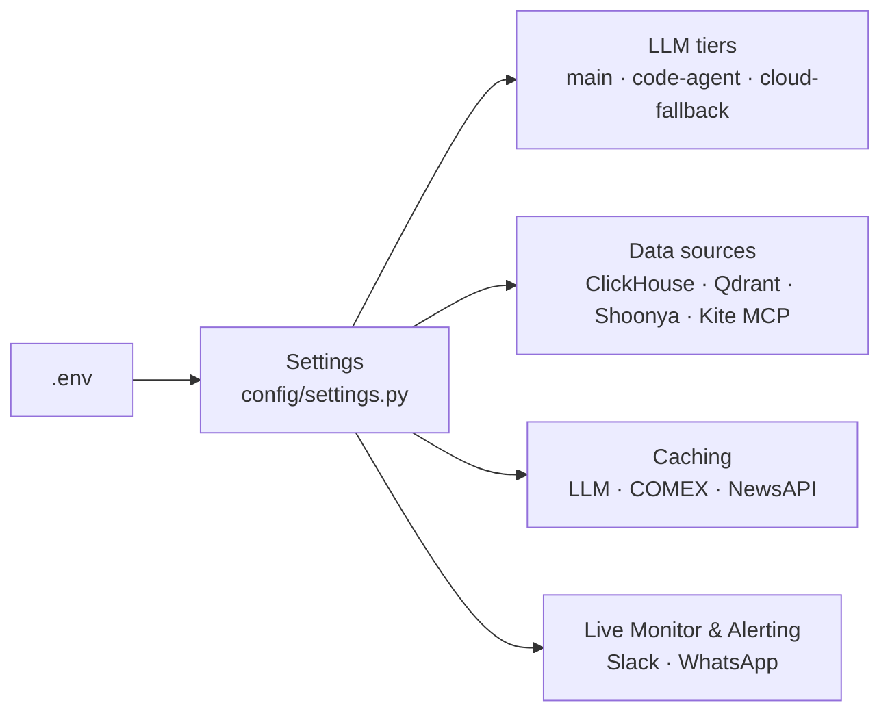

# Configuration Reference

All settings are loaded from `.env` via Pydantic `BaseSettings` (`config/settings.py`, 50+ fields). Copy `.env.example` to `.env` and fill in your values. Run `python src/main.py config` to see the current effective values (API keys masked).



## LLM — Primary

```
OPENAI_API_KEY=sk-...          # or ANTHROPIC_API_KEY, or OPENROUTER_API_KEY, or NVIDIA_API_KEY
ANTHROPIC_API_KEY=...
LLM_PROVIDER=anthropic         # default is "anthropic", NOT "openai"
LLM_MODEL=claude-sonnet-5      # default model — NOT gpt-4o-mini
LLM_BASE_URL=                  # set for a local/self-hosted OpenAI-compatible endpoint (LM Studio / Ollama)
LLM_CONTEXT_WINDOW_CONFIGURED=0  # 0 = auto-detect from model/provider; env var name is LLM_CONTEXT_WINDOW
LLM_TEMPERATURE=0.0
LLM_THINK=false                 # Ollama native thinking mode (qwen3, deepseek-r1)
LLM_LOCAL_DISABLED=false        # true = always use the cloud LLM, skip local entirely
LLM_REQUEST_TIMEOUT=600         # per-call HTTP timeout (s); local models default 600, cloud effectively 60
AGENT_TIMEOUT=600               # total wall-clock budget (s) for one ReAct agent run, all tool calls included
```

**Local model (LM Studio / Ollama):**
```
LLM_BASE_URL=http://localhost:1234/v1
LLM_MODEL=DeepSeek-R1-Distill-Qwen-14B-GGUF
OLLAMA_HOST=http://localhost:11434
OLLAMA_FALLBACK_HOST=http://localhost:11434   # tried if OLLAMA_HOST is unreachable
```
> Models < 30B struggle with multi-turn tool orchestration. COMEX and news agents bypass LangGraph for local models automatically.

> **Docker networking auto-rewrite:** `Settings.__init__` rewrites `LLM_BASE_URL`/`CODE_LLM_BASE_URL` automatically depending on where the process runs — `localhost`/`127.0.0.1` → `host.docker.internal` when running *inside* a container, and `host.docker.internal` → `127.0.0.1` when running on the bare host and that name doesn't resolve. You generally don't need to set this per-environment yourself.

## LLM — Code Agent override (optional)

The `CodeSubAgent` can run on a different model than the main agent — useful for routing code execution to a stronger/cheaper model. Blank fields inherit the primary LLM settings above.
```
CODE_LLM_PROVIDER=
CODE_LLM_MODEL=
CODE_LLM_BASE_URL=
CODE_LLM_CONTEXT_WINDOW=0        # 0 = inherit
```

## LLM — Cloud fallback tier (optional)

When the primary LLM is local (Ollama/LM Studio) and a task needs more capability than a local model can reliably deliver, sub-agents can escalate to a cloud model.
```
LLM_CLOUD_PROVIDER=              # blank disables cloud fallback entirely
LLM_CLOUD_MODEL=claude-3-5-haiku-20241022
LLM_CLOUD_CONTEXT_WINDOW=0       # 0 = auto-detect
GOOGLE_API_KEY=                  # Gemini, if used as the cloud provider
```

## Caching

```
LLM_CACHE_ENABLED=true           # SQLite response cache — saves API cost on repeated queries
LLM_CACHE_TTL_HOURS=24           # 0 = no expiry
COMEX_CACHE_TTL_SECONDS=3600     # COMEX API response cache (default 1h)
NEWSAPI_CACHE_TTL_SECONDS=3600   # NewsAPI response cache (default 1h)
```

## API Keys

```
NEWSAPI_KEY=...                # free at newsapi.org — 100 req/day
GOLD_API_KEY=...               # free at gold-api.com — COMEX spot prices
SEC_API_KEY=...                # sec-api.io — used by the DeepDive sub-agent for US filings
GEMINI_CLI_PATH=gemini         # path to the gemini CLI binary, if installed
```

## Zerodha Kite MCP

```
KITE_MCP_URL=https://mcp.kite.trade/mcp
KITE_API_KEY=                  # only needed for self-hosted MCP
KITE_API_SECRET=
KITE_MCP_TIMEOUT=30
```

## Shoonya (live NSE data — ETF price/quote primary source)

```
SHOONYA_USER_ID=
SHOONYA_PASSWORD=               # a literal "$$" in the value is auto-unescaped to "$"
SHOONYA_API_SECRET=
```
Shoonya is the primary source for ETF prices per the data-source priority order (Shoonya → NSE → yfinance) — leave blank and the pipeline falls back automatically.

## ClickHouse (Data Hub & Connection Pool)

```
CLICKHOUSE_HOST=localhost
CLICKHOUSE_PORT=8123
CLICKHOUSE_DATABASE=market_data
CLICKHOUSE_USER=default
CLICKHOUSE_PASSWORD=

# Connection pool (src/db/pool.py — shared across all service modules)
CLICKHOUSE_POOL_MIN=5           # warm idle connections kept alive
CLICKHOUSE_POOL_MAX=30          # hard cap on total live connections
CLICKHOUSE_POOL_TIMEOUT=30.0    # seconds to wait for a free pool slot
```

All service modules import the pool singleton via `from src.db.pool import get_pool`.
Use `pool.query_df(sql)` for SELECT, `pool.execute(sql)` for DDL/INSERT,
or `with pool.acquire() as client:` for raw multi-statement access.

## Qdrant (vector database)

```
QDRANT_HOST=localhost
QDRANT_PORT=6333
QDRANT_GRPC_PORT=6334           # used when prefer_grpc=True
```
See [rag-architecture.md](rag-architecture.md) for the 6 collections and their read/write paths.

## Behaviour

```
NEWS_ARTICLES_PER_STOCK=5
NEWS_LOOKBACK_DAYS=7
MAX_HOLDINGS_PER_RUN=0          # 0 = no cap
SCRAPE_DELAY_SECONDS=2.0
OUTPUT_DIR=./output
LOG_LEVEL=INFO
ANOMALY_GARCH_Z_THRESHOLD=      # blank/None = off; 3.5 recommended if enabling the GARCH-residual anomaly gate
```

## Indian Market Constants

```
NSE_SUFFIX=.NS
BSE_SUFFIX=.BO
MARKET_TIMEZONE=Asia/Kolkata
MARKET_OPEN=09:15
MARKET_CLOSE=15:30
```

## Live Monitor & Alerting (`src/agents/live_monitor.py`)

Standalone multi-symbol live anomaly + news-correlation monitor. Watches Shoonya ticks during market hours, scores 5-minute bars for price/volume anomalies, and pushes Slack/WhatsApp alerts. Key settings (see `config/settings.py` for the full set — bar size, buffer size, VIX confirmation gate, polling fallback interval, etc.):

```
SLACK_WEBHOOK_URL=                        # blank disables Slack delivery (alerts still logged to ClickHouse)
CALLMEBOT_WHATSAPP_PHONE=                 # country code + number, no "+"
CALLMEBOT_WHATSAPP_APIKEY=
LIVE_MONITOR_ZSCORE_THRESHOLD=3.0         # same scale as the EOD pipeline's z_robust, not yet validated intraday
```

## News Filter LLM (optional semantic pre-filter)

```
NEWS_FILTER_LLM_ENABLED=false
NEWS_FILTER_LLM_BASE_URL=http://localhost:11434/v1
NEWS_FILTER_LLM_MODEL=mistral:7b-instruct
NEWS_FILTER_LLM_TIMEOUT=10
```

## Check current config

```bash
python src/main.py config
```
