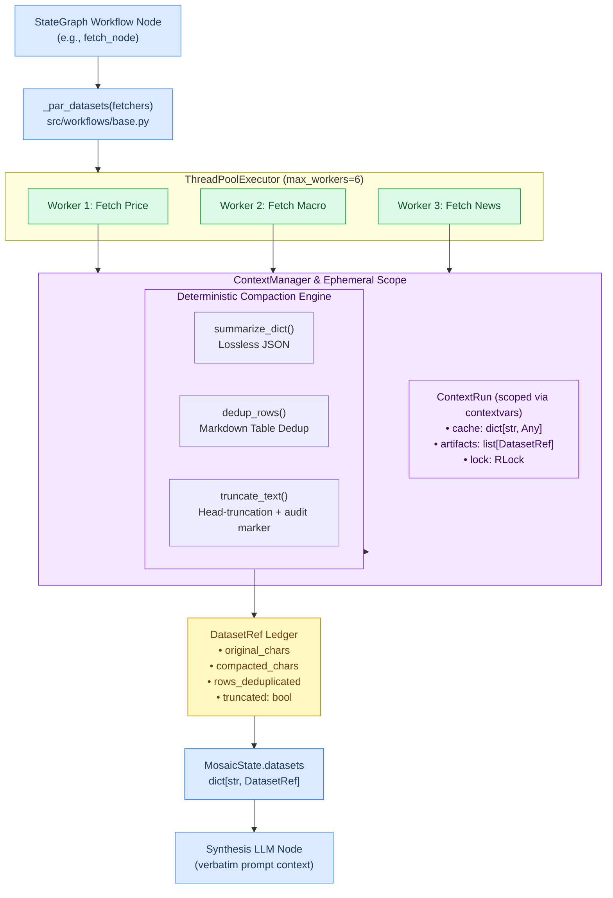

# ContextManager Architecture & Design

> Last updated: 2026-07-24
> Reference for deterministic context compression, thread-safe per-run caching, and prompt compaction in Mosaic StateGraph workflows.

---

## Overview & Design Philosophy

The **ContextManager** (`src/workflows/context_manager.py`) is the deterministic context compression and token-optimization engine for Mosaic's [StateGraph Workflows](agent-architecture.md#workflows-stategraph).

### Core Mandates

1. **Zero-LLM-Distortion Mandate**:
   - **Never ask an LLM to summarize numerical workflow inputs**.
   - All financial numbers (prices, NAV, returns, ratios, Z-scores, FII flows) must reach the synthesis prompt **verbatim** from source tools. LLM summarization of intermediate data introduces hallucination risk and violates the project's **No LLM Calculations** rule.
2. **Rule-Based Compaction**:
   - Context budget reduction is achieved via deterministic text truncation, whitespace/header normalization, and Markdown table row deduplication.
3. **Thread-Safe Ephemeral Caching**:
   - Prevents redundant tool calls during parallel fan-out nodes using thread-safe, `contextvars`-scoped caching.
4. **Full Auditability**:
   - Every compacted dataset is wrapped in a `DatasetRef` metadata ledger tracking exact pre- and post-compaction character counts and truncation flags.

---

## Architecture & Data Flow



---

## Execution Sequence

The sequence diagram below demonstrates how worker threads safely interact with the `ContextManager` during a parallel fetch node:

```mermaid
sequenceDiagram
    autonumber
    participant Node as Workflow Node
    participant Par as _par_datasets
    participant Pool as ThreadPoolExecutor
    participant CM as ContextManager
    participant Run as ContextRun Scope
    participant LLM as Synthesis Node

    Node->>Par: Invoke _par_datasets
    Par->>CM: Initialize ContextRun scope
    CM->>Run: Create ephemeral cache & RLock
    Par->>Pool: Submit fetchers concurrently
    
    par Worker 1 Fetch
        Pool->>CM: Fetch Tool 1 Data
        CM->>Run: Acquire RLock & check cache
        Run-->>CM: Cache Miss
        CM-->>Pool: Execute raw fetcher
        CM->>CM: Compact result (dedup / truncate)
        CM->>Run: Store cache & DatasetRef artifact
    and Worker 2 Fetch
        Pool->>CM: Fetch Tool 2 Data
        CM->>Run: Acquire RLock & check cache
        Run-->>CM: Cache Miss
        CM-->>Pool: Execute raw fetcher
        CM->>CM: Compact result (dedup / truncate)
        CM->>Run: Store cache & DatasetRef artifact
    end

    Pool-->>Par: Return worker results
    Par->>Node: Return dict of DatasetRef
    Node->>Node: Update MosaicState.datasets
    Node->>LLM: Inject verbatim content into prompt
```

---

## Data Structures

### 1. `DatasetRef` (Compaction Audit Ledger)

A frozen dataclass representing a prompt-ready fetch output along with metadata needed to audit compaction quality:

```python
@dataclass(frozen=True)
class DatasetRef:
    key: str                   # Dataset identifier (e.g. "price_summary", "macro_themes")
    content: str               # Prompt-ready compacted text
    source_type: str           # Source category ("dict", "dataframe", "str")
    original_chars: int        # Raw character count before compaction
    compacted_chars: int       # Final character count passed to prompt
    rows_deduplicated: bool    # True if duplicate rows were stripped
    truncated: bool            # True if head-truncation was applied
```

### 2. `ContextRun` (Thread-Safe Execution Scope)

An ephemeral state container bound to the active thread context via Python's `contextvars`:

```python
@dataclass
class ContextRun:
    cache: dict[str, Any] = field(default_factory=dict)
    artifacts: list[DatasetRef] = field(default_factory=list)
    lock: RLock = field(default_factory=RLock, repr=False)
```

- **Thread-Safety**: Protected by an internal `RLock` so concurrent worker threads inside a `ThreadPoolExecutor` can safely read/write cache entries and append artifacts.
- **Context Isolation**: Uses `contextvars.ContextVar("_workflow_context_run")` so parallel or nested workflow executions never leak state into each other.

---

## Core Compaction Mechanics

### Text Truncation (`truncate_text`)

Head-truncates oversized text outputs while preserving Unicode safety and injecting an explicit audit marker:

```python
DEFAULT_MAX_CHARS = 12_000

def truncate_text(text: str, max_chars: int = DEFAULT_MAX_CHARS) -> str:
    if len(text) <= max_chars:
        return text
    trimmed = len(text) - max_chars
    return f"{text[:max_chars]}\n…[{trimmed} chars trimmed — use narrower queries to fit context]"
```

### Lossless Serialization (`summarize_dict`)

Serializes structured dicts into clean JSON without dropping or deriving fields:

```python
def summarize_dict(raw: dict[str, Any]) -> str:
    return json.dumps(raw, ensure_ascii=False, indent=2, sort_keys=True, default=str)
```

---

## Workflow Integration (`src/workflows/base.py`)

### Parallel Fetch with Automatic Compaction (`_par_datasets`)

`_par_datasets()` is the primary entry point for workflows (`signal.py`, `macro.py`, `news.py`). It combines `ThreadPoolExecutor` fan-out with automatic `ContextManager` compaction:

```python
def _par_datasets(
    fetchers: dict[str, Any],
    max_chars: int = 12_000,
    max_workers: int | None = None,
) -> dict[str, DatasetRef]:
    """Execute fetchers concurrently and compact results into DatasetRef objects."""
```

### Flow inside `_par_datasets`:

1. Executes all callables in `fetchers` concurrently via `ThreadPoolExecutor` (capped at `_PAR_MAX_WORKERS = 6`).
2. Retries failed fetchers up to 2 times with linear backoff.
3. Passes each result through `ContextManager.compact()`:
   - Dicts → formatted via `summarize_dict()`
   - Strings / DataFrames → line-deduplicated + truncated via `truncate_text()`
4. Wraps outputs into `DatasetRef` objects and returns `dict[str, DatasetRef]`.

---

## Workflow State Binding (`MosaicState`)

All workflows inherit from the shared `MosaicState` TypedDict ancestor in `src/workflows/state.py`:

```python
class MosaicState(TypedDict, total=False):
    question: str
    plan: list[str]
    plan_id: str
    datasets: dict[str, DatasetRef]
```

### Synthesis Prompt Usage

During the synthesis node of a workflow, prompt templates extract `content` directly from `datasets`:

```python
# Example from src/workflows/signal.py
datasets = state.get("datasets", {})
macro_text = datasets.get("macro", DatasetRef("macro", "", "", 0, 0, False, False)).content
inav_text  = datasets.get("inav",  DatasetRef("inav",  "", "", 0, 0, False, False)).content

prompt = f"""
Evaluate ETF signals using the following raw verbatim data:

--- MACRO OVERLAY ---
{macro_text}

--- iNAV SNAPSHOTS ---
{inav_text}

{SYNTH_SUFFIX}
"""
```

---

## Performance & Token Savings

| Workflow | ReAct Token Cost | StateGraph + ContextManager Cost | Token Savings |
|---|---|---|---|
| `run_news` | ~8,000 | ~1,500 | **81%** |
| `run_signal` | ~18,000 | ~4,000 | **78%** |
| `run_mf_planner` | ~25,000 | ~6,000–12,000 | **55–76%** |
| `run_macro` | ~12,000 | ~3,500 | **71%** |

---

## Testing & Verification

The `ContextManager` is covered by 44 unit tests in `tests/test_context_manager.py` and `tests/test_workflows.py`:

```bash
# Run context manager tests
python -m pytest tests/test_context_manager.py -v
python -m pytest tests/test_workflows.py -v
```

Tests cover:
- Ephemeral cache isolation across contextvars
- `DatasetRef` metadata character auditing
- Unicode-safe head truncation
- Thread-safe concurrent writes under high worker contention
