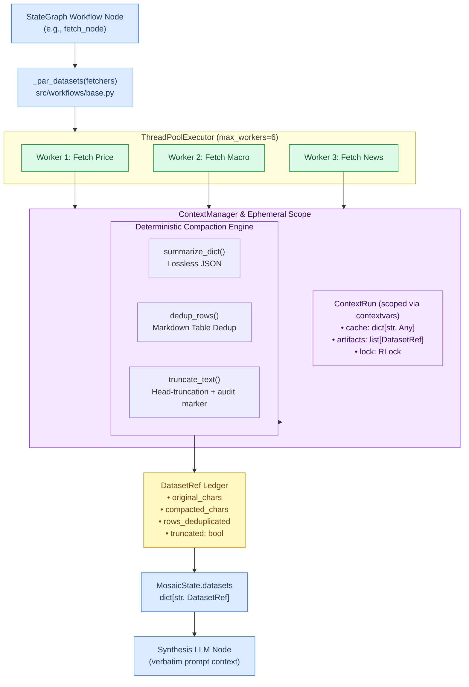

# ContextManager Architecture & Design

> **Last updated:** 2026-07-24  
> **Target Audience:** Developers building or extending Mosaic StateGraph workflows.  
> **Source Module:** `src/workflows/context_manager.py`  
> **Related Issue:** [#156 (Runtime Roadmap — Group B: Dataset & Artifact Retrofit)](https://github.com/Mosaic-agent/Mosaic-fund-agent/issues/156)

---

## What is ContextManager?

When running multi-step quantitative workflows—like fetching live iNAV prices, news sentiment, macro indicators, or FII/DII flows—passing raw tool responses directly into an LLM prompt can quickly consume tens of thousands of context tokens.

Common naive solutions try using LLM passes to summarize raw data before sending it to the main prompt. However, **summarizing numerical market data with an LLM risks hallucinating or altering raw figures** (such as NAV prices, Z-scores, or position weights).

The **ContextManager** solves this problem by providing **rule-based, zero-LLM context compression**. It cleans, deduplicates, and bounds tool data deterministically using pure Python logic, ensuring that every financial figure reaches the final LLM prompt verbatim while keeping token costs down by **55% to 81%**.

---

## Core Principles

> [!IMPORTANT]
> **1. Zero-LLM-Distortion Mandate**  
> Never use an LLM to summarize intermediate numerical data. All market numbers (OHLCV prices, iNAV premiums, Kelly weights, GARCH volatilities) must reach synthesis prompts exactly as returned by database queries or tool APIs.

> [!NOTE]
> **2. Rule-Based Compaction**  
> Context reduction relies entirely on deterministic algorithms:
> - **Markdown Table Deduplication**: Strips duplicate body rows from contiguous tables while preserving headers.
> - **Unicode-Safe Head Truncation**: Bounds oversized payloads while adding clear audit markers.
> - **Lossless JSON Serialization**: Formats dictionaries cleanly without dropping or modifying fields.

> [!TIP]
> **3. Thread-Safe Ephemeral Caching**  
> When multiple worker threads run concurrently during parallel fetch steps, `ContextManager` uses Python's `contextvars` and thread `RLock` locks to cache results safely for the duration of a single workflow run.

> [!NOTE]
> **4. Verifiable Compaction Audit Ledger**  
> Every compressed dataset returns a `DatasetRef` metadata object containing exact character counts before and after compression, so you can audit compaction performance.

---

## Architecture & Data Flow

Here is how data flows from a workflow node through parallel worker threads into the `ContextManager` compaction engine, and finally into the workflow's state ledger (`MosaicState.datasets`):



---

## Execution Lifecycle

The sequence below illustrates how concurrent worker threads safely query tool APIs and pass outputs through the `ContextManager` without thread interference:

```mermaid
sequenceDiagram
    autonumber
    participant Node as Workflow Node
    participant Par as _par_datasets
    participant Pool as ThreadPoolExecutor
    participant CM as ContextManager
    participant Run as ContextRun Scope
    participant LLM as Synthesis Node

    Node->>Par: Invoke _par_datasets
    Par->>CM: Initialize ContextRun scope
    CM->>Run: Create ephemeral cache & RLock
    Par->>Pool: Submit worker tasks concurrently

    rect rgb(240, 253, 244)
        note over Pool,Run: Concurrent Worker Execution (ThreadPoolExecutor)
        Pool->>CM: Worker 1: Fetch Tool 1 Data
        CM->>Run: Acquire RLock & check cache
        Run-->>CM: Cache Miss
        CM-->>Pool: Execute raw fetcher 1
        CM->>CM: Compact result (dedup / truncate)
        CM->>Run: Store cache & DatasetRef artifact 1

        Pool->>CM: Worker 2: Fetch Tool 2 Data
        CM->>Run: Acquire RLock & check cache
        Run-->>CM: Cache Miss
        CM-->>Pool: Execute raw fetcher 2
        CM->>CM: Compact result (dedup / truncate)
        CM->>Run: Store cache & DatasetRef artifact 2
    end

    Pool-->>Par: Return worker results
    Par->>Node: Return dict of DatasetRef
    Node->>Node: Update MosaicState.datasets
    Node->>LLM: Inject verbatim content into prompt
```

---

## Key Data Structures

### 1. `DatasetRef` (Compaction Audit Ledger)

When raw data is processed, `ContextManager` wraps it into an immutable `DatasetRef`. This dataclass holds both the clean prompt text and diagnostic metadata:

```python
@dataclass(frozen=True)
class DatasetRef:
    key: str                   # Unique identifier (e.g. "price_summary", "macro_themes")
    content: str               # Clean, compacted text ready for the prompt
    source_type: str           # Original shape ("dict", "dataframe", "str")
    original_chars: int        # Raw character count before processing
    compacted_chars: int       # Character count after processing
    rows_deduplicated: bool    # True if duplicate table rows were stripped
    truncated: bool            # True if head-truncation was applied
```

### 2. `ContextRun` (Thread-Safe Execution Scope)

During a workflow's data-gathering phase, `ContextRun` acts as a thread-safe container for the active run:

```python
@dataclass
class ContextRun:
    cache: dict[str, Any] = field(default_factory=dict)
    artifacts: list[DatasetRef] = field(default_factory=list)
    lock: RLock = field(default_factory=RLock, repr=False)
```

- **Thread-Safety**: Worker threads inside `ThreadPoolExecutor` acquire `lock` before writing to `cache` or `artifacts`.
- **Context Isolation**: Scoped via `contextvars.ContextVar("_workflow_context_run")`, ensuring concurrent workflow runs remain isolated.
- **Context Propagation**: When `_par_datasets()` spawns thread pool workers, it invokes `contextvars.copy_context().run(_run, fn, key)` for each worker task. This explicitly propagates the parent thread's active `ContextRun` scope into background threads so workers share the same run-local cache.

---

## How Data is Compacted

### 1. Markdown Table Deduplication (`dedup_rows`)
When scrapers or API tools return tables with repeated entries (e.g., duplicate news headlines or market snapshots), `dedup_rows()` removes identical body rows while keeping headers intact:

```python
def dedup_rows(text: str) -> str:
    """Removes duplicate rows from contiguous Markdown tables without affecting prose or headers."""
```

### 2. Unicode-Safe Truncation (`truncate_text`)
If a tool output exceeds max capacity, `truncate_text()` head-truncates the text and appends an explicit marker showing how many characters were trimmed:

```python
DEFAULT_MAX_CHARS = 12_000

def truncate_text(text: str, max_chars: int = DEFAULT_MAX_CHARS) -> str:
    if len(text) <= max_chars:
        return text
    trimmed = len(text) - max_chars
    return f"{text[:max_chars]}\n…[{trimmed} chars trimmed — use narrower queries to fit context]"
```

### 3. Lossless Dict Formatting (`summarize_dict`)
Formats dictionary objects into indented JSON, ensuring no key-value pairs are dropped:

```python
def summarize_dict(raw: dict[str, Any]) -> str:
    return json.dumps(raw, ensure_ascii=False, indent=2, sort_keys=True, default=str)
```

---

## How Workflows Use ContextManager

Workflows trigger compaction using the `_par_datasets()` utility function in `src/workflows/base.py`:

```python
# In src/workflows/signal.py
datasets = _par_datasets({
    "macro": lambda: run_macro_scanner(),
    "inav": lambda: get_live_inav("GOLDBEES"),
    "flows": lambda: get_fii_dii_summary(),
}, max_chars=12_000)
```

### Injecting into Prompts

The resulting `datasets` dictionary is stored in the workflow state (`MosaicState.datasets`) and read directly inside synthesis nodes:

```python
# Extracting verbatim content in synthesis prompt
macro_text = state["datasets"]["macro"].content
inav_text  = state["datasets"]["inav"].content

prompt = f"""
Evaluate ETF signals using the following verbatim market data:

--- MACRO DATA ---
{macro_text}

--- iNAV SNAPSHOTS ---
{inav_text}

{SYNTH_SUFFIX}
"""
```

---

## Token Reduction Benchmarks

By replacing multi-turn ReAct loops with `StateGraph` workflows backed by `ContextManager`, Mosaic achieves dramatic token savings across major query intents:

| Workflow | Legacy ReAct Token Cost | StateGraph + ContextManager | Token Reduction |
|---|---|---|---|
| `run_news` | ~8,000 tokens | ~1,500 tokens | **81% reduction** |
| `run_signal` | ~18,000 tokens | ~4,000 tokens | **78% reduction** |
| `run_macro` | ~12,000 tokens | ~3,500 tokens | **71% reduction** |
| `run_mf_planner` | ~25,000 tokens | ~6,000–12,000 tokens | **55–76% reduction** |

---

## Testing & Verification

`ContextManager` behaviour is thoroughly verified across unit tests:

```bash
# Run unit test suite
python -m pytest tests/test_workflows.py -v
```

Tests verify thread isolation across `contextvars`, character-audit accuracy in `DatasetRef`, lossless formatting, and table deduplication logic.
