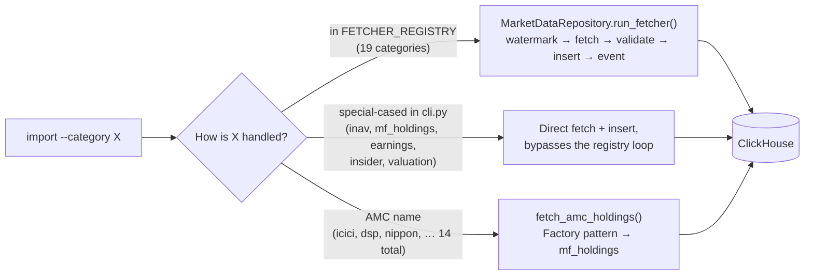

# Import Categories & ClickHouse Schema

## Import Categories

Run imports via CLI: `python src/main.py import --category <name>` (comma-separated; omit `--category` or use `all` to run every registered category).



### Registry-driven categories (`FETCHER_REGISTRY`, 19)

| Category | Source | Symbols | ClickHouse Table |
|---|---|---|---|
| `stocks` | Yahoo Finance (`.NS`) | 50 NSE large/mid-caps | `daily_prices`, `stock_earnings`, `stock_insider_trades`, `stock_valuation` |
| `us_stocks` | Yahoo Finance | US-listed stocks | `daily_prices`, `stock_earnings`, `stock_insider_trades`, `stock_valuation` |
| `etfs` | Shoonya → nselib → Yahoo Finance fallback chain | 30+ NSE ETFs | `daily_prices` |
| `commodities` | Yahoo Finance (futures) | Gold, Silver, Copper, Crude Oil, etc. | `daily_prices` |
| `indices` | Yahoo Finance | Nifty50, Sensex, S&P500, Nasdaq, etc. | `daily_prices` |
| `nse_indices` | nselib (direct NSE) | Sectoral/factor indices not on Yahoo | `daily_prices` |
| `nse_eod` | NSE official EOD bulk archive | ETFs + stocks | `daily_prices` |
| `nse_delivery` | NSE official delivery archive | ETFs + stocks | `nse_delivery` |
| `fx_rates` | Yahoo Finance (free) | Daily OHLC for USDINR, USDCNY, USDAED, USDSAR, USDKWD | `fx_rates` |
| `mf` | MFAPI.in (AMFI official) | NAV history for 13 ETF schemes | `mf_nav` |
| `fii_dii` | Sensibull oxide API | Daily + monthly FII/DII institutional cash flows + F&O OI | `fii_dii_flows`, `fii_dii_monthly`, `fii_dii_fno_daily` |
| `cot` | CFTC Socrata API (free) | Weekly Gold COT — Managed Money + Commercials | `cot_gold` |
| `cb_reserves` | IMF IFS REST API (free) | Monthly gold reserves for 9 central banks | `cb_gold_reserves` |
| `etf_aum` | Yahoo Finance (free) | Daily AUM snapshot for GLD, IAU, SGOL, PHYS | `etf_aum` |
| `world_bank` | World Bank WDI API (free) | Annual macro indicators (GDP, CPI, etc.) | `macro_indicators` |
| `imf_weo` | IMF WEO API (free) | Annual macro projections/forecasts | `macro_indicators` |
| `indian_macro` | RBI / MOSPI public series | Indian macro indicators | `indian_macro_indicators` |
| `amfi_flows` | AMFI portal | Category-wise monthly MF flows + AUM | `amfi_category_flows` |
| `bulk_deals` / `events` | NSE bulk & block deals API (aliases — same fetcher) | Large institutional/promoter transactions | `bulk_block_deals` |

### Special-cased categories (handled directly in `cli.py`, not via the registry)

| Category | Source | Symbols | ClickHouse Table |
|---|---|---|---|
| `inav` | NSE API (live) | 15 ETFs — iNAV + market price + premium/discount | `inav_snapshots` |
| `mf_holdings` | Morningstar via mstarpy | Current portfolio snapshot for DSP, Quant, ICICI multi-asset funds. Auto-vectorizes into Qdrant `mf_holdings` + `mf_fund_profiles` on each insert. | `mf_holdings` |
| `earnings` | Yahoo Finance | US_STOCKS watchlist quarterly earnings | `stock_earnings` |
| `insider` | Yahoo Finance | US_STOCKS watchlist insider transactions | `stock_insider_trades` |
| `valuation` | Yahoo Finance | US_STOCKS watchlist valuation snapshot | `stock_valuation` |

### AMC fund-holdings importers (factory pattern, 14 AMCs)

`icici`, `nippon`, `icici-index`, `dsp`, `bajaj`, `quant`, `hdfc`, `kotak`, `abakkus`, `abacus`, `helios`, `invesco`, `canara`, `mirae` — each dispatches through `fetch_amc_holdings()` (`src/data_importer/fetchers/amc_holdings_fetcher.py`) into `mf_holdings`.

### Personal data

| Category | Source | Symbols | ClickHouse Table |
|---|---|---|---|
| `user_data` | Zerodha Kite MCP | Personal portfolio, margins, profile, positions, and orders | `user_holdings`, `user_profile`, `user_margins`, `user_positions`, `user_orders` |

### Delta-sync

All imports are **watermark-based** — only new data since the last successful run is fetched (3-day overlap for late corrections). Use `--full` to ignore watermarks and re-fetch all history.

```bash
python src/main.py import --category commodities --full   # full re-import
python src/main.py import --category etfs --dry-run       # preview, no DB writes
```

### High-Concurrency & Parallel Stock Imports

For `stocks` and `us_stocks` categories, the sequential importer is automatically intercepted and routed to a high-concurrency parallel pipeline ([parallel_importer.py](file:///Users/dhiraj.thakur/project/ofin-agent/src/data_importer/parallel_importer.py)).

This pipeline concurrently processes each stock symbol using a thread pool to fetch pricing history (`daily_prices`), quarterly earnings, insider transactions, and valuation snapshots.
- **Worker Limit:** Capped at 5 concurrent worker threads to balance speed and stability.
- **Anti-Rate-Limiting Jitter:** Staggers worker execution using randomized initial delays (`0.1s` to `1.2s`) and spacing delays (`0.3s` to `1.0s`) between fetches. This prevents Yahoo Finance from blocking requests with `HTTP Error 401: Unauthorized` or rate-limiting.
- **Auto-Routing:** Agent LLM loops and standard CLI calls like `python src/main.py import --category stocks` are automatically routed through this parallel importer.

You can also invoke the script directly from the project root:
```bash
python src/scripts/portfolio/import_stocks_parallel.py --workers 5 [--dry-run] [--full]
```


### Fetcher Adapter Pattern

All general data categories have typed **Fetcher adapters** (`src/data_importer/fetchers/adapters.py`):

| Adapter | Category | Overlap | Description |
|---|---|---|---|
| `ShoonyaFetcher` | etfs | 3 days | Shoonya API with nselib + yfinance fallbacks |
| `StocksFetcher` | stocks, us_stocks | 3 days | Price, earnings, insider, valuation data |
| `YFinanceFetcher` | commodities, indices | 3 days | Yahoo Finance EOD price history |
| `NSElibFetcher` | etfs (fallback) | 3 days | Direct NSE OHLCV |
| `NseIndexFetcher` | nse_indices | 3 days | Sectoral/factor indices via nselib |
| `NseEodFetcher` | nse_eod | 3 days | Official NSE EOD bulk archive |
| `IndianMacroFetcher` | indian_macro | 30 days | RBI/MOSPI Indian macro series |
| `MFNavFetcher` | mf | 3 days | MFAPI mutual fund daily NAVs |
| `FIIDIIFetcher` | fii_dii | 3 days | FII/DII daily cash, F&O OI, monthly aggs |
| `FXRatesFetcher` | fx_rates | 3 days | Yahoo Finance USD currency pairs |
| `COTGoldFetcher` | cot | 21 days | CFTC COT Gold Managed Money |
| `CbReservesFetcher` | cb_reserves | 0 days | IMF IFS Central Bank Gold Reserves |
| `EtfAumFetcher` | etf_aum | 0 days | Gold ETF AUM & implied tonnes |
| `WorldBankMacroFetcher` | world_bank | 365 days | World Bank WDI annual macro indicators |
| `IMFWEOFetcher` | imf_weo | 180 days | IMF WEO projections & forecasts |
| `AmfiCategoryFlowsFetcher` | amfi_flows | 0 days | AMFI category-wise monthly flows + AUM |
| `NseDeliveryFetcher` | nse_delivery | 3 days | NSE daily delivery %/volume (bhavcopy, whole-market) |
| `BulkBlockDealsFetcher` | bulk_deals, events | 3 days | NSE Bulk & Block Deals (large institutional/promoter transactions) |
| `MfHoldingsFetcher` | mf_holdings | — (month-presence check, not watermark) | Monthly MF portfolio holdings (constructed per-call in `cli.py`, not registry-cached) |

Use `MarketDataRepository.run_fetcher(fetcher)` to execute the full watermark → fetch → validate → insert → event cycle programmatically:

```python
from src.db.repository import MarketDataRepository
from src.data_importer.fetchers.adapters import get_registry
from src.db.pool import get_pool

repo = MarketDataRepository(get_pool())
result = repo.run_fetcher(get_registry()["fii_dii"], dry_run=True)
print(result)  # FetchResult: 8 rows  2026-05-07→2026-05-13 (dry-run)
```

### Developer Guide: Adding a New Fetcher Adapter

To add a new data source to Mosaic, follow these **2 steps**:

#### Step 1: Subclass `Fetcher` in `src/data_importer/fetchers/adapters.py`
Implement `fetch()`, `validate()`, `insert()`, and `max_date()`:

```python
from datetime import date
from typing import Any
import logging
from src.data_importer.base_fetcher import Fetcher

log = logging.getLogger(__name__)

class MyNewDataFetcher(Fetcher):
    """Daily fetcher for My New Data Feed."""
    source_name  = "my_source_name"   # Watermark source key in ClickHouse
    symbol_key   = "ALL"              # Watermark symbol key ("ALL", "MARKET", etc.)
    description  = "My New Data Feed" # Display description for CLI/logs
    overlap_days = 1                  # Lookback overlap in days for delta-sync

    def fetch(self, from_date: date, to_date: date) -> list[dict[str, Any]]:
        """1. Fetch raw data from external API / scraper."""
        from src.data_importer.fetchers.my_data_fetcher import fetch_my_data
        return fetch_my_data(from_date=from_date, to_date=to_date)

    def validate(self, rows: list[dict]) -> list[dict]:
        """2. Filter invalid or corrupted rows."""
        return [r for r in rows if r.get("value") is not None]

    def insert(self, rows: list[dict], ch) -> int:
        """3. Insert into ClickHouse using ClickHouseImporter instance `ch`."""
        n = ch.insert_my_table(rows)
        if rows:
            latest = max(rows, key=lambda r: r["trade_date"])
            log.info("MyNewData latest (%s): Value = %s", latest["trade_date"], f"{latest['value']:,.2f}")
        return n

    def max_date(self, rows: list[dict]) -> date:
        """4. Return max trade date to update import_watermarks."""
        return max(r["trade_date"] for r in rows)
```

#### Step 2: Register in `_build_registry()` inside `src/data_importer/fetchers/adapters.py`

```python
def _build_registry() -> dict[str, Fetcher]:
    ...
    registry["my_category"] = MyNewDataFetcher()
    return registry
```

Once registered:
- **CLI Ingestion**: `python src/main.py import --category my_category [--dry-run] [--full]`
- **Programmatic Execution**: `repo.run_fetcher(get_registry()["my_category"])`
- **Automatic Observer Integration**: Post-import, `DataImportedEvent` fires automatically to trigger downstream ML models, signals, and anomaly alerts.

## ClickHouse Schema

Database: `market_data`, **37 tables**, all `ReplacingMergeTree` for idempotent re-imports. This is the single source of truth for the full schema — [architecture.md](architecture.md#clickhouse-tables) links back here rather than duplicating it.

#### Prices & Live Market Data

| Table | Partition | Order Key | Purpose |
|---|---|---|---|
| `daily_prices` | toYYYYMM(trade_date) | (symbol, trade_date) | OHLCV for stocks, ETFs, commodities, indices |
| `nse_delivery` | toYYYYMM(trade_date) | (symbol, trade_date, series) | NSE daily delivery %/volume stats (bhavcopy) |
| `inav_snapshots` | toYYYYMM(snapshot_at) | (symbol, snapshot_at) | Live ETF iNAV vs market price (intraday) |
| `live_quotes` | toYYYYMM(last_trade_time) | (symbol, last_trade_time) | Real-time quote snapshots |
| `live_alerts` | toYYYYMM(alert_timestamp) | (symbol, alert_timestamp) | Real-time z-score/volume anomaly alert log |

#### Mutual Funds

| Table | Partition | Order Key | Purpose |
|---|---|---|---|
| `mf_nav` | toYYYYMM(nav_date) | (symbol, nav_date) | Daily MF/ETF NAV from AMFI via MFAPI.in |
| `mf_holdings` | toYYYYMM(as_of_month) | (scheme_code, as_of_month, isin) | Monthly MF portfolio holdings snapshot |
| `mf_holding_summaries` | — | (isin, as_of_month) | Cross-fund security ownership rollup (active_funds_count, total value) |
| `amfi_category_flows` | — | (report_month, category_name) | AMFI category-wise monthly flows + AUM |

#### Institutional Flows & Corporate Actions

| Table | Partition | Order Key | Purpose |
|---|---|---|---|
| `fii_dii_flows` | — | (trade_date) | Daily FII/DII cash-market net flows (₹ Crore) |
| `fii_dii_monthly` | — | (month_date) | Monthly FII/DII aggregate + Nifty (Sep 2018→present) |
| `fii_dii_fno_daily` | — | (trade_date) | Daily F&O participant OI (futures + options, 4 categories) |
| `bulk_block_deals` | — | (deal_date, deal_type, symbol, client_name, buy_sell, quantity, trade_price) | NSE bulk & block deal transactions |
| `corporate_actions` | — | (symbol, ex_date, action_type) | NSE split/bonus/demerger/rights/dividend history |

#### Macro & Commodities

| Table | Partition | Order Key | Purpose |
|---|---|---|---|
| `cot_gold` | — | (report_date) | Weekly CFTC COT — mm_net, comm_net, open_interest |
| `cb_gold_reserves` | — | (ref_period, country_code) | Monthly central bank gold reserves (metric tonnes) |
| `etf_aum` | toYYYYMM(trade_date) | (trade_date, symbol) | Daily ETF AUM (USD) + implied gold tonnes |
| `fx_rates` | toYYYYMM(trade_date) | (symbol, trade_date) | Daily OHLC for 5 USD pairs |
| `macro_indicators` | — | (ref_year, country_code, indicator_code, source) | World Bank / IMF WEO annual macro indicators |
| `indian_macro_indicators` | — | (as_of_date, indicator_code) | RBI/MOSPI Indian macro series |

#### ML, Signals & Risk

| Table | Partition | Order Key | Purpose |
|---|---|---|---|
| `ml_predictions` | — | (as_of, horizon_days) | LightGBM 5-day forecast log |
| `signal_composite` | — | (as_of, etf_symbol) | Multi-pillar ETF composite scores + BUY/HOLD/SELL |
| `weight_checkpoints` | — | (as_of, symbol, method) | Kelly / Risk Governor position-sizing decisions |

#### US Stock Fundamentals

| Table | Partition | Order Key | Purpose |
|---|---|---|---|
| `stock_earnings` | — | (symbol, earnings_date) | US quarterly earnings + surprise % |
| `stock_insider_trades` | — | (symbol, transaction_date, insider_name) | US insider buy/sell transactions |
| `stock_valuation` | — | (symbol, snapshot_date) | US valuation/fundamentals snapshot |

#### News

| Table | Partition | Order Key | Purpose |
|---|---|---|---|
| `news_articles` | — | (fetched_at, source_type, category, title) | ETF-tagged news + macro events (gnews + yfinance, no key) |

#### User (Zerodha Kite backups)

| Table | Partition | Order Key | Purpose |
|---|---|---|---|
| `user_holdings` | — | (tradingsymbol, imported_at) | Personal CNC holdings snapshot |
| `user_profile` | — | (user_id, imported_at) | Kite account profile details |
| `user_margins` | — | (segment, imported_at) | Available cash & utilised margins |
| `user_positions` | — | (tradingsymbol, imported_at) | Intraday (MIS/NRML) open positions |
| `user_orders` | — | (order_id, imported_at) | Historical order book log |

#### System / Ops

| Table | Partition | Order Key | Purpose |
|---|---|---|---|
| `import_watermarks` | — | (source, symbol, dataset) | Delta-sync watermarks |
| `import_failures` | — | (source, dataset, symbol, failed_at) | Failed fetch/insert attempts log |
| `agent_traces` | toYYYYMM(created_at) | (agent, run_id, step_idx) | LLM agent tool-call execution traces (latency, tokens, errors) |
| `agent_preferences` | — | (preference_key) | Key-value store for agent-learned preferences |
| `pipeline_manifest` | — | (stage, symbol) | Per-stage pipeline run manifest (fingerprint/idempotency tracking) |

### Querying tips

All tables use `ReplacingMergeTree`. Use `FINAL` to get deduplicated results:

```sql
SELECT trade_date, fii_net_cr, dii_net_cr
FROM market_data.fii_dii_flows FINAL
ORDER BY trade_date DESC
LIMIT 30;
```

For large tables, `argMax` is faster than `FINAL`:

```sql
SELECT trade_date, argMax(close, imported_at) AS close
FROM market_data.daily_prices
WHERE symbol = 'GOLDBEES'
GROUP BY trade_date
ORDER BY trade_date DESC;
```

To force deduplication (e.g. after a double-import):

```sql
OPTIMIZE TABLE market_data.daily_prices FINAL;
```

## Recommended Cron Schedule

```bash
# iNAV — every 15 min during market hours (IST)
*/15 9-15 * * 1-5  cd /path/to/project && .venv/bin/python src/main.py import --category inav

# EOD prices — after NSE close
30 15 * * 1-5  cd /path/to/project && .venv/bin/python src/main.py import --category nse_eod

# FII/DII flows — daily after market close
0 16 * * 1-5   cd /path/to/project && .venv/bin/python src/data_importer/fetchers/fii_dii_fetcher.py --insert

# COT — Fridays after 3:30 PM ET (CFTC release)
30 22 * * 5    cd /path/to/project && .venv/bin/python src/main.py import --category cot

# IMF reserves — monthly, run weekly to catch publishing lag
0 9 * * 1      cd /path/to/project && .venv/bin/python src/main.py import --category cb_reserves

# ETF AUM — daily after US market close
0 23 * * 1-5   cd /path/to/project && .venv/bin/python src/main.py import --category etf_aum

# ML forecast — daily after Indian market close
30 15 * * 1-5  cd /path/to/project && .venv/bin/python src/ml/trend_predictor.py

# MF holdings snapshot — 5th of each month after AMFI disclosure
0 10 5 * *     cd /path/to/project && .venv/bin/python src/main.py import --category mf_holdings

# Macro & ETF news — twice daily (morning pre-market + evening post-close)
30 8  * * 1-5  cd /path/to/project && .venv/bin/python src/main.py macro --save
0  16 * * 1-5  cd /path/to/project && .venv/bin/python src/main.py macro --save
30 8  * * 1-5  cd /path/to/project && .venv/bin/python src/main.py etf-news --save
0  16 * * 1-5  cd /path/to/project && .venv/bin/python src/main.py etf-news --save
```

---

## Qdrant Backfill

After the first `import --category mf_holdings` run, populate Qdrant with the full existing holdings history:

```bash
python -m src.scripts.backfill_mf_qdrant           # all 809 funds (~22k rows, latest month each)
python -m src.scripts.backfill_mf_qdrant --limit 5  # first 5 funds (quick test)
python -m src.scripts.backfill_mf_qdrant --dry-run  # preview what would be vectorized
```

This is a one-time operation. Subsequent imports auto-vectorize via hooks in `insert_mf_holdings()` and `BaseFundImporter.run()`.

**Collections populated:**

| Collection | Points | Tenant index | Tools using it |
|---|---|---|---|
| `mf_holdings` | 1 per fund×security×month | `isin` | `find_funds_holding` |
| `mf_fund_profiles` | 1 per fund×month | `fund_name` | `find_similar_funds`, `search_mf_exposure` |
| `market_anomalies` | 1 per anomaly date×symbol | `symbol` | `find_similar_anomaly_events` |
