# RAG / Qdrant Integration Architecture

Reference for how Mosaic uses Qdrant for retrieval-augmented generation. The goal is
**token reduction**: agents retrieve pre-computed, symbol-scoped context (news, holdings,
anomaly precedent, DB schemas) from vector search instead of re-fetching raw data live or
dumping it into the prompt. All numeric work stays in Python/SQL — RAG only surfaces
material for the LLM to narrate.

- **Embedding model:** Ollama `nomic-embed-text`, 768-dim, COSINE distance. Text is
  truncated to 512 chars before embedding (`_EMBED_DIM=768`, `news_rag.py`).
- **Batching:** `embed_batch()` chunks input into groups of `_OLLAMA_EMBED_BATCH=32`
  (Ollama's `/api/embed` 400s on larger batches) and drops empty strings from the request.
  24h disk cache keyed by `sha256(text)` in `data/.cache/embeddings/`.
- **Client:** lazy singleton per module; host/port from `QDRANT_HOST`/`QDRANT_PORT` or
  `settings.qdrant_host` (default `localhost:6333`, dashboard at `/dashboard`).
- **Writes are fire-and-forget** (background thread) on the import/analysis hot path so a
  Qdrant outage never blocks the pipeline.

## Diagram

```mermaid
flowchart TD
    subgraph Sources["Data sources"]
        IMP[Importers<br/>daily_prices, mf_nav, fx, macro, cot]
        MFI[Fund importers<br/>DSP / Nippon / ICICI]
        ANOM[Anomaly pipeline<br/>run_composite_anomaly]
        NEWS[News fetch<br/>GNews / NewsAPI]
        CORR[Correlation engine<br/>CorrelationService]
    end

    subgraph Embed["Embedding layer (src/ml/correlation/news_rag.py)"]
        EB[embed_batch / embed_text<br/>nomic-embed-text 768d, chunk=32, disk cache]
    end

    subgraph Qdrant["Qdrant collections (768d COSINE)"]
        C1[(news_articles<br/>tenant: symbol&#91;&#93;)]
        C2[(market_anomalies<br/>tenant: symbol)]
        C3[(mf_holdings<br/>tenant: isin)]
        C4[(mf_fund_profiles<br/>tenant: fund_name)]
        C5[(clickhouse_metadata)]
        C6[(market_data<br/>tenant: symbol · write-only)]
    end

    subgraph Read["Read path — agent @tools"]
        T1[get_stock_news / retrieve_articles<br/>two-pass symbol filter]
        T2[find_similar_anomaly_events<br/>find_anomaly_correlations]
        T3[find_funds_holding / find_similar_funds<br/>search_mf_exposure]
        T5[search_db_metadata]
    end

    IMP --> EB --> C6
    MFI --> EB --> C3 & C4
    ANOM -->|store_anomalies_with_attribution| EB --> C2
    NEWS -->|upsert_to_qdrant / _cache_articles_to_qdrant| EB --> C1
    CORR -->|attribution written back| C2

    C1 --> T1
    C2 --> T2
    C3 & C4 --> T3
    C5 --> T5
    T2 -->|precedent feeds scoring| CORR
```



## Collection inventory

| Collection | Granularity / content | Key indexes (tenant) | Written by | Read by | Status |
|---|---|---|---|---|---|
| `news_articles` | one point per article; `symbol` is a **list** of tickers | `symbol[]`*(tenant)*, `published_timestamp`(float), `published_date`(kw), `category`(kw) | `upsert_to_qdrant`, `_cache_articles_to_qdrant` (news_search.py), live fallback (event_registry.py), backfill | `retrieve_articles` (two-pass), `retrieve_cached_news_for_symbol` | **active** |
| `market_anomalies` | one point per (symbol × flagged date); GARCH/z-score signature **+ attribution** | `symbol`*(tenant)*, `category`, `regime`, `trade_timestamp`, `attributed_event_type` | `store_anomalies` / `store_anomalies_with_attribution` (anomaly_vector.py) via `run_composite_anomaly(symbol=...)` | `find_similar_anomaly_events`, precedent stage in correlation `filters.py` | **active** |
| `mf_holdings` | one point per (fund × security × month), ~22k+ pts | `isin`*(tenant)*, `fund_name`, `asset_type`, `as_of_timestamp` | `vectorize_holdings` (fund imports + backfill) | `find_funds_holding` | **active** |
| `mf_fund_profiles` | one aggregated fingerprint per (fund × month): equity/gold/bond/cash % + top-5 | `fund_name`*(tenant)*, `asset_type_primary`, `as_of_timestamp` | `_do_vectorize_profiles` | `find_similar_funds`, `search_mf_exposure` | **active** |
| `clickhouse_metadata` | table schemas + pre-baked SQL templates (prompt-size reduction) | (semantic only) | `db_metadata_init.py` | `search_db_metadata` | **active** |
| `market_data` | one point per market row (OHLCV/NAV/FX/macro/COT) | `symbol`*(tenant)*, `category`, `trade_timestamp` | `vectorize_prices/nav/fx_rates/macro/cot` (on import) | — none wired | **write-only** (populated, no reader yet) |

## news_articles retrieval (two-pass, symbol-scoped)

`retrieve_articles(query, around_date, days, k, symbol=None)` in `news_rag.py`:

1. **Pass 1 (precise):** Qdrant `query_points` filtered by `published_timestamp` range **and**
   `FieldCondition(key="symbol", match=MatchValue(symbol.upper()))`. Because `symbol` is stored
   as a **list** (`_normalize_symbols` splits `"GOLDBEES,SILVERBEES"` → `["GOLDBEES","SILVERBEES"]`),
   a keyword index matches the query ticker against any element — so multi-symbol news is found.
2. **Pass 2 (recall fallback):** if Pass 1 yields fewer than `max(3, k//4)` hits (cold/untagged
   history, or `symbol=None`), broaden to the original symbol-less semantic search and merge/dedup
   by URL. Log line: `Retrieved N articles from Qdrant (symbol=X, symbol_hits=M, broadened=bool)`.
3. **ClickHouse fallback:** if Qdrant is down, brute-force cosine over `market_data.news_articles`,
   with the same symbol-soft-filter on the `etfs_impacted` column.

This eliminated the prior "live-fetch storm": the old semantic-only retrieval returned generic
market news, post-filtered to <3 stock-specific, and fired a live GNews/NewsAPI fetch on nearly
every run — whose results were then stored with `symbol=""` (unfindable), so it never compounded.

## Correlation attribution loop (precedent memory)

`CorrelationService.find_correlations` (`src/ml/correlation/`) maps price anomalies to events
(corporate actions, macro milestones, FX shocks, news). After scoring, the winning attribution
per anomaly is persisted to `market_anomalies` via `store_anomalies_with_attribution` (with
`attributed_event_type` / `attributed_confidence`, or `UNEXPLAINED`). The `apply_precedent_weight`
filter stage then retrieves statistically similar past anomalies and nudges a finding's score
±10 based on whether precedent corroborates the same event type — a corroboration signal that
compounds as history accumulates. Cold start (no attributed history) is a no-op.

## Read tools (agent-facing)

| Tool | File | Collection |
|---|---|---|
| `get_stock_news` (cache-first) | `src/tools/news_search.py` | `news_articles` |
| `find_anomaly_correlations` | `src/tools/market/correlation_tools.py` | `news_articles` + `market_anomalies` |
| `search_anomaly_events`, `find_similar_anomaly_events` | `src/tools/market/equity.py` | `market_anomalies` |
| `find_funds_holding`, `find_similar_funds`, `search_mf_exposure` | `src/tools/market/mf_tools.py` | `mf_holdings`, `mf_fund_profiles` |
| `search_db_metadata` | `src/tools/db_tools.py` | `clickhouse_metadata` |

## Backfill / migration

```bash
# MF holdings + profiles (once after first fund import)
python -m src.scripts.backfill_mf_qdrant

# News: embed unembedded CH rows, then mirror CH → Qdrant (idempotent, URL-hashed IDs).
# symbol is written from the etfs_impacted column (list-valued). Drop the collection first
# to pick up index/schema changes, then:
python -m src.scripts.news_rag_backfill --migrate-qdrant

# ClickHouse metadata (schemas + SQL templates)
python -m src.scripts.db_metadata_init
```

Point IDs are deterministic (UUID5 of URL/key), so re-running any backfill upserts in place
rather than duplicating.
